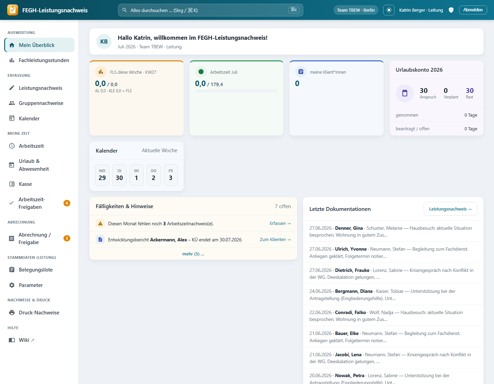
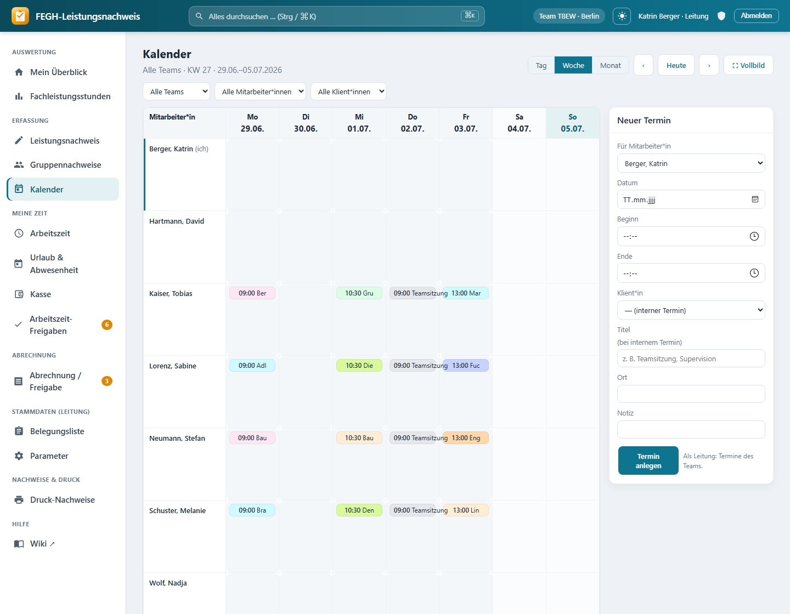
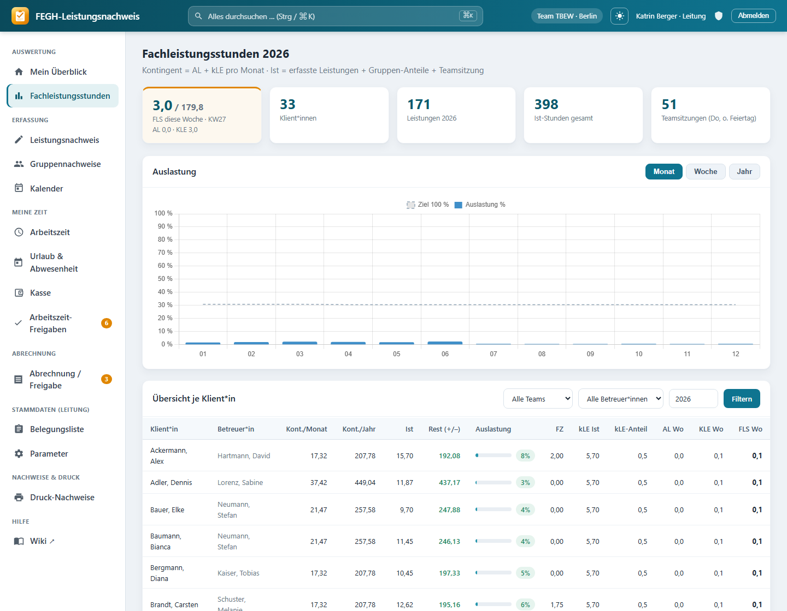
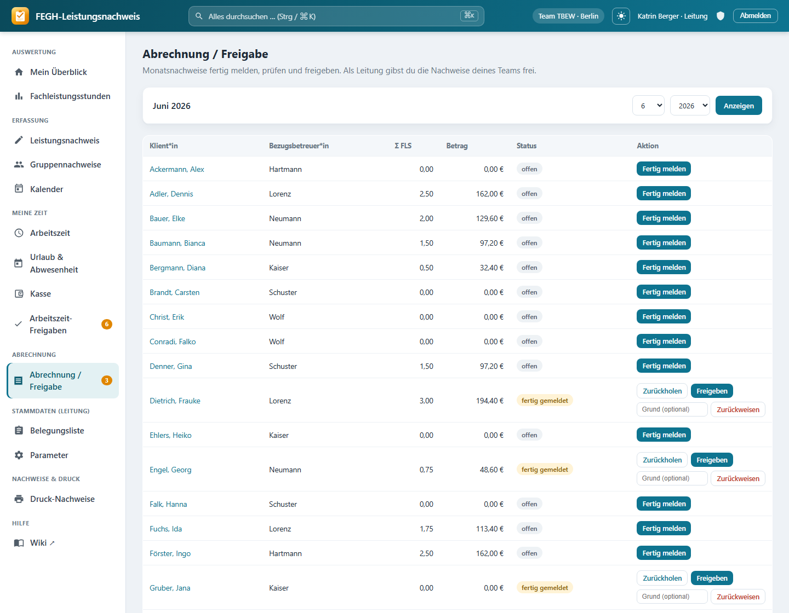
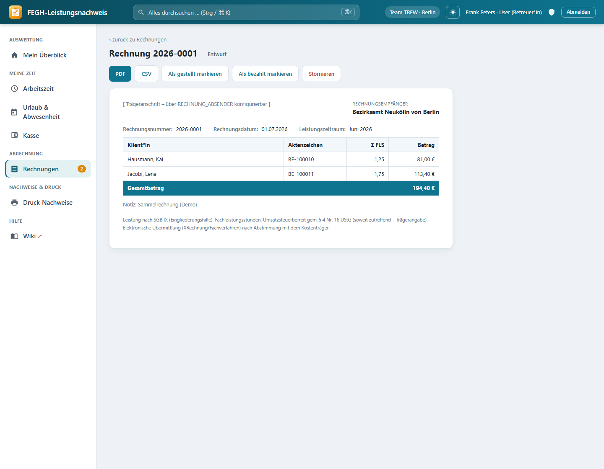

# FEGH-Leistungsnachweis

Web-App für **Leistungsnachweise und Abrechnung** in der **Berliner Eingliederungshilfe**
(Team **TBEW** – Therapeutisch Betreutes Einzelwohnen). Sie löst die bisherige Excel-Mappe
ab: mehrbenutzerfähig, rollenbasiert, mit team-genauer Datentrennung und einem durchgängigen
Ablauf von der Leistungserfassung über den Kalender bis zur Rechnung an den Kostenträger.

Fachliche Grundlage: Berlin ab 01.01.2026 (FLS = FS/WFS/BAO, kalkulatorische Leistungseinheit
kLE, Beschluss 3/2026). Bewilligte FLS = **AL + kLE pro Monat**.

> **Status: Prototyp mit FIKTIVEN Demodaten.** Keine echten Klientendaten – so entwickeln wir
> ohne Datenschutz-Risiko. Vor dem Einsatz mit echten (Art.-9-DSGVO-)Daten: Hosting in DE/EU,
> Freigabe durch Träger/Datenschutzbeauftragte, AVV, Revisionssicherheit, Backups, TLS.



## Funktionen

- **Rollen & Teams mit Datentrennung** – *User* (Betreuer\*in), *Leitung*, *Verwaltung*,
  *Administration* plus technischer Break-Glass-Zugang. DSGVO-Kern: jede\*r sieht nur das
  eigene bzw. geleitete Team; Administration und Verwaltung haben **keinen** Zugriff auf
  Klientenakten (die Verwaltung sieht für die Abrechnung ausschließlich Abrechnungsdaten).
- **Leistungsnachweis** – Erfassung je Klient\*in/Monat (FS, WFS, BAO, FUS, FZ, AL, KLE, FH),
  Teamsitzung und Gruppen-Anteile werden serverseitig berechnet.
- **Wochenkalender** – Team-Matrix mit **Drag & Drop**, Tages-Stundenraster (Zeit/Dauer per
  Ziehen), Monats-/Wochen-/Tagesansicht, wiederkehrende Serientermine (Supervision u. a.).
- **Fachleistungsstunden-Auswertung** – Ist vs. bewilligtes Kontingent, Auslastung je
  Woche/Monat/Jahr, Teamsitzung (Do ohne Berliner Feiertage) und Gruppen automatisch verteilt.
- **Abrechnung / Freigabe** – Freigabekette **Mitarbeiter\*in → Leitung → Verwaltung**;
  freigegebene Monatsnachweise werden zu **Sammelrechnungen** je Kostenträger gebündelt
  (fortlaufende Rechnungsnummer, PDF & CSV, Storno).
- **Arbeitszeit & Urlaub** – Selfservice-Erfassung, Leitungs-Freigaben, Stempeluhr (Verwaltung).
- **Kasse** – Kassenbuch mit Beleg-Nummern und monatlichem Zählprotokoll (Soll/Ist).
- **Druck-Nachweise als PDF** (WeasyPrint) – amtlicher Leistungsnachweis, Arbeitszeit, Kasse, Gruppe.
- **Globale Suche**, **Hell-/Dunkel-Modus**, **Zwei-Faktor (TOTP)**, **Audit-Trail**,
  **PostgreSQL Row-Level-Security** und ein **Wiki/Handbuch** (MkDocs Material).

## Im Bild

| Wochenkalender (Drag & Drop) | Fachleistungsstunden-Auswertung |
| :---: | :---: |
|  |  |
| **Abrechnung / Freigabe** | **Rechnung an den Kostenträger** |
|  |  |

## Rollen

| Rolle | Klient\*innen | Besonderes |
| --- | --- | --- |
| **User** (Betreuer\*in) | eigenes Team (Vertretung) | erfasst Leistungen, meldet Monat „fertig" |
| **Leitung** | geleitete + eigenes Team | Auswertung, Freigaben, Stammdaten, Kalender fürs Team |
| **Verwaltung** | *keine Akten* – nur Abrechnungsdaten | Rechnungen, Kasse (Finanz-Hub) |
| **Administration** | *keine* | Teams & Mitarbeiter-Verwaltung (keine Fachdaten) |

## Tech-Stack

- **Django 5.2** (Python) – Auth, Rollen, ORM, serverseitige Fachlogik
- **PostgreSQL** (Produktion, inkl. Row-Level-Security) / **SQLite** (lokal)
- **Docker + Caddy + gunicorn + WhiteNoise**, Container ohne Root
- **WeasyPrint** (PDF), **django-otp** (2FA), **django-axes** (Brute-Force-Schutz),
  **django-auditlog** (Änderungshistorie), **argon2** (Passwort-Hash)
- **MkDocs Material** – Wiki/Handbuch, via GitHub Actions nach GitHub Pages

## Lokal starten

```bash
python -m pip install -r requirements.txt
python manage.py migrate
python manage.py seed          # fiktive Demodaten anlegen
python manage.py runserver
```

Aufruf: http://127.0.0.1:8000/ · Demo-Logins (Passwort `demo12345`):

| Login | Rolle |
| --- | --- |
| `berger` | Leitung (TBEW + WG) |
| `neumann` | Betreuer\*in |
| `peters` | Verwaltung |
| `sander` | Administration |

## Datenschutz & Sicherheit

Die App ist auf **Art.-9-DSGVO-Daten** (Gesundheits-/Sozialdaten) ausgelegt: team-genaue
Zugriffstrennung, need-to-know für die Verwaltung, Audit-Trail, optional PostgreSQL
Row-Level-Security, 2FA (TOTP), Brute-Force-Schutz, Session-Timeout und TLS.
Vorlagen für die organisatorischen Pflichtdokumente (VVT, DSFA, Meldeprozess, AVV
Träger↔Betreiber, Rechtsgrundlage/Informationspflichten) liegen im **Wiki**.

## Wiki / Handbuch

Ausführliche Doku (Härtung, RLS, Backup/Restore, Deployment, Bedienung, Datenschutz):
**https://miri2577.github.io/FEGH-Leistungsnachweis/**

## Roadmap

- [x] Datenmodell, Fachleistungsstunden-Auswertung, Demodaten
- [x] Rollen & team-genaue Datentrennung (DSGVO), globale Suche
- [x] Erfassungs-Grid, Gruppennachweise, Wochenkalender mit Drag & Drop + Serienterminen
- [x] Arbeitszeit/Urlaub (Selfservice + Freigaben), Kasse mit Zählprotokoll
- [x] Amtliche Druck-Nachweise als PDF (WeasyPrint)
- [x] Abrechnung: Freigabe-Workflow (MA→Leitung→Verwaltung) + Rechnungen (PDF/CSV)
- [x] 2FA (TOTP), Audit-Trail, PostgreSQL Row-Level-Security, Docker-Deployment
- [ ] XRechnung/DTA-Export (Format nach Abstimmung mit dem Kostenträger)
- [ ] Harte Festschreibung der Leistungen nach Monatsfreigabe
