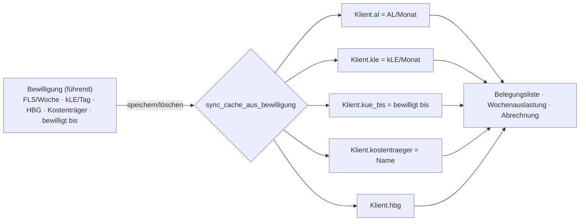

# Bewilligungen & Kontingent

Die **Bewilligung** ist in der App die *führende Kostenzusage* je Klient*in: Sie hält fest, **wer** (Kostenträger) **was** (Leistungstyp) in **welchem Zeitraum** und **welchem Kontingent** bewilligt hat. Aus ihr fließen die bewilligten Stunden automatisch in die Belegungsliste und in die Abrechnung. Diese Seite erklärt, wie du eine Bewilligung anlegst, fortschreibst, wie das Kontingent aus **FLS/Woche** und **kLE/Tag** entsteht, wie die App auslaufende oder fehlende Kostenzusagen überwacht und wie du die 12 Berliner Bezirke als Kostenträger anlegst.

!!! info "Wer darf Bewilligungen pflegen?"
    Der Reiter **Kostenzusage** (Bewilligungen) und die **Kostenträger-Verwaltung** sind **nur für die Leitung** sichtbar. Betreuer*innen sehen die Eckdaten der aktiven Bewilligung indirekt im Fallakten-Kopf und in den Stammdaten, pflegen sie aber nicht. Beide Ansichten sind **team-gescopt** – du bearbeitest nur Klient*innen deiner geleiteten Team(s). Admin- und Verwaltungs-Konten haben aus Datenschutzgründen keinen Klientenzugriff.

---

## Warum die Bewilligung führt

Früher standen die bewilligten Stunden als Freitext-/Cache-Felder direkt am Klienten (AL, kLE, KÜ bis, Kostenträger). Diese Felder gibt es weiterhin – aber **sobald eine aktive Bewilligung existiert, ist sie die einzige Quelle der Wahrheit**. Die App synchronisiert die alten Cache-Felder dann selbst aus der Bewilligung; das Klient-Formular überschreibt sie nicht mehr (keine Divergenz).

!!! tip "Faustregel"
    Solange es **keine** Bewilligung gibt, kannst du AL/kLE/HBG/KÜ noch direkt im Klient-Formular eintragen. Ab der **ersten** Bewilligung pflegst du das Kontingent nur noch hier – die Belegungsliste zieht automatisch nach.

Du erreichst die Bewilligungen über die **Fallakte → Reiter „Kostenzusage“** (oder aus der Belegungsliste heraus). Oben rechts liegt der Button **„Kostenträger verwalten“**.

---

## Eine Bewilligung anlegen

Unter der Bewilligungs-Tabelle liegt das Formular **„Neue Bewilligung“**. Es ist in zwei Abschnitte gegliedert: **Kostenzusage** (wer/was/wann) und **Kontingent** (die Bescheid-Einheiten).

### Abschnitt „Kostenzusage“

| Feld | Bedeutung |
|---|---|
| **Kostenträger** | Rechnungsempfänger – i. d. R. das zuständige Berliner Bezirksamt (siehe unten). Auswahl aus den **aktiven** Kostenträgern. |
| **Aktenzeichen** | Das Az. des Bescheids beim Kostenträger (Freitext). |
| **bewilligt ab / bewilligt bis** | Gültigkeitszeitraum der Kostenzusage. Beide Felder dürfen leer bleiben – „offen“ zählt dann als gültig. |
| **Leistungstyp** | Aktuell **„Fachleistungsstunden + kLE“** (Berliner BEW-Systematik). |
| **Leistungskatalog** | Optional. **Leer = klassisches Berliner BEW** (FLS + kLE). Gesetzt = ein Katalogeintrag bestimmt Einheit/Entgelt (Fundament für weitere Bereiche, z. B. Jugendhilfe-Tagessatz). |
| **Status** | **aktiv**, **abgelaufen** oder **storniert**. Neue Bewilligungen sind standardmäßig *aktiv*. |

### Abschnitt „Kontingent (Bescheid-Einheiten)“

Die App speichert das Kontingent in den **Einheiten, die auch im Bescheid stehen** – nicht in Monatswerten. Die Monatswerte werden daraus abgeleitet.

| Feld | Bedeutung |
|---|---|
| **HBG (1–12)** | Hilfebedarfsgruppe. Über **„aus HBG übernehmen“** füllst du FLS/Woche und kLE/Tag aus der hinterlegten HBG-Tabelle der Team-Parameter vor. |
| **FLS/Woche (bewilligt)** | Bewilligte Fachleistungsstunden pro **Woche** – die native Bescheid-Einheit. |
| **kLE/Tag** | Kalkulatorische Leistungseinheit pro **Kalendertag** (einheitlich, HBG-unabhängig). |
| **Kommentar** | Freitext-Notiz. |

!!! tip "HBG-Vorbelegung"
    Trägst du eine **HBG** ein und sind FLS/Woche und kLE/Tag noch leer (oder 0), übernimmt die App die Werte automatisch aus der HBG-Tabelle des laufenden Jahres. Der Bescheid der/des einzelnen Klient*in **darf abweichen** – du kannst die vorbelegten Werte jederzeit überschreiben. Der Button **„aus HBG übernehmen“** setzt sie auf Wunsch erneut.

### Monatswerte werden abgeleitet

Aus den Bescheid-Einheiten rechnet die App die Monatswerte, die Belegungsliste und Abrechnung erwarten:

!!! abstract "Umrechnung Bescheid → Monat"
    ```
    AL/Monat  = FLS/Woche × 4,34821   (365,25 ÷ 7 ÷ 12 Wochen je Monat)
    kLE/Monat = kLE/Tag   × 30,4375   (365,25 ÷ 12 Kalendertage je Monat)
    FLS gesamt/Monat = AL/Monat + kLE/Monat
    ```
    Die Spalte **„≈ FLS/Monat“** in der Tabelle zeigt genau diese abgeleitete Summe. Rundung kaufmännisch auf 3 Nachkommastellen.

---

## Die Bewilligungs-Tabelle

Die Tabelle listet alle Bewilligungen der/des Klient*in. Die **aktive** Bewilligung ist grün hinterlegt; oben im Panel steht ihr Gültigkeitszeitraum bzw. der Warnhinweis **„keine aktive Bewilligung“**.

| Spalte | Inhalt |
|---|---|
| **Status** | Badge *aktiv* (grün), *abgelaufen* (gelb) oder *storniert* (rot). Ein **↩** kennzeichnet eine Fortschreibung (hat einen Vorgänger). |
| **Kostenträger** | Name des Rechnungsempfängers. |
| **Aktenzeichen** | Az. des Bescheids. |
| **Zeitraum** | bewilligt ab – bis (leer = „offen“). |
| **FLS/Wo** | bewilligte Fachleistungsstunden pro Woche. |
| **kLE/Tag** | kalkulatorische Leistungseinheit pro Tag. |
| **≈ FLS/Monat** | abgeleitete Monatssumme (AL/Monat + kLE/Monat). |
| (Aktionen) | **Bearbeiten**, **Fortschreiben**, **Löschen (✕)**. |

!!! note "Welche Bewilligung ist „aktiv“?"
    Als aktiv gilt die Bewilligung mit **Status *aktiv***, deren Zeitraum den heutigen Tag umfasst (offener Beginn/offenes Ende zählen als gültig). Gibt es mehrere, gewinnt die mit dem **jüngsten „bewilligt ab“**. Genau diese Bewilligung speist Belegungsliste, Wochenauslastung und Abrechnung.

---

## Fortschreibungskette (Änderungsbescheide)

Bewilligungen werden regelmäßig fortgeschrieben – die alte Kostenzusage endet, eine neue schließt an. Dafür gibt es den Button **„Fortschreiben“**.

1. Klick auf **„Fortschreiben“** an der bestehenden Bewilligung.
2. Das Formular öffnet als **„Fortschreibung (neue Fassung)“** und ist aus der Vorgänger-Bewilligung vorbefüllt. Der Vorgänger wird automatisch als `vorgaenger` verknüpft (die Kette).
3. Passe Zeitraum und Kontingent an den neuen Bescheid an und speichere.
4. Setze die **alte** Bewilligung anschließend auf Status **„abgelaufen“**, damit nur die neue Fassung aktiv ist.

!!! warning "Zwei aktive Bewilligungen vermeiden"
    Lässt du die Vorgänger-Fassung fälschlich auf *aktiv* mit offenem Ende, überlappen sich die Zeiträume. Die App wählt dann die mit dem jüngsten „bewilligt ab“ – setze den Vorgänger sicherheitshalber immer auf **abgelaufen**. Der Hinweis dazu steht auch direkt im Formular.

Die `↩`-Markierung in der Statusspalte macht Fortschreibungen sichtbar; die `vorgaenger`-Verknüpfung bildet die vollständige **Fortschreibungskette** eines Falls ab.

---

## Kontingent- & Fristenüberwachung

Die App überwacht laufend, ob für jede*n Klient*in in Betreuung eine **rechtssichere, nicht ablaufende Kostenzusage** vorliegt. Das passiert an zwei Stellen:

**In der Belegungsliste und im Fallakten-Kopf** erscheinen Aufmerksamkeits-Badges (nur bei Status *Betreuung*):

| Badge | Farbe | Bedeutung |
|---|---|---|
| **keine Bewilligung** | rot | Keine aktive Bewilligung – die Kostenzusage für die Abrechnung fehlt. |
| **Bewilligung abgelaufen** | rot | Die aktive Bewilligung liegt hinter ihrem „bewilligt bis“. |
| **Bewilligung endet in N T** | gelb | Sie läuft in **70 Tagen oder weniger** aus (N = Resttage). |

**In der Fristenübersicht** (Kontingent-/Fristenüberwachung für die Leitung) werden genau die kritischen Fälle gesammelt:

- Klient*innen **in Betreuung**, deren aktive Bewilligung in **≤ 70 Tagen** ausläuft, **oder**
- die **keine** aktive Bewilligung haben (dann fehlt die Kostenzusage komplett).

Sortiert werden sie **fehlende zuerst**, danach nach Restlaufzeit aufsteigend – das Dringendste steht oben.

!!! note "Warum 70 Tage / 10 Wochen?"
    Der Vorlauf gibt der Leitung Zeit, die **Fortschreibung** der Kostenzusage rechtzeitig auf den Weg zu bringen, bevor die Frist verstreicht. Dieselbe 70-Tage-Schwelle gilt auch für die Berichtsfrist (Entwicklungsbericht vor KÜ-Ende).

!!! danger "Ohne aktive Bewilligung keine saubere Abrechnung"
    Fehlt die aktive Kostenzusage, fehlt die rechtliche Grundlage für die Rechnung an den Kostenträger. Die roten Badges sind deshalb ein echtes Stopp-Signal – hier zuerst handeln.

---

## Kostenträger: die 12 Berliner Bezirke

In Berlin sind die **Bezirksämter** (Ämter für Soziales / Teilhabefachdienste) die örtlichen Träger der Eingliederungshilfe. Für das ambulant betreute Wohnen rechnest du gegen den **zuständigen Bezirk** ab. Die App kennt die 12 amtlichen Bezirke und legt sie auf Knopfdruck als Kostenträger an.

In der **Kostenträger-Verwaltung** gibt es dafür die Aktion **„Berliner Bezirke anlegen“**. Sie ist **idempotent**: bereits vorhandene Bezirke bleiben unangetastet, nur fehlende werden ergänzt (Rückmeldung „N/12 vorhanden“). Angelegt werden sie als „Bezirksamt … von Berlin“:

| # | Bezirk | # | Bezirk |
|---|---|---|---|
| 1 | Mitte | 7 | Tempelhof-Schöneberg |
| 2 | Friedrichshain-Kreuzberg | 8 | Neukölln |
| 3 | Pankow | 9 | Treptow-Köpenick |
| 4 | Charlottenburg-Wilmersdorf | 10 | Marzahn-Hellersdorf |
| 5 | Spandau | 11 | Lichtenberg |
| 6 | Steglitz-Zehlendorf | 12 | Reinickendorf |

Je Kostenträger pflegst du außerdem:

| Feld | Bedeutung |
|---|---|
| **Typ** | *Bezirksamt*, *überörtlicher Träger*, *Selbstzahler* oder *Sonstige*. |
| **Amt / Fachbereich** | z. B. „Amt für Soziales – Eingliederungshilfe / Teilhabefachdienst“. |
| **Anschrift · Ansprechpartner** | für die Rechnungsstellung. |
| **Leitweg-ID (XRechnung)** | für die E-Rechnung – je Bezirk mit dem echten Wert zu ergänzen. |
| **DATEV Debitorenkonto** | für den Buchungsstapel-Export (max. 9 Stellen). |
| **Zahlungsziel (Tage)** | Standard 30 – Basis für Fälligkeit/Mahnwesen. |
| **aktiv** | Nur aktive Kostenträger stehen im Bewilligungs-Formular zur Auswahl. |

!!! warning "Leitweg-IDs nachtragen"
    Die Bezirke werden **ohne** Leitweg-ID angelegt. Für gültige XRechnungen musst du je Bezirk die echte Leitweg-ID aus der Rechnungsstellung nachpflegen.

---

## Sync in die Belegungsliste

Sobald du eine Bewilligung speicherst oder löschst, gleicht die App die **Cache-Felder am Klienten** automatisch aus der aktiven Bewilligung ab – ohne dass du irgendwo doppelt eintragen musst:



So bleiben Belegungsliste, Wochenauslastung und Abrechnung unverändert lesbar (sie lesen weiter `al`/`kle`/`kue_bis`), obwohl die Bewilligung jetzt die führende Quelle ist.

!!! note "Verwandte Seiten"
    - [Fachleistungsstunden (FLS) & kLE](../fachliches/fls-kle.md) – wie AL + kLE das Monatskontingent und die Auslastung ergeben
    - [Fallakte & Belegungsliste](../anleitung/fallakte.md) – die Reiter der Fallakte und die Status-Badges
    - [Berichtsfristen (KÜ-Ende)](../fachliches/berichtsfristen.md) – der Entwicklungsbericht im selben 70-Tage-Vorlauf

---

## Datenschutz-Hinweise

!!! warning "Team-Scoping & Datensparsamkeit (Art. 9 DSGVO)"
    Bewilligungen enthalten personenbeziehbare Sozialdaten. Der Zugriff ist konsequent **team-gescopt** und zusätzlich auf die **Leitung** beschränkt; Admin und Verwaltung sind ausgeschlossen. In der Versionshistorie der Bewilligung sind **Aktenzeichen und Kommentar bewusst ausgenommen** (personenbeziehbar, Löschkonzept) – trage dort nur das fachlich Erforderliche ein.

---

## Für Neugierige: Technik dahinter

!!! note "Nur zur Nachvollziehbarkeit"
    Dieser Abschnitt richtet sich an alle, die verstehen (oder nachbauen) möchten, wie die Bewilligungen technisch aufgebaut sind. Für die tägliche Bedienung ist er nicht nötig.

- **View:** `nachweis/views_stammdaten.py` → `bewilligungen(request, pk)` – holt die Person mit `get_object_or_404(services.klienten_fuer(request.user), pk=pk)` (team-gescopt, zusätzlich `_nur_leitung`), lädt `klient.bewilligungen.select_related("kostentraeger")`, reicht `aktive = klient.aktive_bewilligung()`, die HBG-Vorschläge als `hbg_json` (`services.hbg_tabelle`, `kle_je_tag`) sowie `bearbeiten`/`fortschreibung` (aus `?edit=` / `?fort=`) ans Template.
- **Speichern/Löschen:** `bewilligung_speichern` und `bewilligung_loeschen` (beide `@require_POST`, `@login_required`, `_nur_leitung`). `bewilligung_speichern` mappt die POST-Felder (`kostentraeger`, `aktenzeichen`, `leistungstyp`, `katalog`, `gueltig_von/bis`, `fls_woche`, `kle_tag`, `hbg`, `status`, `vorgaenger`, `kommentar`) und ruft `b.save()`, das den Klient-Cache automatisch nachzieht.
- **Model `Bewilligung`** (`nachweis/models.py`): Felder `klient` (FK), `kostentraeger` (FK, `on_delete=PROTECT`), `aktenzeichen`, `leistungstyp` (`Leistungstyp.FLS_KLE`), `katalog` (optional), `gueltig_von`/`gueltig_bis`, `fls_woche`, `kle_tag`, `hbg`, `status` (`BewilligungStatus.AKTIV|ABGELAUFEN|STORNIERT`), `vorgaenger` (self-FK → `nachfolger`, die Fortschreibungskette). Properties `al_monat` (`× WOCHEN_JE_MONAT`), `kle_monat` (`× TAGE_JE_MONAT`), `fls_gesamt_monat`, `ist_gueltig_heute`. `save()`/`delete()` rufen `klient.sync_cache_aus_bewilligung()`. History via `HistoricalRecords(excluded_fields=["aktenzeichen", "kommentar"])`.
- **Konstanten** (`nachweis/models.py` / `services_senatstool.py`): `WOCHEN_JE_MONAT = 365,25 ÷ 7 ÷ 12 = 4,34821`, `TAGE_JE_MONAT = 365,25 ÷ 12 = 30,4375`.
- **Aktive Bewilligung & Cache:** `Klient.aktive_bewilligung(stichtag)` filtert `status=AKTIV` und den Zeitraum (offener Beginn/Ende inklusiv), sortiert `-gueltig_von`. `Klient.sync_cache_aus_bewilligung()` schreibt `al`/`kle`/`kue_bis`/`kostentraeger`/`hbg` per `.update()` (abgeleiteter Cache, kein Auditlog).
- **Fristenüberwachung:** `nachweis/services.py` → `bewilligung_fristen(klienten, stichtag, vorlauf_tage=70)` – nur `Status.BETREUUNG`; liefert `{klient, bewilligung, gueltig_bis, tage_bis, fehlt}`, „fehlt“ zuerst, dann nach Restlaufzeit. Verwandt: `klient_hinweise` erzeugt die Badges *keine Bewilligung*/*Bewilligung abgelaufen* (`art="bad"`) und *Bewilligung endet in N T* bei `tage <= 70` (`art="warn"`).
- **Kostenträger:** Model `Kostentraeger` (`typ` = `KostentraegerTyp.BEZIRKSAMT|UEBEROERTLICH|SELBSTZAHLER|SONSTIGE`, `amt`, `adresse`, `ansprechpartner`, `leitweg_id`, `debitorenkonto`, `zahlungsziel_tage`, `aktiv`). Views `kostentraeger_liste`/`kostentraeger_speichern`/`kostentraeger_bezirke`. Die 12 Bezirke: `nachweis/berlin.py` → `BERLINER_BEZIRKE`, `bezirk_name()`, `ensure_berliner_bezirke()` (idempotent, `get_or_create`).
- **Template:** `nachweis/templates/nachweis/bewilligungen.html` – bindet `_fallakte_kopf.html` mit `fa_tab="kostenzusage"`, zeigt die Grid-Tabelle (`.st`-Status-Badges, `.ist-aktiv`, Spalte `fls_gesamt_monat`), das Formular mit Abschnitten *Kostenzusage*/*Kontingent* und das JS zur HBG-Übernahme (`hbg_json`, füllt nur leere `#b-fls`/`#b-kle`).
- **URL-Namen** (`nachweis/urls.py`): `nachweis:bewilligungen`, `nachweis:bewilligung_speichern`, `nachweis:bewilligung_loeschen`, `nachweis:kostentraeger_liste`, `nachweis:kostentraeger_speichern`, `nachweis:kostentraeger_bezirke`.
