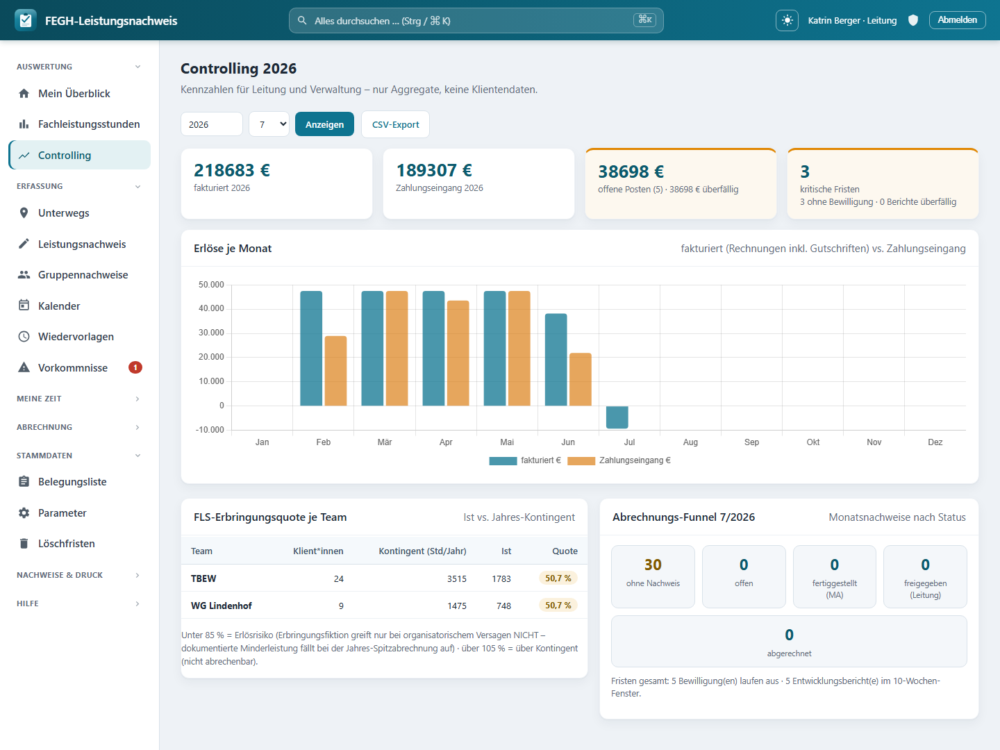

# Controlling & DATEV-Export

*Controlling: Erlöse je Monat (fakturiert vs. Zahlungseingang), FLS-Erbringungsquote je Team, Abrechnungs-Funnel.*

Leitung und Verwaltung brauchen den Überblick über das Geld, aber ausdrücklich **ohne** in die Fallakten zu schauen. Genau dafür gibt es das **Controlling**: ein Kennzahlen-Cockpit, das nur mit **Aggregaten** arbeitet – Erlöse je Monat, Stand der offenen Posten, FLS-Erbringungsquote je Team (mit Ampel), der Abrechnungs-Funnel des Monats und die kritischen Fristen. Kein einziger Klientenname, kein Betrag pro Person, keine Dokumentation. Diese Seite erklärt, was du im Cockpit siehst, wie du die Zahlen als CSV herausziehst und wie aus den gestellten Rechnungen ein **DATEV-Buchungsstapel (EXTF-700)** für das Steuerbüro wird.

!!! warning "Nur Aggregate – kein Klientenbezug"
    Das Controlling ist bewusst so gebaut, dass es **keine personenbezogenen Einzeldaten** anzeigt. Wo eine Zahl aus einzelnen Klient*innen entsteht (z. B. die Erbringungsquote eines Teams), wird **sofort summiert** und nur der aggregierte Wert an die Seite gegeben. So dürfen Leitung *und* Verwaltung dieselbe Seite sehen: Die Verwaltung bekommt die Geld-Sicht, ohne die für sie ohnehin gesperrte Tätigkeits-Dokumentation (Art-9-Gesundheitsdaten) zu berühren.

---

## Wer darf das Controlling sehen?

Der Zugang ist auf zwei App-Rollen beschränkt. Wer beide nicht hat, wird auf die Startseite umgeleitet.

| Rolle | Zugriff aufs Controlling | Was sie zusätzlich sieht |
|-------|--------------------------|--------------------------|
| **Leitung** | ja | die volle Geld-Sicht (Erlöse, offene Posten) plus die Team-/Fristen-Kennzahlen |
| **Verwaltung** | ja | dieselben Aggregate – weiterhin **ohne** Klientendokumentation |
| **User (Betreuer\*in)** | nein | – |
| **Administration** | nein | – (Admin hat grundsätzlich keinen Klienten-/Geld-Bezug) |

!!! note "Datensparsamkeit ist im Code erzwungen"
    Die Zugangsprüfung (`_darf_controlling`) lässt nur `services.ist_leitung` **oder** `services.ist_verwaltung` durch. Die Seite baut ihre Werte nie aus einzelnen sichtbaren Klient*innen zusammen, sondern aggregiert intern und übergibt ans Template ausschließlich Summen und Quoten.

---

## Das Cockpit im Überblick

Du erreichst das Cockpit über **Controlling** in der Navigation. Oben stellst du den Auswertungszeitraum ein:

| Filter | Bedeutung | Vorbelegung |
|--------|-----------|-------------|
| **Jahr** | Bezugsjahr für Erlöse, Team-Quoten und Funnel | laufendes Jahr |
| **Monat** | betrifft **nur** den Abrechnungs-Funnel (auf 1–12 begrenzt) | laufender Monat |

Darunter liegen vier Kennzahl-Kacheln (KPIs) und die einzelnen Panels. Die Kacheln fassen das Jahr zusammen:

| Kachel | Inhalt | Ampel |
|--------|--------|-------|
| **fakturiert** | Summe aller fakturierten Beträge des Jahres | – |
| **Zahlungseingang** | Summe aller gebuchten Zahlungen des Jahres | – |
| **offene Posten** | offener Gesamtbetrag, Anzahl offener Rechnungen, überfälliger Anteil | orange, sobald etwas überfällig ist |
| **kritische Fristen** | fehlende Bewilligungen + überfällige Berichte | orange, sobald es einen kritischen Fall gibt |

---

## Erlöse je Monat

Das Balkendiagramm stellt für jeden Monat des gewählten Jahres zwei Werte gegenüber:

| Reihe | Woraus sie entsteht |
|-------|---------------------|
| **fakturiert** | Rechnungen mit Status *gestellt* oder *bezahlt*, verbucht nach **Rechnungsdatum** (Gutschriften wirken über ihren negativen Betrag saldierend) |
| **Zahlungseingang** | tatsächlich gebuchte Zahlungen, verbucht nach **Zahldatum** |

!!! tip "Fakturiert ist nicht gleich Zahlungseingang"
    Weil die eine Reihe nach Rechnungsdatum und die andere nach Zahldatum läuft, klaffen die Balken je Monat auseinander – das ist gewollt. Der Abstand zwischen „fakturiert" und „Zahlungseingang" ist genau das Geld, das noch als **offener Posten** aussteht.

---

## Offene-Posten-Stand

Die KPI-Kachel *offene Posten* verdichtet den kompletten OP-Stand:

| Wert | Bedeutung |
|------|-----------|
| **Summe** | offener Gesamtbetrag über alle gestellten, noch nicht (voll) bezahlten Rechnungen |
| **Anzahl** | wie viele Rechnungen einen Restbetrag > 0 haben |
| **überfällig** | Betrag der Rechnungen, deren Fälligkeit überschritten ist |
| **n überfällig** | Anzahl dieser überfälligen Rechnungen |

Sobald etwas überfällig ist, färbt sich die Kachel orange. Für die eigentliche Bearbeitung (Mahnen, Zahlungen buchen) wechselst du in die **Offene-Posten-Liste** der Verwaltung – das Controlling zeigt hier nur den Stand.

---

## FLS-Erbringungsquote je Team (Ampel)

Diese Tabelle vergleicht je Betreuungs-Team das **Ist** an Fachleistungsstunden mit dem **Jahres-Kontingent** aus den Bescheiden. Verwaltungs-Teams sind ausgenommen; Teams ohne Klient\*innen erscheinen nicht.

| Spalte | Inhalt |
|--------|--------|
| **Team** | Name des Betreuungs-Teams |
| **Klient\*innen** | Anzahl zugeordneter Klient\*innen (nur die Zahl) |
| **Kontingent (Std/Jahr)** | bewilligtes Jahres-Kontingent des Teams |
| **Ist** | tatsächlich erbrachte Fachleistungsstunden |
| **Quote** | Ist ÷ Kontingent × 100, farbig als Ampel |

Die Ampel-Logik:

| Quote | Ampel | Lesart |
|-------|-------|--------|
| **≥ 85 % und ≤ 105 %** | grün | im Zielkorridor |
| **< 85 %** | orange | **Erlösrisiko** – dokumentierte Minderleistung fällt bei der Jahres-Spitzabrechnung auf |
| **> 105 %** | rot | über Kontingent – der Überhang ist **nicht abrechenbar** |

!!! warning "Unter 85 % ist ein Erlösrisiko"
    Die Erbringungsfiktion greift nur, wenn eine Leistung **nicht** durch organisatorisches Versagen ausfällt. Dokumentierte Minderleistung fällt bei der Jahres-Spitzabrechnung auf – eine dauerhaft orange Quote ist also ein früher Hinweis, gegenzusteuern.

---

## Abrechnungs-Funnel

Der Funnel zeigt für den **gewählten Monat**, in welchem Freigabe-Status die Monatsnachweise stehen – als Trichter von „noch gar nichts" bis „abgerechnet".

| Stufe | Bedeutung |
|-------|-----------|
| **ohne Nachweis** | Klient\*innen in Betreuung, für die es diesen Monat noch keinen Monatsnachweis gibt (orange hervorgehoben) |
| **offen** | Nachweis existiert, wird noch bearbeitet |
| **fertiggestellt (MA)** | von der/dem Mitarbeiter\*in eingereicht |
| **freigegeben (Leitung)** | fachlich freigegeben, bereit zur Abrechnung |
| **abgerechnet** | Position einer Rechnung |

So siehst du auf einen Blick, ob der Monat abrechnungsreif ist oder wo noch etwas hängt. Unter dem Funnel steht zusätzlich die Fristen-Zeile: wie viele Bewilligungen auslaufen und wie viele Entwicklungsberichte im 10-Wochen-Fenster fällig sind.

!!! note "„ohne Nachweis" nie negativ"
    Die Stufe *ohne Nachweis* rechnet sich aus „Klient\*innen in Betreuung minus vorhandene Nachweise" und wird nie unter 0 gedrückt. Bleibt sie über 0, fehlt für diese Fälle noch die Monatsdokumentation.

---

## Fristen-Compliance

Die Fristen-Kennzahlen fassen zwei Compliance-Themen zusammen, die für die Abrechnung geschäftskritisch sind:

| Wert | Bedeutung |
|------|-----------|
| **ohne Bewilligung** | Klient\*innen in Betreuung ohne aktive Bewilligung – ohne rechtssichere Kostenzusage ist die Leistung nicht abrechenbar |
| **Bewilligungen auslaufend** | aktive Bewilligungen, die im Vorlauf-Fenster (Standard 70 Tage) enden |
| **Berichte überfällig** | Entwicklungsberichte, deren Fälligkeitsdatum überschritten und die noch nicht versendet sind |
| **Berichte fällig** | Entwicklungsberichte im 10-Wochen-Fenster vor dem KÜ-Ende |

Fehlende Bewilligungen und überfällige Berichte fließen in die orange **„kritische Fristen"**-Kachel oben.

---

## CSV-Export der Monats-Kennzahlen

Mit **CSV-Export** ziehst du die Erlös-Kennzahlen des gewählten Jahres als Tabelle heraus – für Träger, Steuerberatung oder eigene Auswertungen.

| Eigenschaft | Wert |
|-------------|------|
| **Dateiname** | `Controlling_<Jahr>.csv` |
| **Trennzeichen** | Semikolon |
| **Kodierung** | UTF-8 mit BOM (LibreOffice/Excel-freundlich) |
| **Spalten** | `Monat`, `Fakturiert_EUR`, `Zahlungseingang_EUR` |
| **Zeilen** | 12 Monatszeilen (`MM.JJJJ`) plus eine `SUMME`-Zeile |

!!! note "Nur Erlöse, keine Klientendaten"
    Der CSV-Export enthält bewusst nur die zwei Erlös-Reihen je Monat. Offene Posten, Team-Quoten und Funnel bleiben als Live-Ansicht im Cockpit – die Datei ist damit unbedenklich weiterzugeben.

---

## DATEV-Buchungsstapel (EXTF-700)

Für die Buchhaltung erzeugt die App aus den Ausgangsrechnungen eines Zeitraums einen **DATEV-Buchungsstapel im EXTF-Format (Version 700, Kategorie 21 „Buchungsstapel")**. Gebucht wird die **Sollstellung**: Debitor (Kostenträger) an Erlöskonto. Gutschriften kommen mit umgekehrtem Soll/Haben-Kennzeichen (Haben auf den Debitor).

Du wählst einen **Von–Bis-Zeitraum**; exportiert werden alle Rechnungen mit Status *gestellt* oder *bezahlt*, deren Rechnungsdatum im Zeitraum liegt.

| Eigenschaft | Wert |
|-------------|------|
| **Format** | DATEV EXTF, Version 700, Kategorie 21 (Buchungsstapel) |
| **Dateiname** | `EXTF_Buchungsstapel_<von>-<bis>.csv` |
| **Kodierung** | **cp1252** (Windows-1252) – das von DATEV erwartete Format |
| **Wirtschaftsjahr-Beginn** | 1. Januar des Von-Jahres |
| **Belegdatum** | Rechnungsdatum als `TTMM` |
| **Belegfeld 1** | Rechnungsnummer (max. 36 Zeichen) |
| **Buchungstext** | „Rechnung"/„Gutschrift" + Nummer + Zeitraum (max. 60 Zeichen) |
| **Nicht enthalten** | Zahlungseingänge – die bucht das Steuerbüro über den Kontoauszug |

Die benötigten Konten kommen aus den **Stammdaten**, nicht aus dem Code:

| Konto | Herkunft |
|-------|----------|
| **Debitorenkonto** (je Rechnung) | am **Kostenträger** hinterlegt (`Kostentraeger.debitorenkonto`, DATEV-Debitor) |
| **Erlöskonto** (Gegenkonto) | am **Rechnungssteller** hinterlegt (`Rechnungssteller.datev_erloeskonto`) |
| **Berater-/Mandanten-Nr.** | am Rechnungssteller (`datev_berater`, `datev_mandant`, in die EXTF-Kopfzeile) |

!!! warning "Ohne Konten kein Export"
    Fehlt bei einem der einbezogenen Kostenträger das **Debitorenkonto**, bricht der Export mit einer Fehlermeldung ab und nennt die betroffenen Rechnungsnummern. Fehlt das **Erlöskonto** am Rechnungssteller, wirst du direkt auf die Rechnungssteller-Stammdaten geleitet. Ergänze die Konten (Werte vom Steuerbüro) und starte den Export erneut.

!!! danger "Vor dem ersten Echt-Import mit dem Steuerbüro testen"
    Der Buchungsstapel bildet die Sollstellung ab, wie sie hier verstanden wird. Konkrete Konten, Buchungslogik und Steuerschlüssel legt aber das Steuerbüro fest. **Importiere die Datei zuerst als Test**, gleiche das Ergebnis mit dem Steuerbüro ab und stelle den Echtbetrieb erst danach um.

---

## Für Neugierige: Technik dahinter

!!! note "Nur zur Nachvollziehbarkeit"
    Dieser Abschnitt richtet sich an alle, die verstehen (oder nachbauen) möchten, wie das Controlling und der DATEV-Export technisch aufgebaut sind. Für die tägliche Bedienung ist er nicht nötig.

- **Controlling-View:** `nachweis/views_controlling.py` → `controlling` (`@login_required`) prüft `_darf_controlling` (= `services.ist_leitung` **oder** `services.ist_verwaltung`), sonst Redirect auf `nachweis:start`. Übergibt ans Template ausschließlich Aggregate: `chart` (Labels + `fakturiert`/`eingang` je Monat), `summe_fakturiert`, `summe_eingang`, `op`, `teams`, `funnel`, `fristen`.
- **Aggregat-Helfer (alle in `views_controlling.py`):** `_erloese_je_monat(jahr)` summiert fakturierte Rechnungen (`Rechnungsstatus.GESTELLT`/`BEZAHLT`, nach `datum.month`) und Zahlungen (`Zahlung`, nach `datum.month`) in 13er-Listen; `_op_stand()` über `Rechnung.offener_betrag` und `Rechnung.tage_ueberfaellig`; `_team_quoten(jahr)` iteriert `Team.objects.exclude(typ=Teamtyp.VERWALTUNG)` und ruft je Team `services.fachleistungsstunden(jahr, klienten=…)` (nur die aggregierte `summe`, nicht die Einzelzeilen); `_freigabe_funnel(jahr, monat)` zählt `Monatsfreigabe` je `Freigabestatus.choices` plus „ohne Nachweis" gegen `Klient.objects.filter(status=Status.BETREUUNG)`; `_fristen_stand()` über `services.bewilligung_fristen`, `services.berichte_faellig` und überfällige `Bericht`.
- **CSV-Export:** `views_controlling.py` → `controlling_csv` (`@login_required`, gleiche Rechteprüfung), `HttpResponse` mit `text/csv; charset=utf-8-sig`, Semikolon-Trenner, Spalten `Monat`/`Fakturiert_EUR`/`Zahlungseingang_EUR` und `SUMME`-Zeile; Dateiname `Controlling_{jahr}.csv`.
- **Template:** `nachweis/templates/nachweis/controlling.html` – KPI-Kacheln (`.kpi`, orange bei `op.n_ueberfaellig` bzw. kritischen Fristen), Balkendiagramm (Chart.js, lokal via `static 'nachweis/vendor/chartjs/chart.umd.min.js'`, `chart|json_script:"ctr-data"`), Team-Tabelle mit Quote-Badge (`b-bad` > 105 %, `b-ok` ≥ 85 %, sonst `b-warn`) und Funnel-Steps.
- **DATEV-Export:** `nachweis/views_abrechnung.py` → `datev_export` (`@login_required`, `services.darf_abrechnen`). Lädt `Rechnungssteller.load()`, filtert `Rechnung` nach `datum__gte/lte` und `status in [GESTELLT, BEZAHLT]`, `select_related("kostentraeger")`. Baut die EXTF-700-Kopfzeile (Kategorie 21, WJ-Beginn 1. Januar, Berater-/Mandanten-Nr.) und Buchungszeilen von Hand (kein `csv.writer`, DATEV-Quotes selbst gesetzt); Soll/Haben-Kennzeichen `S`/`H` je Vorzeichen des Betrags (`Rechnungstyp.GUTSCHRIFT` → Haben). Antwort `text/csv; charset=cp1252`, Zeilen mit `\r\n`.
- **Guards im DATEV-Export:** fehlendes `kostentraeger.debitorenkonto` → Fehlermeldung mit Rechnungsnummern, Redirect `nachweis:rechnungen`; fehlendes `s.datev_erloeskonto` → Redirect `nachweis:rechnungssteller`. Zahlungen werden bewusst **nicht** exportiert (Kontoauszug beim Steuerbüro).
- **Stammdaten-Modelle:** `nachweis/models.py` → `Kostentraeger.debitorenkonto` (DATEV-Debitor, max. 9 Zeichen) und `Rechnungssteller` (Singleton, `load()`) mit `datev_berater`, `datev_mandant`, `datev_erloeskonto` (Werte vom Steuerbüro). Weitere: `Freigabestatus`, `Rechnung`/`Rechnungsstatus`/`Rechnungstyp`, `Zahlung`, `Monatsfreigabe`, `Bericht`/`BerichtsStatus`, `Team`/`Teamtyp`, `Klient`/`Status`.
- **URLs:** `nachweis/urls.py` → `nachweis:controlling` (`controlling/`), `nachweis:controlling_csv` (`controlling/csv/`), `nachweis:datev_export` (`datev/`).
- **Scoping/Rollen:** `services.ist_leitung`, `services.ist_verwaltung`, `services.darf_abrechnen`. Das Cockpit aggregiert intern und gibt nie ein Klient-Objekt an die Seite – strukturelle Art-9-Datensparsamkeit, dieselbe Linie wie in der übrigen Verwaltungs-/Abrechnungsansicht.

!!! note "Verwandte Seiten"
    - [Abrechnung, Rechnungen & XRechnung](rechnungen.md)
    - [Mahnwesen & offene Posten](mahnwesen.md)
    - [Fachleistungsstunden (FLS) & kLE](../fachliches/fls-kle.md)
    - [Datenschutz](../sicherheit/datenschutz.md)
