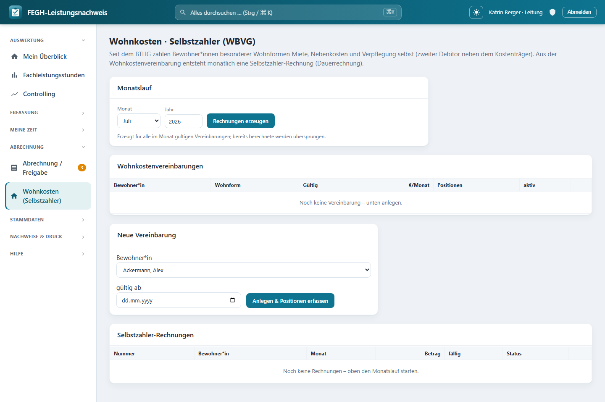

# Wohnkosten / Selbstzahler (WBVG)

*Wohnkosten-/Selbstzahler-Abrechnung nach dem WBVG.*

Seit dem BTHG zahlen Bewohner*innen besonderer Wohnformen ihre Miete, Nebenkosten und Verpflegung selbst – sie sind neben dem Kostenträger der **zweite Debitor**. Damit du diese wiederkehrenden Beträge nicht jeden Monat von Hand tippst, hinterlegst du je Bewohner*in einmal eine **Wohnkostenvereinbarung** nach WBVG mit ihren Monatspositionen (Grundmiete, Verpflegung …). Der **Monatslauf** macht daraus per Knopfdruck für den gewählten Monat je eine **Selbstzahler-Rechnung** mit eigenem Nummernkreis (`WK-JAHR-NNNN`), aus der du PDF druckst und die du als bezahlt markierst oder stornierst. Diese Seite erklärt den kompletten Ablauf und wer was darf.

!!! note "Zweiter Debitor – getrennt vom Kostenträger"
    Die Selbstzahler-Rechnung hat mit den Kostenträger-Sammelrechnungen (Abrechnung → Rechnungen) nichts zu tun: **eigener Nummernkreis** (`WK-…` statt der normalen Rechnungsnummer), eigenes Modell, eigene Liste. Es ist der Anteil, den die Bewohner*in privat trägt, nicht die Fachleistung des Kostenträgers.

---

## Wer darf Wohnkosten pflegen?

Wohnkosten sind eine Finanzfunktion. Zugriff haben genau zwei Rollen:

| Rolle | Sieht / bearbeitet | Grundlage |
|-------|--------------------|-----------|
| **Leitung** | nur Bewohner*innen und Wohnform-Angebote des **eigenen Teams** | `services.ist_leitung` |
| **Verwaltung / Break-Glass** | **alle** Bewohner*innen (wie bei den Kostenträger-Rechnungen) | `services.darf_abrechnen` |

Mitarbeiter*innen ohne Leitungs- oder Abrechnungsrecht haben keinen Zugriff; jede View im Modul weist sie serverseitig mit `403` ab.

!!! warning "Team-Scoping gilt auch für die Wohnform-Auswahl"
    Damit kein Objekt- oder Namensleak aus fremden Teams entsteht, sieht die Leitung in der Wohnform-Auswahl **nur die eigenen Team-Angebote**, die Verwaltung alle. Die Liste der Bewohner*innen ist auf denselben Zugriff gescopt wie überall in der App.

---

## Schritt 1 – Wohnkostenvereinbarung anlegen

Unter **Wohnkosten** findest du oben den Monatslauf, in der Mitte die Tabelle aller Vereinbarungen im Zugriff und darunter das kleine Formular **Neue Vereinbarung**:

| Feld | Pflicht? | Bedeutung |
|------|----------|-----------|
| **Bewohner*in** | ja | für wen die Wohnkosten gelten |
| **gültig ab** | nein | Beginn der Vereinbarung (leer = offen ab jetzt) |

Nach dem Anlegen springst du direkt in die Detailseite der Vereinbarung, um die Positionen zu erfassen.

---

## Schritt 2 – Kopfdaten und Positionen pflegen

Auf der Detailseite einer Vereinbarung pflegst du oben die **Kopfdaten** und darunter die **wiederkehrenden Monatspositionen**.

### Kopfdaten der Vereinbarung

| Feld | Bedeutung |
|------|-----------|
| **Wohnform** | zugeordnetes Angebot (optional, team-gescopt) |
| **gültig ab / gültig bis** | Zeitraum, in dem die Vereinbarung im Monatslauf greift (bis leer = offen) |
| **fällig am Tag** | Tag des Monats für das Fälligkeitsdatum der Rechnung, **1–28** (höhere Werte werden gekappt, damit jeder Monat den Tag hat) |
| **aktiv** | nur aktive Vereinbarungen werden beim Monatslauf berücksichtigt |
| **Notiz** | Freitext, max. 200 Zeichen |

### Positionen

Jede Position ist ein wiederkehrender Monatsbetrag. Die Summe aller Positionen (`Σ €/Monat`) steht oben und ist der Rechnungsbetrag.

| Feld | Bedeutung |
|------|-----------|
| **Kategorie** | Wohnraum / Grundmiete, Neben-/Betriebskosten, Verpflegung, Investitionskosten, Barbetrag / Weiteres, Sonstiges |
| **Bezeichnung** | frei, max. 120 Zeichen (z. B. „Grundmiete Zimmer 3") |
| **€/Monat** | Monatsbetrag |

!!! tip "Beträge deutsch eingeben"
    Trag den Betrag deutsch ein, z. B. `1234,56` (Komma als Dezimaltrenner, Punkt als Tausenderpunkt optional). Ein leeres Feld gilt als `0`. Nicht lesbare oder negative Beträge werden **nicht** still als `0,00` gespeichert, sondern mit einer Fehlermeldung abgelehnt.

---

## Schritt 3 – Monatslauf: Rechnungen erzeugen

Auf der Übersicht wählst du im Kasten **Monatslauf** Monat und Jahr und startest mit **Rechnungen erzeugen**. Der Lauf legt für **alle im gewählten Monat gültigen, aktiven Vereinbarungen im Zugriff** je eine Selbstzahler-Rechnung an.

Eine Vereinbarung „gilt im Monat", wenn sie aktiv ist und ihr Gültigkeitszeitraum den Monat überlappt. Der Lauf meldet dir danach als Nachricht, was passiert ist:

| Ergebnis | Bedeutung |
|----------|-----------|
| **erstellt** | neue Rechnung(en) für den Monat angelegt |
| **bereits vorhanden** | für diese*n Bewohner*in gibt es den Monat schon (nicht doppelt) |
| **ohne Positionen** | Vereinbarung ohne Positionen – übersprungen, es gibt nichts abzurechnen |

!!! danger "Mehrere gültige Vereinbarungen – wird nicht geraten"
    Hat eine Bewohner*in für denselben Monat **mehr als eine gültige, aktive Vereinbarung**, rechnet die App diesen Fall **nicht** ab und rät auch keinen Betrag zusammen, sondern meldet die Namen als Fehler und überspringt sie. Bereinige dann die Zeiträume bzw. den *aktiv*-Status so, dass pro Bewohner*in und Monat nur **eine** Vereinbarung gültig ist, und starte den Lauf erneut.

!!! note "Doppelklick-sicher"
    Jede Rechnung wird einzeln angelegt. Ein Doppelklick oder ein parallel gestarteter Lauf kann keine Doppelrechnung erzeugen: pro `(Bewohner*in, Jahr, Monat)` ist auf Datenbankebene nur eine aktive Rechnung erlaubt, kollidierende Versuche werden verworfen.

!!! tip "Positionen werden festgeschrieben (Snapshot)"
    Beim Erzeugen kopiert der Lauf die Positionen als **Snapshot** in die Rechnung. Änderst du später die Vereinbarung, ändert das die bereits erzeugten Rechnungen nicht rückwirkend – die Abrechnung bleibt reproduzierbar.

---

## Schritt 4 – Rechnung öffnen, drucken, buchen

Unten in der Übersicht steht die Liste der letzten Selbstzahler-Rechnungen (Nummer, Bewohner*in, Monat, Betrag, Fälligkeit, Status). Über **Öffnen** kommst du auf die Detailseite. Dort:

| Aktion | Wann möglich | Wirkung |
|--------|--------------|---------|
| **PDF** | immer | druckfertige Rechnung mit den Absender-Stammdaten (Rechnungssteller) |
| **als bezahlt markieren** | Status *gestellt* | setzt *bezahlt* + Zahlungsdatum |
| **wieder als offen markieren** | Status *bezahlt* | zurück auf *gestellt*, Zahlungsdatum entfällt |
| **stornieren** | solange nicht bereits storniert | setzt *storniert* (der Monat ist dann wieder frei für einen neuen Lauf) |

!!! warning "Zahlungsdatum wird auf Plausibilität geprüft"
    Beim Markieren als bezahlt darf das Zahlungsdatum **nicht in der Zukunft** und **nicht vor dem Rechnungsdatum** liegen – sonst lehnt die App es mit einer Meldung ab. Ohne Angabe wird das heutige Datum genommen.

!!! note "Storno gibt den Monat wieder frei"
    Eine stornierte Rechnung zählt nicht mehr als aktiv. Der Monatslauf für denselben Monat kann danach wieder eine neue Rechnung für diese*n Bewohner*in anlegen (z. B. nach einer Korrektur der Positionen).

---

## Datenschutz

!!! warning "Nur Finanzdaten, keine Dokumentation"
    Das Wohnkosten-Modul verarbeitet **Abrechnungsdaten** (Name, Wohnform, Beträge, Fälligkeit, Status) – **keine** Tätigkeits-Dokumentation und keine Art-9-Gesundheitsdaten. Zugriff ist auf Leitung (eigenes Team) und Verwaltung gescopt; alles ist team-getrennt wie im Rest der App. Halte die Positions-Bezeichnungen datensparsam (z. B. „Grundmiete Zimmer 3" statt diagnosebezogener Angaben).

---

## Für Neugierige: Technik dahinter

!!! note "Nur zur Nachvollziehbarkeit"
    Dieser Abschnitt richtet sich an alle, die verstehen (oder nachbauen) möchten, wie das Wohnkosten-Modul technisch aufgebaut ist. Für die tägliche Bedienung ist er nicht nötig.

- **Views:** `nachweis/views_wohnkosten.py` → `wohnkosten` (Übersicht: Vereinbarungen + letzte 50 Rechnungen), `vereinbarung_anlegen`, `wohnkosten_vereinbarung` (Detail/Bearbeiten), `vereinbarung_speichern` (Kopfdaten, `faelligkeit_tag` auf 1–28 geklemmt), `position_speichern` / `position_loeschen`, `wohnkosten_erzeugen` (Monatslauf), `selbstzahler_rechnung` (Detail), `selbstzahler_pdf`, `selbstzahler_aktion` (`bezahlt`/`offen`/`storno`). Alle mit `@login_required`; mutierende mit `@require_POST`; Rechte-Gate `wk.darf_wohnkosten` → sonst `HttpResponseForbidden`.
- **Service-Schicht:** `nachweis/services_wohnkosten.py` → `darf_wohnkosten` (`ist_leitung` ODER `darf_abrechnen`), `klienten_im_zugriff` / `angebote_im_zugriff` (Leitung team-gescopt via `klienten_fuer` / `teams_fuer`, Verwaltung alle), `naechste_wohnkosten_nummer(jahr)` (Präfix `WK-{jahr}-`, lückenlos, `NNNN` vierstellig), `rechnungen_erzeugen(jahr, monat, ersteller, klienten_qs)` → dict `{erstellt, uebersprungen, ohne_positionen, mehrdeutig}`, `_rechnung_anlegen` (eigener `transaction.atomic`-Savepoint je Rechnung, Retry bei Nummernkollision, gibt `None` bei `(klient,jahr,monat)`-Constraint-Konflikt).
- **Mehrdeutigkeit & Snapshot:** `rechnungen_erzeugen` sammelt gültige Vereinbarungen `je_klient` via `Wohnkostenvereinbarung.gilt_im_monat(jahr, monat)`; bei `len(vs) > 1` → `mehrdeutig` (kein Betrag geraten). Positionen werden per `SelbstzahlerPosition.objects.bulk_create` als Snapshot aus `Wohnkostenposition` festgeschrieben; Betrag = Summe der `monatsbetrag`.
- **Modelle:** `nachweis/models.py` → `WohnkostenKategorie` (miete/nebenkosten/verpflegung/investition/barbetrag/sonstiges), `Wohnkostenvereinbarung` (`klient`, `angebot`=Wohnform, `gueltig_von`/`gueltig_bis`, `faelligkeit_tag` 1–28, `aktiv`, `notiz`, Property `monatssumme`, `gilt_im_monat`, `HistoricalRecords`), `Wohnkostenposition` (`kategorie`, `bezeichnung`, `monatsbetrag ≥ 0`), `SelbstzahlerRechnung` (`nummer` unique, `empfaenger`, `jahr`/`monat`, `datum`/`faellig_am`, `betrag`, `status` via `Rechnungsstatus`, `bezahlt_am`, `erstellt_von`; UniqueConstraint `eine_selbstzahler_rechnung_je_klient_monat` auf `(klient,jahr,monat)` mit `status in {entwurf,gestellt,bezahlt}`; Property `monat_text`, `ist_offen`; `HistoricalRecords`), `SelbstzahlerPosition` (Snapshot: `bezeichnung`, `betrag`).
- **Templates:** `nachweis/templates/nachweis/wohnkosten.html` (Monatslauf, Vereinbarungstabelle mit `monatssumme`, Rechnungsliste mit Statusbadges), `wohnkosten_vereinbarung.html` (Kopfdaten + Positionen), `selbstzahler_rechnung.html` (Detail), `selbstzahler_pdf.html` (Druck mit `Rechnungssteller.objects.first()`).
- **URLs:** `nachweis/urls.py` → `nachweis:wohnkosten`, `wohnkosten_vereinbarung_anlegen`, `wohnkosten_vereinbarung`, `wohnkosten_vereinbarung_speichern`, `wohnkosten_position_speichern`, `wohnkosten_position_loeschen`, `wohnkosten_erzeugen`, `selbstzahler_rechnung`, `selbstzahler_pdf`, `selbstzahler_aktion`.

!!! note "Verwandte Seiten"
    - [Abrechnung, Rechnungen & XRechnung](rechnungen.md)
    - [Rollen & Team-Typen](../fachliches/rollen-teams.md)
    - [Datenschutz](../sicherheit/datenschutz.md)
