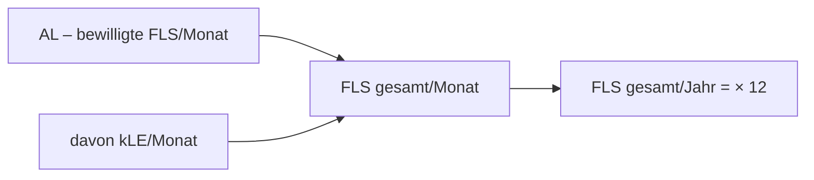

# Belegungsliste pflegen

Die **Belegungsliste** ist das Stammdaten-Verzeichnis aller betreuten Klient*innen des Teams. Sie ist die fachliche Grundlage für den Leistungsnachweis und die Rechnungsstellung: Aus den hier hinterlegten bewilligten Fachleistungsstunden (FLS) ergibt sich, wie viel Betreuungszeit pro Monat abgerechnet werden darf.

!!! info "Wer pflegt die Belegungsliste?"
    Klientendaten werden von der **Leitung** gepflegt. Die Rolle **Administration** verwaltet Teams und Mitarbeitende, hat aber – aus Datenschutzgründen – **keinen Zugriff auf Klientendaten** (siehe [Datenschutz](../sicherheit/datenschutz.md)). Alle Angaben im Prototyp sind **fiktive Demodaten**.

## Ein neuer Datensatz – die Felder

Die Erfassung erfolgt im Django-Admin unter **Belegungsliste (Klient*innen)**. Das Formular ist in vier Abschnitte (Fieldsets) gegliedert:

### Person

| Feld | Bedeutung |
|------|-----------|
| **Nachname / Vorname** | Name der Klientin/des Klienten |
| **geb. am** (`geburtsdatum`) | Geburtsdatum, optional |
| **Personen-ID** (`person_id`) | interne/aktenführende Kennung, u. a. für die Suche |

### Team & Betreuung

| Feld | Bedeutung |
|------|-----------|
| **Team** | organisatorische Zuordnung (BEW / WG / Verwaltung) |
| **Bezugsbetreuer*in** | zuständige betreuende Person (Pflichtangabe) |
| **Vertretung 1 / Vertretung 2** | Vertretungsregelung |
| **Status** | *Betreuung* oder *Beendigung* (siehe unten) |

!!! note "Bezugsbetreuer*in ist geschützt"
    Die/der Bezugsbetreuer*in ist per `on_delete=PROTECT` mit dem Datensatz verknüpft: Eine mitarbeitende Person, die noch Bezugsbetreuung für Klient*innen ist, lässt sich **nicht löschen**. So bleibt der Nachweis nachvollziehbar. Setzen Sie stattdessen zuerst eine neue Bezugsbetreuung oder deaktivieren Sie die Person (Feld *aktiv* im Mitarbeiterdatensatz).

### Fachleistungsstunden (pro Monat)

Dies ist der abrechnungsrelevante Kern des Datensatzes. Berlin rechnet ab 01.01.2026 nach dem Modell **FLS = AL + kLE** (Beschluss 3/2026).

| Feld | Modellfeld | Bedeutung |
|------|-----------|-----------|
| **bewilligt FLS/Monat (AL)** | `al` | Vom Kostenträger **bewilligte** Fachleistungsstunden pro Monat (Assistenzleistung). Dezimalwert mit drei Nachkommastellen. |
| **davon kLE/Monat** | `kle` | Anteil **kalkulatorische Leistungseinheit** an den bewilligten Stunden. |
| **HBG** | `hbg` | Hilfebedarfsgruppe (kleine ganze Zahl, optional). |

!!! tip "AL + kLE = FLS gesamt"
    Das System berechnet die **bewilligten FLS gesamt pro Monat** automatisch als Summe von AL und kLE (`fls_gesamt`). In der Listenansicht steht diese Summe in der Spalte **FLS gesamt/Monat**; der Jahreswert ist `fls_gesamt × 12`. Auch der **kLE-Anteil** (kLE ÷ FLS gesamt) wird intern berechnet. Sie müssen also nur AL und kLE eintragen – die Summe nicht.

### Verwaltung

| Feld | Modellfeld | Bedeutung |
|------|-----------|-----------|
| **KÜ bis** | `kue_bis` | Ende der aktuellen **Kostenübernahme** (Bewilligungszeitraum). Steuert die Erinnerung an fällige Berichte. |
| **BRP zu Teamleitung bis** | `brp_bis` | Frist Bericht/Betreuungsplanung an die Leitung. |
| **versendet am** | `versendet_am` | Datum, an dem der Nachweis versendet wurde. |
| **Zuständigkeit THFD** | `thfd` | zuständiger Träger der freien … / Fachdienst (Freitext). |
| **Kommentar** | `kommentar` | interne Notiz. |

!!! warning "KÜ bis steuert die Berichts-Erinnerung"
    Aus **KÜ bis** leitet das System den Zeitpunkt für den fälligen Verlaufsbericht ab (Vorlauf von einigen Tagen vor Ablauf, `BERICHT_VORLAUF_TAGE`). Ein Datensatz mit Status *Betreuung* und nahendem KÜ-Ende wird als „Bericht fällig“ markiert. Halten Sie **KÜ bis** deshalb aktuell.

## Status: Betreuung vs. Beendigung

Das Feld **Status** kennt genau zwei Werte:

| Status | Bedeutung |
|--------|-----------|
| **Betreuung** | laufende, aktive Betreuung – zählt in Auswertungen und Berichts-Erinnerungen mit. |
| **Beendigung** | Betreuung ist beendet / läuft aus. Der Datensatz bleibt zur Nachvollziehbarkeit erhalten, wird bei der Berichts-Erinnerung aber nicht mehr als „fällig“ geführt. |

!!! tip "Beenden statt löschen"
    Setzen Sie eine auslaufende Betreuung auf **Beendigung**, statt den Datensatz zu löschen. Zurückliegende Leistungen bleiben so für die Abrechnung und die Revision erhalten. Ein echtes Löschen erfolgt erst im Rahmen des [Löschkonzepts](../sicherheit/backups-loeschkonzept.md).

## Suchen und Filtern

Die Listenansicht bietet:

- **Suche** nach Nachname, Vorname und Personen-ID
- **Filter** nach Status, Team, Bezugsbetreuer*in und HBG
- direkte Spalten für AL, kLE, FLS gesamt/Monat, HBG, KÜ bis und Status

So finden Sie z. B. schnell alle Klient*innen einer Bezugsbetreuung oder alle Datensätze mit demnächst ablaufender Kostenübernahme.

## Typische Aufgaben (Kurzanleitung)

1. **Neue Klientin/neuen Klienten anlegen** → *Belegungsliste* → *Hinzufügen* → Person, Team, Bezugsbetreuung und bewilligte FLS (AL/kLE) eintragen, Status *Betreuung*, **KÜ bis** setzen.
2. **Neue Bewilligung eingetragen** → AL/kLE und **KÜ bis** aktualisieren.
3. **Betreuung endet** → Status auf *Beendigung*, ggf. *versendet am* pflegen. Nicht löschen.
4. **Bezugsbetreuung wechselt** → Feld *Bezugsbetreuer*in* ändern; die bisherige Person bleibt für zurückliegende Nachweise verknüpft.
