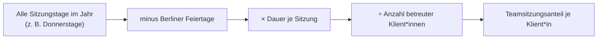

# Team-Parameter (Teamsitzung & FLS-Preis)

Über die **Team-Parameter** stellt die Leitung/Administration die jahresbezogenen Rechengrößen ein, die in die Auswertung einfließen: die **Teamsitzung** (Wochentag und Dauer) sowie den **FLS-Preis**. Es gibt einen Parametersatz **pro Jahr**.

## Die Felder

Im Django-Admin unter **Team-Parameter**:

| Feld | Modellfeld | Default | Bedeutung |
|------|-----------|---------|-----------|
| **Jahr** | `jahr` | – | Bezugsjahr des Parametersatzes |
| **Teamsitzung Wochentag** | `teamsitzung_wochentag` | Donnerstag | Wochentag der regelmäßigen Teamsitzung (0 = Montag … 6 = Sonntag) |
| **Teamsitzung Dauer (Std)** | `teamsitzung_dauer_std` | 3,0 | Dauer einer Teamsitzung in Stunden |
| **FLS-Preis €** | `fls_preis` | 0,00 | Preis je Fachleistungsstunde (für spätere Betragskalkulation) |

!!! note "Ein Satz pro Jahr"
    Legen Sie zu Jahresbeginn einen neuen Parametersatz mit dem aktuellen **FLS-Preis** und ggf. angepasster Teamsitzungs-Dauer an. Ältere Jahre bleiben erhalten, damit zurückliegende Auswertungen mit den damals gültigen Werten reproduzierbar sind.

## Wie die Teamsitzung berechnet wird

Die auf einzelne Klient*innen umzulegende **Teamsitzungszeit** wird nicht von Hand erfasst, sondern berechnet:

Konkret: Anzahl der Sitzungstage (alle Termine am eingestellten **Wochentag** im Jahr, **ohne Berliner Feiertage**) × **Dauer** ergibt die Gesamt-Teamsitzungszeit; geteilt durch die Zahl der betreuten Klient*innen ergibt sich der pro Person anrechenbare Anteil.

!!! tip "Warum das wichtig ist"
    Teamsitzungszeit ist mittelbare Betreuungszeit, die anteilig auf die Nachweise umgelegt wird. Ändert sich der Sitzungs-Wochentag oder die Dauer, passt der eingestellte Parameter die Berechnung für das gesamte Jahr an – ohne dass einzelne Nachweise angefasst werden müssen.

## FLS-Preis

Der **FLS-Preis** ist der Euro-Betrag je Fachleistungsstunde. Er dient der späteren Umrechnung von geleisteten/bewilligten Stunden in Beträge für die Rechnungsstellung. Halten Sie ihn zu jeder Vergütungsanpassung (z. B. neuer Berliner Beschluss) aktuell.

!!! warning "Prototyp"
    Im Prototyp steht der FLS-Preis per Default auf `0,00`. Tragen Sie für belastbare Betragsauswertungen den aktuell gültigen Wert ein.
