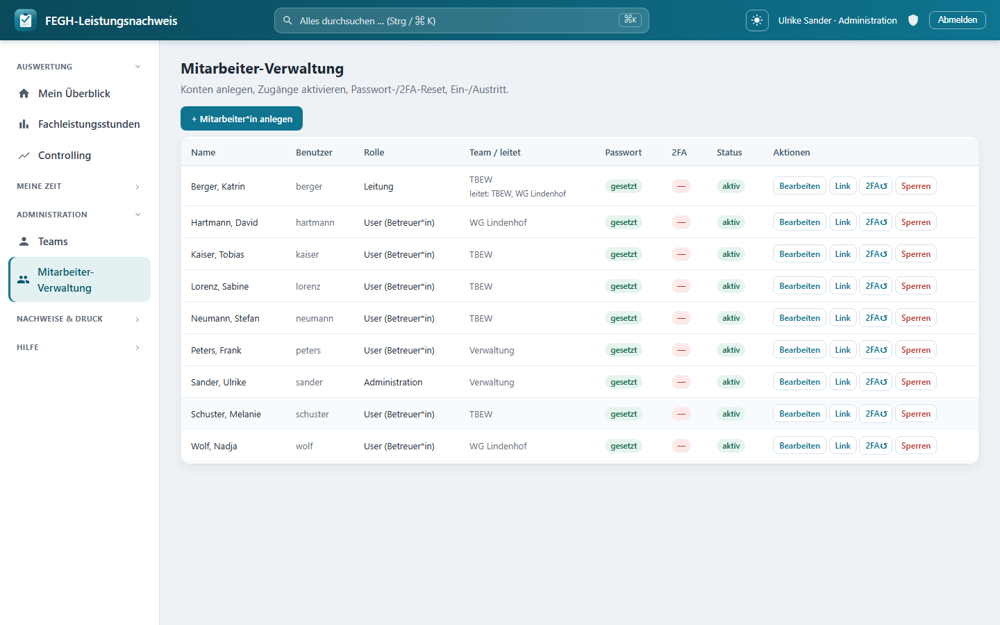
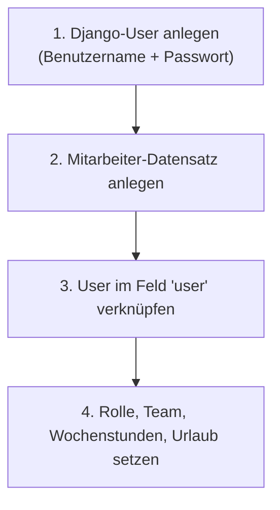

# Teams & Mitarbeitende verwalten

*Mitarbeitendenverwaltung: Rollen, Teams, 2FA-Status.*

Diese Seite richtet sich an die Rolle **Administration**. Sie legt die organisatorische Struktur an: **Teams**, **Mitarbeitende**, deren **Rollen/Rechte** sowie die Selfservice-Vorgaben **Wochenstunden** und **Urlaubstage**. Außerdem beschreibt sie, wie eine Administration einem Nutzer die **Zwei-Faktor-Authentisierung (2FA) zurücksetzt**.

!!! info "Rollentrennung"
    **Administration** verwaltet Struktur und Zugänge, hat aber bewusst **keinen fachlichen Zugriff auf Klientendaten**. Die inhaltliche Pflege der [Belegungsliste](belegungsliste.md) liegt bei der **Leitung**. Diese Trennung ist eine Datenschutzmaßnahme (Art. 9 DSGVO, siehe [Datenschutz](../sicherheit/datenschutz.md)).

## Teams anlegen

Ein **Team** ist die organisatorische Einheit, der Mitarbeitende und Klient*innen zugeordnet werden. Im Django-Admin unter **Teams**:

| Feld | Bedeutung |
|------|-----------|
| **name** | eindeutiger Teamname |
| **typ** | *Betreutes Einzelwohnen (BEW)*, *Wohngemeinschaft (WG)* oder *Verwaltung* |
| **aktiv** | inaktive Teams bleiben erhalten, tauchen aber nicht mehr in Auswahllisten auf |

Die Listenansicht zeigt zusätzlich die Zahl der **Mitglieder** und **Klient*innen** je Team.

!!! note "Teamtyp *Verwaltung*"
    Der Typ steuert später u. a. das Verhalten der Stempeluhr (Verwaltung = fester Arbeitsplatz). Für die reine Nachweis-Erfassung ist zunächst der Name entscheidend.

## Mitarbeitende anlegen

Ein **Mitarbeiter-Datensatz** verknüpft eine Person mit einem **Login (Django-User)**. Reihenfolge in der Praxis:

Das Formular ist dreigeteilt:

### Person

| Feld | Bedeutung |
|------|-----------|
| **user** | verknüpfter Login (Autocomplete). Ohne User kann sich die Person nicht anmelden. |
| **name / vorname / kuerzel** | Nachname, Vorname, Kürzel |
| **aktiv** | ausgeschiedene Personen deaktivieren statt löschen |

### Rolle & Team

| Feld | Bedeutung |
|------|-----------|
| **rolle** | Systemrolle (siehe Tabelle unten) |
| **team** | Team-Zugehörigkeit der Person |
| **leitet** | nur für Rolle *Leitung*: welche Teams diese Person leitet (Mehrfachauswahl) |

### Arbeitszeit & Urlaub (Selfservice)

| Feld | Modellfeld | Default | Bedeutung |
|------|-----------|---------|-----------|
| **Wochen-Soll (Std)** | `wochenstunden` | 39,0 | Wochenarbeitszeit. Das **Tagessoll** wird daraus berechnet (÷ 5). |
| **Urlaubstage/Jahr** | `urlaubstage` | 30 | Jahresurlaubsanspruch für die Urlaubsverwaltung |

!!! tip "Schnellbearbeitung in der Liste"
    In der Mitarbeiter-Liste sind **rolle**, **team**, **wochenstunden** und **urlaubstage** direkt inline editierbar (`list_editable`). So passen Sie z. B. mehrere Wochenstunden ohne Öffnen der Einzeldatensätze an.

## Rollen & Rechte

Es gibt drei Systemrollen (`Rolle`):

| Rolle | Wert | Rechte |
|-------|------|--------|
| **User (Betreuer*in)** | `user` | sieht/erfasst Leistungen zu **eigenen** Klient*innen; Selfservice (Arbeitszeit, Stempeluhr, Urlaub) |
| **Leitung** | `leitung` | verwaltet das/die geleitete(n) Team(s), inkl. **Klienten- und Belegungsliste**; sieht Auswertungen des Teams |
| **Administration** | `admin` | verwaltet Teams, Mitarbeitende und Zugänge – **kein** Klientenzugriff |

!!! warning "Rolle ≠ Django-Superuser"
    Die Systemrolle steuert die fachliche Sicht in der App. Der **Django-Admin-Zugang** (Häkchen *Mitarbeiter/Staff* bzw. *Superuser* am User-Objekt) ist davon getrennt. Vergeben Sie Superuser-Rechte sparsam – idealerweise nur an einen technischen **Break-Glass-Account** (siehe [Datenschutz](../sicherheit/datenschutz.md)).

## 2FA eines Nutzers zurücksetzen

Hat eine Person ihr Smartphone/den Authenticator verloren und keine Recovery-Codes mehr, kann sie sich nicht mehr per Zwei-Faktor anmelden. Die Administration setzt 2FA dann zentral zurück.

Die 2FA basiert auf **django-otp** mit zwei Gerätetypen pro Nutzer:

- **TOTP-Gerät** (`TOTP device`) – der Authenticator-Code
- **Static device „backup“** (`Static device`) – die Recovery-Codes

### Zurücksetzen im Django-Admin

1. Im Admin die App **OTP_TOTP → TOTP devices** öffnen.
2. Alle Einträge des betroffenen Users markieren und **löschen**.
3. In **OTP_STATIC → Static devices** ebenso den/die Einträge des Users löschen (Recovery-Codes).
4. Der Person Bescheid geben: Beim nächsten Login wird sie – je nach Einstellung `OTP_REQUIRED` bzw. weil kein bestätigtes Gerät mehr existiert – automatisch zur **Neu-Einrichtung** (`2fa_setup`) geleitet.

!!! note "Was beim nächsten Login passiert"
    Die `OTPErzwingenMiddleware` prüft, ob ein **bestätigtes** TOTP-Gerät existiert. Nach dem Löschen ist keines mehr vorhanden → der Nutzer wird auf die **Einrichtungsseite** umgeleitet und scannt einen neuen QR-Code. Es werden dabei automatisch **10 neue Recovery-Codes** erzeugt.

!!! tip "Selfservice-Alternative"
    Solange sich die Person noch anmelden kann, gibt es unter **2FA-Status** einen Button **Zwei-Faktor deaktivieren** (`zwei_faktor_deaktivieren`), der TOTP- und Backup-Gerät der eigenen Person entfernt. Ein Admin-Eingriff ist dann nicht nötig.

### Passwort zurücksetzen

Das Passwort setzt die Administration am **Django-User** zurück (Link *Dieses Passwort ändern* im User-Formular). Die Passwörter werden mit **Argon2** gehasht (siehe `PASSWORD_HASHERS`).
