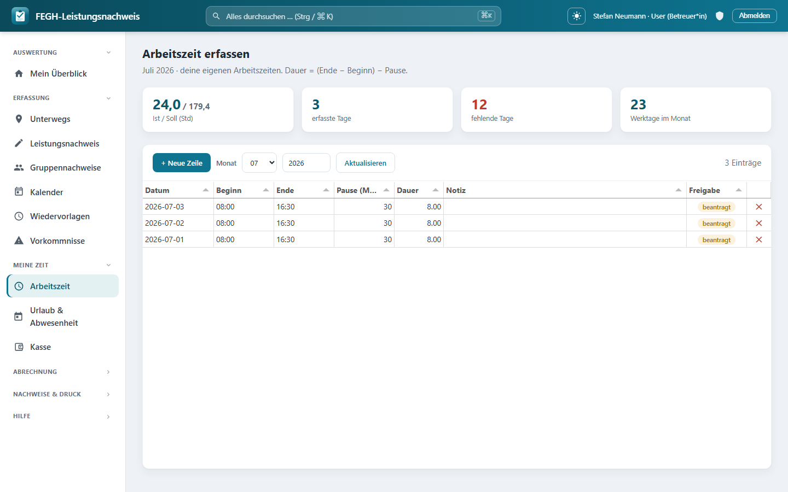
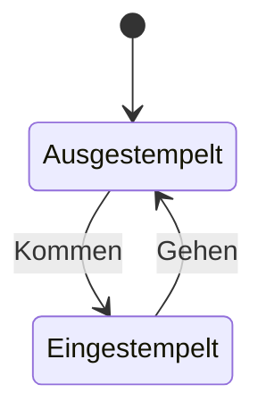

# Arbeitszeit & Stempeluhr

*Arbeitszeit-Erfassung mit Stempeluhr und Monatsübersicht.*

Neben den Leistungsnachweisen erfasst die App deine **eigene Arbeitszeit** (Selfservice). Für Mitarbeitende der **Verwaltung** gibt es zusätzlich eine **Kommen/Gehen-Stempeluhr** auf der Startseite. Beide Wege dienen der Übersicht über Ist- und Soll-Stunden – nicht der Leistungsabrechnung.

## Arbeitszeit erfassen

Die Seite **Arbeitszeit** zeigt oben vier Kennzahlen für den gewählten Monat:

| Kachel | Bedeutung |
|---|---|
| **Ist / Soll (Std)** | Summe deiner erfassten Netto-Stunden gegenüber dem Monats-Soll. |
| **erfasste Tage** | Tage mit gebuchter Arbeitszeit (> 0 h). |
| **fehlende Tage** | Werktage ohne Eintrag (rot, wenn > 0). |
| **Werktage im Monat** | Arbeitstage Mo–Fr ohne Berliner Feiertage. |

!!! info "Wie werden 'fehlende Tage' gerechnet?"
    Gezählt werden Werktage (Mo–Fr, ohne Feiertage) bis heute bzw. bis Monatsende, an denen weder eine Arbeitszeit noch eine genehmigte/beantragte **Abwesenheit** vorliegt. Urlaubs-, Krank- und Fortbildungstage reduzieren also die Zahl der fehlenden Tage.

### Eine Arbeitszeit eintragen

Die Tabelle funktioniert wie das Leistungs-Grid – mit **Auto-Speichern**:

1. **+ Neue Zeile** klicken (setzt das heutige Datum, Cursor springt zu **Beginn**).
2. **Beginn** und **Ende** als Uhrzeit (`HH:MM`) eintragen.
3. **Pause (Min)** als Minutenzahl angeben (Standard 0).
4. **Notiz** optional ergänzen.

Die **Dauer** berechnet der Server: `Dauer = (Ende − Beginn) − Pause`. Ist das Ergebnis ≤ 0, wird 0 gewertet.

!!! note "Nur das Datum ist Pflicht"
    Ohne Datum wird nicht gespeichert (Statuszeile: `Datum nötig …`). Beginn, Ende, Pause und Notiz können nachgetragen werden.

### Filtern, Ändern, Löschen

- **Monat** und **Jahr** oben einschränken, dann **Aktualisieren** (bei Monatswechsel lädt die Tabelle automatisch).
- Zum **Ändern** in eine Zelle klicken; die Zeile speichert beim Verlassen.
- Zum **Löschen** das rote **✕** am Zeilenende nutzen (gespeicherte Zeilen mit Rückfrage).

!!! warning "Nur eigene Zeiten"
    Du kannst ausschließlich deine eigenen Arbeitszeiten sehen und bearbeiten. Ohne hinterlegtes Mitarbeiter-Profil erscheint der Hinweis "Kein Mitarbeiter-Profil hinterlegt – bitte an die Teamleitung wenden."

## Kommen/Gehen-Stempeluhr (Verwaltung)

Mitarbeitende, deren Team vom Typ **Verwaltung** ist, sehen auf der Startseite (**Mein Überblick**) eine Stempelkarte mit einem einzelnen Knopf, der zwischen **Kommen** und **Gehen** umschaltet.

- **Kommen:** Öffnet eine neue Sitzung mit dem aktuellen Zeitpunkt. Bestätigung: "Eingestempelt. Guten Start!"
- **Gehen:** Schließt die offene Sitzung. Bestätigung: "Ausgestempelt. Feierabend!"

Mehrere Kommen/Gehen-Paare pro Tag sind möglich (z. B. Mittagspause). Die Karte zeigt die bisher heute gestempelte Zeit; während einer offenen Sitzung läuft die Anzeige live weiter.

!!! tip "Stempeluhr vs. Arbeitszeit-Tabelle"
    Die Stempeluhr ist die schnelle Erfassung am festen Arbeitsplatz. Die Arbeitszeit-Tabelle eignet sich zum manuellen Nachtragen und für Mitarbeitende im Außendienst (BEW/WG). Beide Wege dienen dem Ist/Soll-Abgleich; für die Leistungsabrechnung ist ausschließlich der [Leistungsnachweis](leistungsnachweis.md) maßgeblich.

!!! note "Soll-Stunden"
    Das Tagessoll ergibt sich aus dem hinterlegten Wochen-Soll geteilt durch 5. Wochen-Soll und Urlaubsanspruch pflegt die Leitung/Administration im Mitarbeiterprofil.