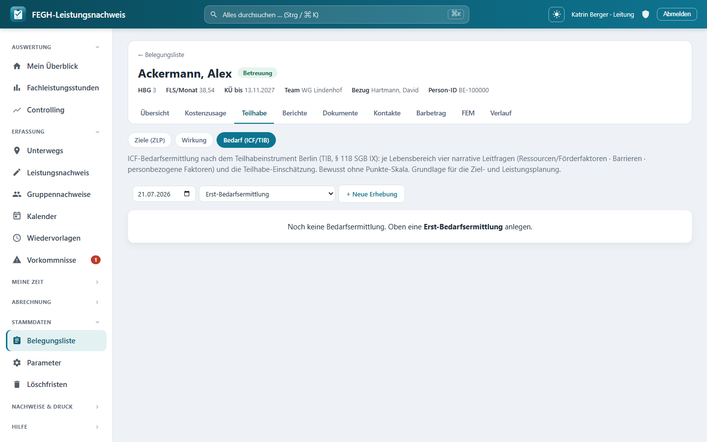

# ICF-Bedarfsermittlung (TIB)

*ICF-Bedarfsermittlung nach dem TIB – narrativ über zwölf Lebensbereiche.*

Zu jeder Klient*in kannst du die **ICF-Bedarfsermittlung nach dem Teilhabeinstrument Berlin (TIB, § 118 SGB IX)** pflegen – die strukturierte, fachliche Bestandsaufnahme, aus der später die Ziel- und Leistungsplanung (ZLP) erwächst. Die App bildet die Berliner Systematik bewusst **narrativ-dialogisch** ab: zwölf Lebensbereiche nach der ICF-Domänenordnung (d1–d9), je Bereich vier Freitext-Leitfragen und eine kategoriale Teilhabe-Einschätzung. Es gibt **keine Punkte-Skala** – kein „Grad der Beeinträchtigung von 0 bis 4“ –, sondern beschreibende Sätze über Ressourcen, Barrieren und Kontext. Jede Bedarfsermittlung ist als eigener Stichtag **versioniert**, sodass Erst- und Folgeerhebungen nebeneinander stehen bleiben und die Entwicklung nachvollziehbar wird.

Du erreichst die Seite über die Fallakte einer Klient*in: Reiter **Teilhabe → Bedarf (ICF/TIB)**. Daneben liegen dort die Reiter **Ziele (ZLP)** und **Wirkung**.

!!! note "Warum keine Skala?"
    Das Teilhabeinstrument Berlin arbeitet ausdrücklich beschreibend statt punktend. Eine Zahl würde die Lebenslage einer Person auf einen Score verkürzen; das TIB will stattdessen erfassen, *was* im Alltag gelingt, *was nicht* und *warum*. Die App folgt dieser Logik strikt: Sie bietet Freitextfelder und eine grobe Teilhabe-Kategorie, aber keinerlei numerische Bewertung.

---

## Die zwölf Lebensbereiche

Die Seite listet zwölf Lebensbereiche in fester Reihenfolge. Sie folgen den ICF-Aktivitäts- und Teilhabe-Domänen d1–d9; die weit gefassten Domänen d8 und d9 sind dabei in mehrere Bereiche aufgeteilt. Jeder Bereich trägt links seine **ICF-Domäne** als kleinen Code.

| # | ICF | Lebensbereich |
|---|-----|---------------|
| 1 | d1 | Lernen und Wissensanwendung |
| 2 | d2 | Allgemeine Aufgaben und Anforderungen |
| 3 | d3 | Kommunikation |
| 4 | d4 | Mobilität |
| 5 | d5 | Selbstversorgung |
| 6 | d6 | Häusliches Leben |
| 7 | d7 | Interpersonelle Interaktionen und Beziehungen |
| 8 | d8 | Erziehung und Bildung |
| 9 | d8 | Arbeit und Beschäftigung |
| 10 | d8 | Wirtschaftliches Leben |
| 11 | d9 | Gemeinschaftsleben, Erholung/Freizeit, Religion/Spiritualität |
| 12 | d9 | Menschenrechte, Politisches Leben, Staatsbürgerschaft |

!!! tip "Nur relevante Bereiche ausfüllen"
    Setz je Bereich oben rechts den Haken **relevant**, wenn er für diesen Fall eine Rolle spielt. Relevante Bereiche werden farblich hervorgehoben (linker Rand). Bereiche, die du komplett leer lässt, kosten keinen Datensatz – die App legt für sie nichts an. Du musst also nicht alle zwölf beschreiben, sondern nur die, die den Fall wirklich betreffen.

Die zwölf Bereiche sind als Stammdaten hinterlegt; die Leitung kann bei Bedarf eigene ergänzen. In der normalen Bedienung arbeitest du mit der vorgegebenen Berliner Liste.

---

## Aufbau einer Erhebung

Oben auf der Seite steuerst du, **welche Erhebung** du bearbeitest, und legst neue an:

- **Erhebung (Auswahl):** Gibt es schon mehrere Bedarfsermittlungen, wählst du über das Auswahlfeld die gewünschte aus (angezeigt mit Datum und Anlass). Ohne Auswahl zeigt die App die **jüngste** Erhebung.
- **Neue Erhebung:** Datum (vorbelegt mit heute) und Anlass wählen, dann **+ Neue Erhebung**.
- **Erhebung löschen:** nur für die Leitung sichtbar (siehe unten).

Ist noch gar keine Bedarfsermittlung vorhanden, weist die Seite darauf hin, dass du oben eine **Erst-Bedarfsermittlung** anlegen kannst.

### Anlass: Erst- oder Folgeerhebung

| Anlass | Bedeutung |
|--------|-----------|
| **Erst-Bedarfsermittlung** | Die erste Bestandsaufnahme; startet mit leeren Lebensbereichen. |
| **Folge-Bedarfsermittlung (Fortschreibung)** | Übernimmt die Einschätzungen der jüngsten Erhebung als Ausgangspunkt und schreibt sie fort. |

!!! note "Fortschreibung startet nicht bei null"
    Legst du eine **Folge-Bedarfsermittlung** an, kopiert die App die Einschätzungen der jüngsten vorhandenen Erhebung als Vorlage in die neue – Relevanz-Haken, alle Freitexte, Teilhabe-Status und Unterstützungshinweis. Du überarbeitest also den bekannten Stand, statt alles neu zu tippen. Die alte Erhebung bleibt als eigener Stichtag unverändert erhalten.

---

## Die vier Leitfragen je Lebensbereich

Jeder relevante Lebensbereich wird über vier narrative Leitfragen beschrieben und mit einer Teilhabe-Kategorie eingeordnet. Alle Beschreibungsfelder sind **Freitext** – es gibt hier keine Zahlen und keine Skala.

| Feld | Art | Bedeutung |
|------|-----|-----------|
| **relevant** | Haken | Ist dieser Lebensbereich für den Fall relevant? Hebt die Karte hervor. |
| **Ressourcen & Förderfaktoren** | Freitext | Was gelingt? Welche Stärken, Ressourcen und förderlichen Umweltfaktoren gibt es? |
| **Barrieren / was nicht gelingt** | Freitext | Wo bestehen Schwierigkeiten? Welche Barrieren stehen der Teilhabe entgegen? |
| **Personbezogene Faktoren / weiteres** | Freitext | Persönliche Faktoren (Haltung, Biografie, Bewältigungsmuster) und alles Weitere. |
| **Teilhabe-Einschätzung** | Auswahl | Grobe Einordnung, ob eine Beeinträchtigung der Teilhabe vorliegt (siehe Tabelle). |
| **Unterstützungsbedarf (Art/Umfang, vorläufig)** | Kurztext | Erster, vorläufiger Hinweis auf Art und Umfang der nötigen Unterstützung (max. 255 Zeichen). |

Die drei ausführlichen Felder (Ressourcen, Barrieren, personbezogene Faktoren) haben keine Längenbegrenzung; das Feld **Unterstützungsbedarf** ist ein Kurztext für einen vorläufigen Hinweis, der später in die ZLP einfließt.

### Teilhabe-Einschätzung

Statt einer Skala trägst du je Bereich eine der vier Kategorien ein:

| Wert | Bedeutung |
|------|-----------|
| **noch offen** | Noch nicht eingeschätzt (Voreinstellung). |
| **Beeinträchtigung liegt vor** | Eine Beeinträchtigung der Teilhabe besteht in diesem Bereich. |
| **Beeinträchtigung droht** | Eine Beeinträchtigung droht, ist aber noch nicht eingetreten. |
| **keine Beeinträchtigung** | In diesem Bereich liegt keine Teilhabe-Beeinträchtigung vor. |

!!! tip "Speichern in einem Rutsch"
    Du füllst alle Lebensbereiche auf einer Seite aus und speicherst sie mit dem **Speichern**-Knopf unten gemeinsam. Der Knopf bleibt beim Scrollen am unteren Rand sichtbar. Es gibt kein Zwischenspeichern pro Bereich – ein Klick sichert die ganze Erhebung.

---

## Grundlage für die ZLP

Die Bedarfsermittlung ist kein Selbstzweck: Sie ist die fachliche **Grundlage der Ziel- und Leistungsplanung**. Aus den beschriebenen Barrieren, Ressourcen und den vorläufigen Unterstützungshinweisen leitest du die **Leitziele und Teilhabeziele** auf dem Nachbarreiter [Ziele (ZLP)](ziele-zlp.md) ab. Die versionierten Folgeerhebungen zeigen dann über die Zeit, ob sich die Teilhabe in den einzelnen Bereichen verbessert – parallel zur Zielerreichung in der ZLP und zur [Wirkung](fallakte.md).

---

## Zugriff und Datenschutz

!!! warning "Team-Scoping"
    Die Bedarfs-Seite ist – wie Ziele und Verlaufsdoku – nur für Personen mit **Klienten-Zugriff** erreichbar: Bezugsbetreuer*in, Vertretung und Leitung des Teams (`klienten_fuer(request.user)`). Rollen **ohne Klientenbezug** – **Verwaltung und Admin** – haben hier keinen Zugriff, weil ihre Klientenliste bewusst leer ist (DSGVO-Trennung). Der Versuch, die Bedarfsermittlung einer fremden Klient*in zu öffnen oder zu speichern, wird serverseitig abgewiesen.

!!! warning "Löschen ist der Leitung vorbehalten"
    Eine **ganze Erhebung** zu löschen, sieht nur die **Leitung**; die App fragt vor dem Entfernen noch einmal nach. Fachlich sinnvoll ist fast immer, stattdessen eine **Folge-Bedarfsermittlung** anzulegen und den Stand fortzuschreiben – so bleibt die Historie der Teilhabe-Entwicklung erhalten. Für normale Betreuer*innen gibt es keinen Löschknopf.

!!! danger "Besonders schützenswerte Daten (Art. 9 DSGVO)"
    Die Freitexte zu Ressourcen, Barrieren und personbezogenen Faktoren sind personenbezogene Gesundheits-/Sozialdaten. Sie werden **datensparsam** behandelt: Die Erhebungen sind zwar versioniert (Fortschreibung nachvollziehbar), die schützenswerten **Freitexte werden aber bewusst NICHT in die Historientabelle geschrieben**. Wird eine Klient*in anonymisiert, verschwinden mit ihr auch die Bedarfsermittlungen, ohne dass Freitext-Rückstände in der History überdauern.

---

## Für Neugierige: Technik dahinter

!!! note "Nur zur Nachvollziehbarkeit"
    Diese Seite dient dem Verständnis; für die Bedienung brauchst du sie nicht. Die Namen unten entsprechen dem echten Code.

- **Seiten-View:** `nachweis/views_bedarf.py` → `bedarf(request, pk)`. Lädt die Klient*in über `services.klienten_fuer(request.user)`, holt die gewählte (Query-Parameter `erhebung`) oder jüngste `Bedarfsermittlung` und stellt je aktivem `TibLebensbereich` eine Zeile mit der zugehörigen `BedarfsEinschaetzung` zusammen. Der Reiter „Belegungsliste“ vs. „Start“ hängt an `services.ist_leitung`.
- **Neue Erhebung:** `bedarf_neu` (POST). Legt eine `Bedarfsermittlung` an (Anlass validiert gegen `TibAnlass.values`, sonst `ERST`); bei `TibAnlass.FORTSCHREIBUNG` kopiert es die Einschätzungen der jüngsten vorherigen Erhebung per `bulk_create` als Fortschreibungs-Vorlage.
- **Speichern:** `bedarf_speichern` (POST). Iteriert über alle aktiven `TibLebensbereich`, liest je Bereich die Felder `lb_<id>_relevant|gelingt|barrieren|person|status|unterst`, validiert den Status gegen `TeilhabeStatus.values` (Fallback `OFFEN`), begrenzt `unterst` auf 255 Zeichen und legt für komplett leere Bereiche bewusst **keinen** Datensatz an.
- **Löschen:** `bedarf_loeschen` (POST) – hinter `services.ist_leitung(request.user)`, sonst `HttpResponseForbidden`; entfernt die ganze `Bedarfsermittlung`.
- **Modelle:** `nachweis/models.py` → `TibLebensbereich` (`name`, `icf_code`, `reihenfolge`, `aktiv`), `Bedarfsermittlung` (`klient`, `anlass`, `datum`, `erhoben_von`, `notiz`; `HistoricalRecords(excluded_fields=["notiz"])`) und `BedarfsEinschaetzung` (`relevant`, `gelingt`, `barrieren`, `personfaktoren`, `teilhabe_status`, `unterstuetzung`; UniqueConstraint ein Lebensbereich je Erhebung; `HistoricalRecords(excluded_fields=["gelingt", "barrieren", "personfaktoren"])` – die Art-9-Freitexte bleiben aus der History). Auswahllisten: `TibAnlass` (Erst / Fortschreibung) und `TeilhabeStatus` (offen / liegt_vor / droht / keine).
- **Stammdaten:** Migration `nachweis/migrations/0047_tib_lebensbereiche_default.py` seedt die zwölf Berliner Lebensbereiche (d1–d9) idempotent per `get_or_create`.
- **Template:** `nachweis/templates/nachweis/bedarf.html` (eine `lb-card` je Lebensbereich mit ICF-Code, vier Textfeldern, Status-Auswahl und Unterstützungs-Kurztext; Sticky-Speichern; `fa-subnav` zu Ziele/Wirkung).
- **URLs:** `nachweis/urls.py` → `nachweis:bedarf`, `nachweis:bedarf_neu`, `nachweis:bedarf_speichern`, `nachweis:bedarf_loeschen`.
