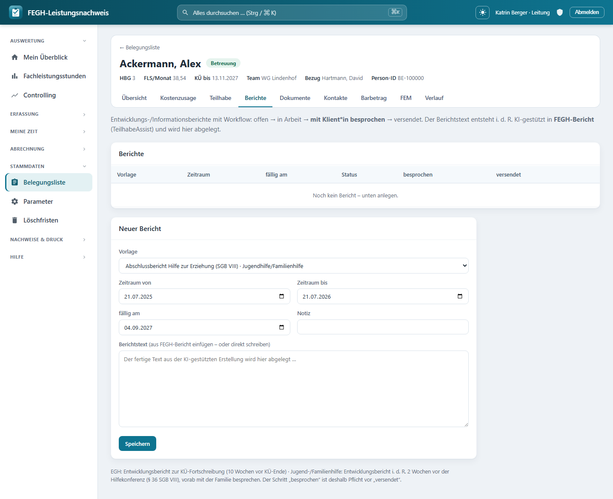

# Berichte & TeilhabeAssist

*Berichte & TeilhabeAssist je Klient*in.*

Zu jeder Klient*in verwaltest du hier die **Berichte** – Entwicklungs- und Informationsberichte mit einem festen **Workflow**: offen → in Arbeit → **mit Klient*in besprochen** → versendet. Der eigentliche Berichtstext entsteht in der Regel **KI-gestützt** in der Desktop-App **FEGH-Bericht (TeilhabeAssist)** und wird hier abgelegt. Damit die KI arbeiten kann, exportiert die App auf Knopfdruck ein strukturiertes **Rohpaket** (Ziele, Verlaufsdoku des Zeitraums, Rahmendaten) als JSON oder Markdown; die **Pseudonymisierung passiert bewusst erst lokal** in der Desktop-App. Zusätzlich gibt es eine **Druckansicht** mit den Anlagen Ziele und Wirkung.

Du erreichst die Seite über die Fallakte einer Klient*in: Reiter **Berichte**. Welche Berichte fällig werden, ergibt sich aus der **KÜ-Frist** (siehe [Berichtsfristen](../fachliches/berichtsfristen.md)).

!!! note "Berichtstyp als Daten, nicht als Code"
    Die App kennt keinen fest verdrahteten „EGH-Bericht“ oder „Jugendhilfe-Bericht“. Jeder Berichtstyp ist ein Datensatz einer **Berichtsvorlage** mit Name, Bereich und einer Gliederung. So sind der EGH-Entwicklungsbericht, der Informationsbericht und – später – der Hilfeplan-Bericht nach § 36 SGB VIII schlicht verschiedene Vorlagen, ohne Programmierung.

---

## Der Berichts-Workflow

Ein Bericht durchläuft vier Status. Die App führt dich der Reihe nach durch – vor dem Versand ist der Schritt **„mit Klient*in besprochen“ Pflicht**.

| Status | Bedeutung | Wie er entsteht |
|--------|-----------|-----------------|
| **offen** | Bericht angelegt, noch kein Text | Ausgangszustand nach dem Anlegen |
| **in Arbeit** | Es liegt Berichtstext vor | Wird **automatisch** gesetzt, sobald Text im Feld steht |
| **mit Klient*in besprochen** | Der Bericht wurde mit der/dem Leistungsberechtigten durchgesprochen | Knopf **„✓ besprochen“** (Pflicht-Schritt) |
| **versendet** | An den Kostenträger übermittelt, festgeschrieben | Knopf **„→ versendet“** |

In der Berichtsliste erkennst du den Status an einem farbigen Kennzeichen; die Spalten **besprochen** und **versendet** zeigen die zugehörigen Daten. Ein **überfälliger** Bericht (Fälligkeit überschritten, noch nicht versendet) wird beim Fälligkeitsdatum rot mit ⚠ markiert.

!!! warning "Besprechen ist Pflicht vor dem Versand"
    Nach der örV/AV Hilfeplanung ist der Bericht **vor dem Versand mit der/dem Leistungsberechtigten zu besprechen**. Deshalb erzwingt die App die Reihenfolge: Wer „→ versendet“ auslöst, ohne dass der Status zuvor **besprochen** war, bekommt die Meldung *„Bitte zuerst ‚mit Klient*in besprochen‘ bestätigen …“* und der Versand wird abgewiesen.

!!! tip "Text nach dem Besprechen geändert? Erneut besprechen"
    Änderst du den Berichtstext, **nachdem** er schon als besprochen markiert war, setzt die App den Status automatisch auf **in Arbeit** zurück und meldet: *„Der Text wurde nach dem Besprechen geändert – bitte erneut mit der/dem Klient*in besprechen.“* Das Besprochene gilt für den geänderten Text nicht mehr.

!!! danger "Versendete Berichte sind festgeschrieben"
    Ein **versendeter** Bericht ging an den Kostenträger und lässt sich nicht mehr bearbeiten. Beim Speicherversuch erscheint: *„Dieser Bericht wurde bereits versendet und ist festgeschrieben – für Korrekturen bitte einen neuen Bericht anlegen.“* Korrekturen laufen also immer über einen **neuen** Bericht.

### „versendet“ pflegt die Fälligkeit nach

Setzt du einen Bericht auf **versendet**, trägt die App das aktuelle Datum in `versendet_am` ein **und** aktualisiert das gleichnamige Feld am Klienten – das ist die Grundlage der bestehenden Fälligkeits-Anzeige („… versendet am“). Nimmst du einen versendeten Bericht später zurück, wird das Versanddatum wieder gelöscht, weil das alte Datum dann nicht mehr gilt.

---

## Einen Bericht anlegen oder bearbeiten

Unten auf der Seite liegt das Formular **„Neuer Bericht“**. Klickst du bei einem bestehenden Bericht auf **„Bearbeiten“**, füllt sich dasselbe Formular mit dessen Werten (Überschrift **„Bericht bearbeiten“**, dazu ein **„Abbrechen“**-Link).

Diese Felder stehen zur Verfügung:

| Feld | Bedeutung |
|------|-----------|
| **Vorlage** | Auswahl aus den aktiven Berichtsvorlagen. Neben dem Namen steht – falls gesetzt – der **Bereich** (z. B. EGH, Jugendhilfe). |
| **Zeitraum von / bis** | Der Berichtszeitraum. Vorbelegt: **von** schließt an den spätesten bisherigen Berichtszeitraum an (sonst die letzten 12 Monate), **bis** ist heute. |
| **fällig am** | Fälligkeitsdatum. Vorbelegt mit **KÜ-Ende − 10 Wochen** (aus `Klient.bericht_faellig_am`), sonst heute + 70 Tage. |
| **Notiz** | Kurze interne Notiz (max. 200 Zeichen), erscheint klein unter der Vorlage in der Liste. |
| **Berichtstext** | Der fertige Text – **aus FEGH-Bericht einfügen** oder direkt schreiben. Sobald hier Text steht, springt der Status von *offen* auf *in Arbeit*. |

!!! note "Fälligkeit kommt aus der Kostenübernahme"
    Die Vorbelegung des Fälligkeitsdatums folgt der **10-Wochen-Regel**: Der Entwicklungsbericht soll 70 Tage vor Ende der Kostenübernahme (`kue_bis`) fertig sein. Ist keine KÜ gepflegt, setzt die App ersatzweise heute + 70 Tage. Details und Rechenbeispiel: [Berichtsfristen (KÜ-Ende)](../fachliches/berichtsfristen.md).

!!! tip "EGH und Jugend-/Familienhilfe: unterschiedliche Fristen"
    - **EGH:** Entwicklungsbericht zur KÜ-Fortschreibung, **10 Wochen vor KÜ-Ende**.
    - **Jugend-/Familienhilfe:** Entwicklungsbericht i. d. R. **2 Wochen vor der Hilfekonferenz** (§ 36 SGB VIII), vorab mit der Familie besprechen.

    In beiden Fällen ist der Schritt **„besprochen“ Pflicht** vor „versendet“.

---

## Vorlagen: EGH und Jugendhilfe unterscheiden sich

Welche Vorlagen im Auswahlfeld stehen, pflegt die Administration als **Berichtsvorlagen** (Daten, kein Code). Jede Vorlage hat:

| Feld der Vorlage | Bedeutung |
|------------------|-----------|
| **Name** | Bezeichnung des Berichtstyps, z. B. „EGH-Entwicklungsbericht“ oder „Informationsbericht 1.01“ |
| **Bereich** | rein informativ, z. B. **EGH** oder **Jugendhilfe** – erscheint hinter dem Namen in der Auswahl |
| **Gliederung (Abschnitte)** | Liste der Abschnitts-Überschriften – die inhaltliche Struktur des Berichts |
| **aktiv** | Nur aktive Vorlagen erscheinen im Auswahlfeld |

Die Gliederung einer Vorlage taucht an zwei Stellen wieder auf: in der **Druckansicht** (als nummerierte Abschnitte, wenn noch kein Berichtstext vorliegt) und im **Rohpaket** (als „Gliederung der Vorlage“, damit die KI dieselbe Struktur nutzt). So kann eine EGH-Vorlage eine andere Abschnittsfolge tragen als eine Jugendhilfe-Vorlage, ohne dass an der App etwas geändert werden muss.

---

## Rohpaket-Export für FEGH-Bericht (TeilhabeAssist)

Damit die KI-gestützte Erstellung in **FEGH-Bericht (TeilhabeAssist)** auf konsistenten Daten arbeitet, exportiert die App zu jedem Bericht ein **Rohpaket** – alles Fachliche des Zeitraums, gebündelt und maschinenlesbar. Zwei Knöpfe in der Berichtsliste:

| Knopf | Ergebnis | Wofür |
|-------|----------|-------|
| **Rohpaket ↓** | Datei `FEGH-Bericht_Rohpaket_<id>.json` | Import in die Desktop-App (strukturiert) |
| **als Text ↓** | Datei `FEGH-Bericht_Rohpaket_<id>.md` (`?format=md`) | direkt als Vorbericht/Stichpunkte einfügbar |

Das Paket enthält:

- **Rahmendaten** aus der zum Berichtszeitraum gültigen Bewilligung (HBG, FLS/Woche, Gültigkeit, Kostenträger, Aktenzeichen),
- die **Ziele (ZLP)** mit Leit-/Teilhabeziel, Indikator, Status und Zielerreichungsgrad,
- die **Wirkungsdimensionen** (Ist → Soll, mit Anlass und Perspektive),
- die **Verlaufsdokumentation des Zeitraums** (chronologisch, mit Tätigkeit, Betreuer*in und Zielbezug),
- eine kleine **Statistik** (Doku-Einträge, Kontakte FS/BAO im Zeitraum) sowie die **Gliederung der Vorlage**.

!!! danger "Pseudonymisierung passiert lokal – das Rohpaket ist Klartext"
    Das Rohpaket enthält **bewusst Klartext** inklusive Name, Geburtsdatum und Person-ID. Die **Pseudonymisierung** ist Sache der Desktop-App FEGH-Bericht (deren eigenes Datenschutzmodell) und geschieht **erst lokal**. Behandle die heruntergeladene Datei entsprechend: Sie enthält besonders schützenswerte Daten nach Art. 9 DSGVO. Die Antworten tragen daher `Cache-Control: no-store` (Art-9-Klartext landet nie in einem Cache), und der **Dateiname enthält absichtlich keinen Klientennamen** (keine PII in Download-Logs/Dateisystem).

!!! note "Jeder Export wird protokolliert"
    Beim Download vermerkt die App den Zeitpunkt in `exportiert_am`. Diese Feld-Änderung landet im **Auditlog** und liefert damit einen Wer/Wann-Nachweis für jeden Art-9-Export.

---

## Druckansicht mit Anlagen (Ziele / Wirkung)

Über **„Druck“** öffnest du eine druckfertige Ansicht des Berichts (Knopf **„🖨️ Drucken / als PDF speichern“**). Sie enthält:

- einen **Kopf** mit Vorlagenname, Klient*in, Person-ID, Bezugsbetreuer*in, Berichtszeitraum und – falls vorhanden – dem Besprochen-Datum,
- den **Berichtstext**; ist noch keiner erfasst, erscheinen stattdessen die **nummerierten Abschnitte der Vorlage** als Gerüst,
- die **Anlage „Ziele der Ziel- und Leistungsplanung“** (Teilhabeziele, die nicht aufgegeben sind, mit Indikator und Stand/Prozent),
- die **Anlage „Wirkungsdimensionen“** (Ist → Soll auf der 7er-Skala, mit Anlass und Perspektive),
- eine **Unterschriftenzeile** für Bezugsbetreuer*in und Leitung.

!!! note "7er-Skala: niedriger ist besser"
    In der Wirkungs-Anlage steht der Hinweis „niedriger = besser“. Zum Hintergrund der Skala und der Dimensionen siehe [Wirkungsmessung](wirkung.md); zu den Zielen siehe [Ziele der ZLP](ziele-zlp.md).

---

## Rollen und Rechte

| Aktion | Wer darf |
|--------|----------|
| Berichte ansehen, anlegen, bearbeiten | alle mit **Klienten-Zugriff** (Bezugsbetreuer*in, Vertretung, Leitung des Teams) |
| Status setzen (besprochen / versendet / zurück) | alle mit Klienten-Zugriff |
| Rohpaket / Druck exportieren | alle mit Klienten-Zugriff |
| Bericht **löschen** (✕) | nur die **Leitung** |

---

## Zugriff und Datenschutz

!!! warning "Team-Scoping"
    Die Berichte-Seite ist – wie Ziele, Wirkung und Verlaufsdoku – nur für Personen mit **Klienten-Zugriff** erreichbar: Bezugsbetreuer*in, Vertretung und Leitung des Teams (`klienten_fuer(request.user)`). Rollen **ohne Klientenbezug** – **Verwaltung und Admin** – haben hier keinen Zugriff, weil ihre Klientenliste bewusst leer ist (DSGVO-Trennung). Der Versuch, einen Bericht einer fremden Klient*in zu öffnen, zu speichern oder zu exportieren, wird serverseitig abgewiesen.

!!! danger "Besonders schützenswerte Daten (Art. 9 DSGVO)"
    Berichtstexte und Rohpakete bündeln Gesundheits-/Sozialdaten. Sie werden **datensparsam** behandelt: Der Workflow ist versioniert, der schützenswerte **Berichtstext wird aber bewusst NICHT in die Historientabelle geschrieben** (`HistoricalRecords(excluded_fields=["inhalt"])`) – so überdauert er das Löschkonzept nicht. Der Rohpaket-Export ist Klartext und nur für Berechtigte abrufbar, wird protokolliert (`exportiert_am`) und trägt `no-store`. Exportiere nur, was für die Berichtserstellung gebraucht wird, und behandle heruntergeladene Dateien wie besonders schützenswerte Dokumente.

---

## Für Neugierige: Technik dahinter

!!! note "Nur zur Nachvollziehbarkeit"
    Diese Seite dient dem Verständnis; für die Bedienung brauchst du sie nicht. Die Namen unten entsprechen dem echten Code.

- **Seiten-View:** `nachweis/views_berichte.py` → `berichte(request, pk)`. Lädt die Klient*in über `services.klienten_fuer(request.user)`, listet `klient.berichte` (`select_related("vorlage")`), reicht die aktiven `Berichtsvorlage.objects.filter(aktiv=True)` und `BerichtsStatus.choices` durch und berechnet die Vorbelegungen `faellig_default` (aus `klient.bericht_faellig_am`, sonst heute + 70 Tage), `von_default` (Anschluss an den spätesten `zeitraum_bis`, sonst −365 Tage) und `bis_default` (heute).
- **Speichern:** `bericht_speichern` (POST). Blockiert das Ändern eines **versendeten** Berichts; setzt Vorlage/Zeitraum/Fälligkeit/Notiz (Notiz auf 200 Zeichen); wenn `inhalt` sich ändert und der Status **besprochen** war, Rücksprung auf `IN_ARBEIT` und `besprochen_am = None`; sobald Text da ist und der Status `OFFEN` war, automatisch `IN_ARBEIT`.
- **Workflow-Status:** `bericht_status` (POST). Erzwingt vor `VERSENDET` den Zustand `BESPROCHEN`; setzt `besprochen_am`/`versendet_am`; bei Versand `type(b.klient).objects.filter(pk=...).update(versendet_am=…)`; bei Rücknahme eines versendeten Berichts wird `versendet_am` wieder auf `None` gesetzt.
- **Löschen:** `bericht_loeschen` (POST) – hinter `services.ist_leitung(request.user)`, sonst `HttpResponseForbidden`; nur innerhalb `klienten_fuer(request.user)`.
- **Rohpaket:** `bericht_rohpaket(request, pk)` (GET) mit `?format=json` (Default) oder `?format=md`. Baut die Daten in `_rohpaket_daten(b)` (Rahmendaten aus `klient.aktive_bewilligung(zeitraum_bis)`, Ziele, `wirkungseinschaetzungen`, chronologische `leistungen` mit Doku und Zielbezug, Statistik FS/BAO) und die Markdown-Fassung in `_rohpaket_markdown(d)`. Setzt `exportiert_am` (`save(update_fields=["exportiert_am", "geaendert"])`), `Content-Disposition` **ohne** Klientenname und `Cache-Control: no-store`.
- **Druck:** `bericht_druck(request, pk)` → Template `nachweis/templates/nachweis/bericht_druck.html`. Anlagen: Handlungsziele (`art="handlungsziel"`, ohne `ZielStatus.AUFGEGEBEN`) und `wirkungseinschaetzungen` (`order_by("datum")`); Fallback auf die `vorlage.abschnitte`, wenn kein `inhalt`.
- **Modelle:** `nachweis/models.py` → `Bericht` (`klient`, `vorlage` FK, `zeitraum_von`/`zeitraum_bis`, `faellig_am`, `status`, `inhalt`, `besprochen_am`, `versendet_am`, `exportiert_am`, `notiz`, `erstellt_von`; `@property ueberfaellig`; `HistoricalRecords(excluded_fields=["inhalt"])`) und `Berichtsvorlage` (`name`, `bereich`, `beschreibung`, `abschnitte` als `JSONField`, `aktiv`). Auswahlliste: `BerichtsStatus` (offen / in_arbeit / besprochen / versendet).
- **Template:** `nachweis/templates/nachweis/berichte.html` (Berichtsliste mit Status-Kennzeichen `.bst`, Workflow-Knöpfe, Rohpaket-/Druck-Links, Anlege-/Bearbeiten-Formular).
- **URLs:** `nachweis/urls.py` → `nachweis:berichte`, `nachweis:bericht_speichern`, `nachweis:bericht_status`, `nachweis:bericht_loeschen`, `nachweis:bericht_druck`, `nachweis:bericht_rohpaket`.
