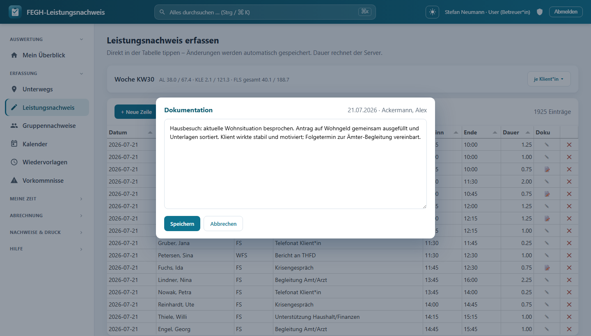

# Dokumentation (Verlaufstexte)

Zu jeder erfassten Leistung kann ein **ausführlicher Doku- bzw. Verlaufstext** hinterlegt werden. Er dient der internen fachlichen Nachvollziehbarkeit der Betreuung – wer hat wann was mit der Klient*in gemacht, wie war die Situation, welche Vereinbarungen gab es. Diese Verlaufsdoku ist von der reinen Zeit-/Leistungserfassung (Datum, Leistungsart, Dauer) getrennt und optional.

!!! note "Ein Doku-Text pro Leistung"
    Die Dokumentation hängt technisch an **einer einzelnen Leistung** (`Leistung.dokumentation`, ein `TextField`). Es gibt also nicht „einen Text pro Tag“, sondern je Zeile im Erfassungs-Grid genau ein Feld. Das Feld ist frei formatierbarer Fließtext (mit Zeilenumbrüchen) und darf leer bleiben.

---

## Wo pflege ich die Doku? (Erfassungs-Grid)

Die Doku wird direkt im **Leistungsnachweis / Erfassungs-Grid** gepflegt. Jede Zeile (= eine Leistung) hat in der Spalte **„Doku“** ein Symbol:

| Symbol | Bedeutung |
|--------|-----------|
| 📝 | Für diese Leistung ist **bereits ein Verlaufstext hinterlegt** |
| ✎ (blass) | Noch **kein Text** – klicken, um Doku hinzuzufügen |

Ein Klick auf das Symbol öffnet den **Doku-Editor** – ein Modal mit einem großen Textfeld.

### So geht's

*Der Doku-Editor als Dialog über dem Grid – mehrzeiliger Verlaufstext, „Speichern"/„Abbrechen".*

1. Im Grid die gewünschte Zeile finden und in der Spalte **„Doku“** auf 📝 bzw. ✎ klicken.
2. Im Modal den **Verlaufstext** eintippen (mehrzeilig erlaubt, das Feld ist in der Höhe frei ziehbar).
3. **„Speichern“** – der Text wird sofort per API gespeichert, das Symbol wechselt auf 📝.
4. Alternativ **„Abbrechen“** (oder **Esc**, oder Klick auf den abgedunkelten Hintergrund) – Änderungen werden verworfen. In der offenen Doku bleibt der Tastaturfokus im Dialog gefangen; nach dem Schließen springt er auf die Ausgangszeile zurück.

!!! tip "Erst die Zeile, dann die Doku"
    Der Editor lässt sich nur öffnen, wenn die Zeile schon **Datum, Klient*in und Leistungsart** enthält. Fehlt eines davon, erscheint der Hinweis *„Erst Datum, Klient*in und Leistung ausfüllen, dann Doku.“* Der Kopf des Modals zeigt zur Kontrolle **Datum · Klient*in** an, damit man sieht, zu welcher Leistung man schreibt.

Nach dem Speichern erscheint kurz die Statusmeldung **„✓ Dokumentation gespeichert“** mit Uhrzeit.

---

## Auf dem Dashboard: „Letzte Dokumentationen“

Auf dem Dashboard **„Mein Überblick“** gibt es die Karte **„Letzte Dokumentationen“**. Sie zeigt die **letzten 10** Verlaufstexte – als schneller Einstieg, ohne ins Grid wechseln zu müssen.

- Jede Zeile zeigt **Datum · Klient*in · Betreuer*in** und eine gekürzte Vorschau (ca. 64 Zeichen).
- Ein Klick klappt die Zeile auf (`
`) und zeigt den **Volltext** – inkl. Tätigkeit als Präfix, falls vorhanden.
- Ein Button **„Leistungsnachweis →“** springt direkt in die Erfassung.

!!! note "Team-Scoping"
    Es werden nur Dokumentationen zu **Klient*innen des eigenen Team-Zugriffs** angezeigt (`klienten_fuer(request.user)`), sortiert nach Datum absteigend. Leere Doku-Texte werden ausgeblendet. Die Karte erscheint **nicht** für Rollen ohne Klientenarbeit – konkret Verwaltung und Admin sehen sie nicht.

---

## Änderungen im Audit-Log

Jede Anlage/Änderung eines Doku-Textes läuft über dieselbe Speicher-API wie die übrige Leistungserfassung und landet damit im **Audit-Log**. Das ist wegen der besonders schützenswerten Daten (DSGVO Art. 9) gewollt: Es ist nachvollziehbar, **wer wann** eine Verlaufsdoku geschrieben oder geändert hat.

!!! warning "Zugriffsschutz"
    Speichern ist nur für Leistungen zu **sichtbaren Klient*innen** möglich. Der Versuch, eine fremde Leistung zu ändern, wird serverseitig mit *Forbidden* abgewiesen (`l.klient not in sichtbar`).

---

## Drucken: Verlaufsdokumentation je Klient*in

Für den Ausdruck (z. B. zur Ablage in der Papierakte oder Fallbesprechung):

1. Menü **„Druck-Nachweise“** öffnen.
2. Karte **„Dokumentation“** wählen.
3. **Klient*in** und **Zeitraum** (Jahr, optional Monat) angeben.
4. Auf der Druckseite **„🖨️ Drucken / als PDF speichern“** klicken.

Der Ausdruck **„Verlaufsdokumentation“** listet chronologisch alle Leistungen **mit Doku-Text** im Zeitraum, jeweils mit Datum, Uhrzeit, Leistungsart, Tätigkeit und Betreuer*in, darunter der Volltext. Kopf mit Träger/Team, Klient*in, Person-ID und Bezugsbetreuer*in; unten Unterschriftsfelder für Bezugsbetreuer*in und Teamleitung.

!!! note "Nur Einträge mit Text"
    Leistungen ohne Doku-Text tauchen im Ausdruck nicht auf (`exclude(dokumentation="")`). Gibt es im Zeitraum keine, steht dort *„Keine Dokumentationen im gewählten Zeitraum.“*

!!! warning "Rollen ohne Klientenarbeit"
    Der Doku-Druck ist für Verwaltung/Admin gesperrt – sie werden auf die Startseite umgeleitet.

---

## Wichtig: Doku ≠ amtlicher Fachleistungs-Druck

!!! danger "Interne Doku steht NICHT auf dem Kostenträger-Nachweis"
    Die Verlaufsdokumentation ist **interne Fachdoku**. Sie erscheint **bewusst nicht** auf dem amtlichen **Fachleistungs-Druck**, der an den **Kostenträger** geht. Auf dem amtlichen Nachweis stehen nur die abrechnungsrelevanten Leistungsdaten (Datum, Leistungsart, Dauer usw.), **nicht** die inhaltlichen Verlaufstexte. Wer die Verlaufsdoku ausdrucken will, nutzt ausschließlich den separaten Weg **Druck-Nachweise → Dokumentation**.

---

## Technische Referenz (für Nachbau/Wartung)

| Baustein | Ort |
|----------|-----|
| Feld | `nachweis/models.py` → `Leistung.dokumentation` (`TextField`, `blank=True`) |
| Speichern | `nachweis/views.py` → `api_leistung_save` (übernimmt `dokumentation`, wenn im Payload) |
| Grid-Zeile/JSON | `nachweis/views.py` → `_row(l)` (liefert `dokumentation`) |
| Dashboard-Liste | `nachweis/views.py` → `mein_ueberblick` (`letzte_dokus`, `[:10]`, team-gescopt) |
| Druck-View | `nachweis/views.py` → `doku_druck` (`exclude(dokumentation="")`, Jahr/Monat-Filter) |
| Editor-Modal + 📝-Spalte | `nachweis/templates/nachweis/erfassung.html` (`#dokuModal`, `openDoku`) |
| Dashboard-Karte | `nachweis/templates/nachweis/mein_ueberblick.html` (Panel „Letzte Dokumentationen“) |
| Druck-Layout | `nachweis/templates/nachweis/doku_druck.html` |
