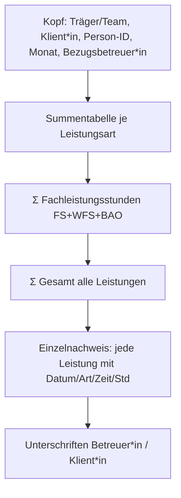

# Druck-Nachweis erstellen

Der **Druck-Nachweis** erzeugt den amtlichen Leistungsnachweis **je Klient*in und Monat** – mit Kopfdaten, Kategorie-Summen, Fachleistungsstunden-Summe, dem Einzelnachweis aller Leistungen und einem Unterschriftenfeld. Dieses Dokument dient als Beleg für die Rechnungsstellung an den Kostenträger.

## Nachweis anzeigen

1. Seite **Druck-Nachweis** öffnen.
2. Im Auswahlbereich **Klient*in** wählen (Pflicht).
3. **Monat** und **Jahr** einstellen.
4. **Anzeigen** klicken.

Daraufhin wird das Dokument als formatierte Vorschau gerendert.

!!! info "Sichtbarkeit"
    Zur Auswahl stehen nur Klient*innen deines Teams / deiner geleiteten Teams. Ohne Auswahl erscheint der Hinweis "Bitte oben Klient*in und Monat wählen."

## Aufbau des Dokuments

### Kopfdaten
Träger/Team (TBEW · Berliner Eingliederungshilfe), Name der Klient*in, Person-ID, Monat und zuständige Bezugsbetreuer*in.

### Summentabelle
Je verwendeter Leistungsart wird die Stundensumme (dezimal) ausgewiesen. Arten, die als **Fachleistungsstunden** zählen (FS, WFS, BAO), sind grün hervorgehoben. Darunter:

- **Σ Fachleistungsstunden (FS + WFS + BAO)** – blau hervorgehoben, die abrechnungsrelevante FLS-Summe.
- **Σ Gesamt (alle Leistungen)** – Summe über alle Arten.

### Einzelnachweis
Jede einzelne Leistung des Monats mit Datum, Art, Bezeichnung, Beginn, Ende und Stunden. Aus Gruppen oder der Teamsitzung **automatisch** erzeugte Anteile sind mit einem Punkt (•) markiert.

!!! note "Was fließt automatisch ein?"
    Neben den manuell im [Grid](leistungsnachweis.md) erfassten Leistungen enthält der Nachweis die anteiligen Zeiten aus [Gruppenangeboten](gruppen.md) sowie den kalkulatorischen Teamsitzungs-Anteil (je nach Klientenzahl und Status). Diese Positionen müssen nicht separat erfasst werden.

### Unterschriften & Rechtsgrundlage
Unten stehen Unterschriftenfelder für Betreuer*in und Klient*in sowie ein Legenden-/Rechtsgrundlagenhinweis (u. a. Beschluss Nr. 3/2026, § 113 i. V. m. § 78 SGB IX, Berlin).

## Drucken oder als PDF speichern

Sobald ein Nachweis angezeigt wird, erscheinen zwei Schaltflächen:

| Schaltfläche | Funktion |
|---|---|
| **🖨️ Drucken / als PDF speichern** | Öffnet den Browser-Druckdialog (`Strg + P`). Über "Als PDF speichern" erhältst du eine PDF-Datei. |
| **PDF herunterladen** | Erzeugt serverseitig ein PDF (falls die PDF-Bibliothek verfügbar ist). |

!!! tip "Druckansicht ist druckoptimiert"
    Beim Drucken werden Navigation, Kopfleiste und Bedienelemente automatisch ausgeblendet – gedruckt wird nur das eigentliche Nachweis-Dokument.

!!! warning "PDF-Download im Prototyp / auf Windows"
    Der serverseitige PDF-Export nutzt WeasyPrint und benötigt native Bibliotheken (Linux/Server). Fehlen diese – etwa im Windows-Prototyp – führt **PDF herunterladen** zurück zur Druckansicht. Nutze dann **🖨️ Drucken / als PDF speichern** (Browser: `Strg + P` → "Als PDF speichern"). Die erzeugte PDF-Datei heißt `Leistungsnachweis_<Nachname>_<MM>_<JJJJ>.pdf`.

## Empfohlener Ablauf zum Monatsende

1. Alle Leistungen im [Erfassungs-Grid](leistungsnachweis.md) vollständig eintragen.
2. [Gruppen](gruppen.md) des Monats erfassen.
3. Druck-Nachweis je Klient*in aufrufen, Summen prüfen.
4. Drucken bzw. als PDF speichern und der Rechnungsstellung zuführen.