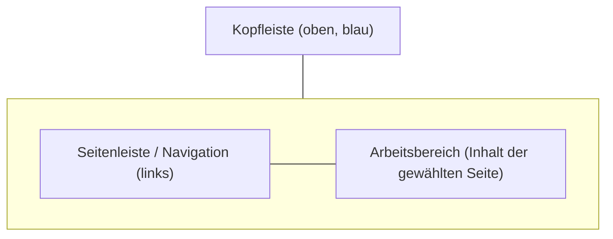
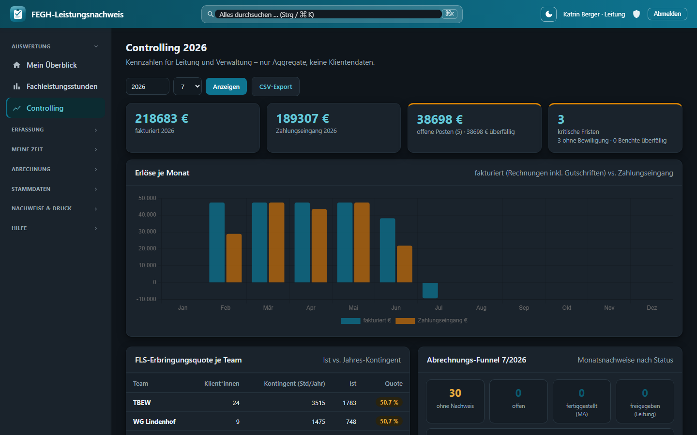

# Erste Schritte

Willkommen beim **FEGH-Leistungsnachweis** – der Web-Anwendung des Teams TBEW (Berliner Eingliederungshilfe) für Leistungsnachweise, Auslastung und die persönliche Zeitwirtschaft (SelfService). Diese Seite zeigt, wie Sie sich anmelden, wie die Oberfläche aufgebaut ist und was Sie je nach Rolle sehen.

!!! info "Für wen ist diese App?"
    Die Anwendung läuft im **Desktop-Browser** (Chrome, Edge, Firefox). Es ist keine Installation nötig – Sie rufen einfach die Adresse auf, die Ihnen die Leitung/Administration mitgeteilt hat, und melden sich mit Ihrem persönlichen Zugang an.

## 1. Anmelden

Beim Aufruf der App erscheint zunächst die Anmeldemaske:

1. **Benutzername** eingeben (in der Regel Ihr Nachname, z. B. `neumann`).
2. **Passwort** eingeben.
3. Auf **Anmelden** klicken.

Stimmen Benutzername oder Passwort nicht, erscheint der Hinweis *„Anmeldung fehlgeschlagen – Benutzername oder Passwort falsch.“* Prüfen Sie in diesem Fall die Groß-/Kleinschreibung.

!!! note "Demo-Zugänge im Prototyp"
    Der aktuelle Prototyp arbeitet ausschließlich mit **fiktiven Demodaten**. Auf der Anmeldeseite sind Beispiel-Zugänge hinterlegt, z. B. `berger` (Teamleitung mit zusätzlichen Rechten) sowie `neumann`, `schuster` u. a. (Betreuer\*innen). In der Demo greifen alle Betreuer\*innen aus Gründen der Vertretung auf **alle** Klient\*innen des Teams zu. In der Produktivumgebung erhalten Sie einen eigenen, persönlichen Zugang.

### Zwei-Faktor-Sicherheit

Sobald für Ihren Zugang die Zwei-Faktor-Authentifizierung (2FA) aktiv ist, werden Sie nach der Passworteingabe automatisch zur Eingabe eines **Einmalcodes** weitergeleitet. Wie Sie 2FA einrichten und im Alltag nutzen, beschreibt die Seite [Zwei-Faktor-Anmeldung](zwei-faktor.md).

### Abmelden

Rechts oben im blauen Kopfbereich finden Sie die Schaltfläche **Abmelden**. Nutzen Sie diese immer, wenn Sie den Arbeitsplatz verlassen – besonders an geteilten Rechnern.

## 2. Aufbau der Oberfläche

Nach der Anmeldung ist der Bildschirm in drei Bereiche gegliedert:



### Kopfleiste (oben)

Die blaue Kopfleiste ist immer sichtbar und enthält:

| Element | Bedeutung |
|---|---|
| **F · FEGH-Leistungsnachweis** | Logo und App-Name (links) |
| **Suchfeld** | Globale Suche (auch mit **Strg/⌘ + K**) |
| **Sonne/Mond-Symbol** | Schaltet zwischen **Hell** und **Dunkel** um (die Wahl bleibt gespeichert) |
| **Name · Rolle** | Ihr angemeldeter Name und Ihre Rolle (z. B. *Betreuer\*in*, *Leitung*) |
| **Schild-Symbol** | Direktlink zur **Zwei-Faktor-Sicherheit** (Status/Einrichtung) |
| **Abmelden** | Beendet die Sitzung |

Die App unterstützt einen **dunklen Modus** – hilfreich bei Nachtdiensten oder lichtempfindlichen Augen. Er folgt standardmäßig der Systemeinstellung und lässt sich über das Sonne/Mond-Symbol jederzeit fest umschalten.



*Dunkler Modus am Beispiel des Controllings – gleiche Funktionen, augenschonende Darstellung.*

### Seitenleiste (links)

Die linke Navigation ist in thematische Gruppen unterteilt. Die aktuell geöffnete Seite ist farblich hervorgehoben. **Welche Einträge erscheinen, hängt von Ihrer Rolle ab** (siehe Abschnitt 3).

| Gruppe | Eintrag | Zweck |
|---|---|---|
| **Auswertung** | Mein Überblick | Persönliche Startseite / Dashboard |
| **Auswertung** | Fachleistungsstunden | Team-Auswertung der Auslastung *(nur Leitung)* |
| **Erfassung** | Leistungsnachweis | Einzelleistungen erfassen (Tabellen-Grid) |
| **Erfassung** | Druck-Nachweis | Amtlichen Monatsnachweis je Klient\*in erzeugen |
| **Erfassung** | Gruppennachweise | Gruppenangebote dokumentieren |
| **Meine Zeit** | Arbeitszeit | Eigene Arbeitszeit erfassen |
| **Meine Zeit** | Urlaub & Abwesenheit | Urlaub / Freizeitausgleich beantragen |
| **Stammdaten (Leitung)** | Belegungsliste | Klienten-Stammdaten *(nur Leitung)* |
| **Administration** | Teams, Mitarbeiter, Admin-Bereich | Verwaltung *(nur Admin)* |
| **Hilfe** | Wiki ↗ | Öffnet dieses Handbuch in neuem Tab |

### Arbeitsbereich (rechts)

Hier erscheint der Inhalt der jeweils gewählten Seite – z. B. Kacheln (KPIs), Tabellen, Formulare oder Diagramme. Jede Seite beginnt mit einer Überschrift und einer kurzen Unterzeile zur Orientierung.

## 3. Rollen – wer sieht was?

Die App kennt drei **Rollen**. Die Rolle bestimmt, welche Menüpunkte sichtbar sind und auf welche Daten Sie zugreifen dürfen. Zusätzlich ist jede\*r Mitarbeiter\*in einem **Team** zugeordnet (z. B. BEW, WG oder Verwaltung).

```mermaid
flowchart LR
    U["User / Betreuer*in"] -->|eigene + Team-Klient*innen| K[(Klient*innen-Daten)]
    L["Leitung"] -->|geleitete Team(s)| K
    A["Admin"] -.->|KEIN Klientenzugriff| K
    A -->|verwaltet| S[(Teams & Mitarbeiter)]
    L -->|verwaltet| S2[(Stammdaten / Belegung)]
```

### Rolle „User" (Betreuer\*in)

Die Standardrolle für Mitarbeitende im Betreuungsdienst.

- Sieht: **Mein Überblick**, die gesamte Gruppe **Erfassung** (Leistungsnachweis, Druck-Nachweis, Gruppennachweise) und **Meine Zeit** (Arbeitszeit, Urlaub & Abwesenheit).
- Datenzugriff: alle Klient\*innen des **eigenen Teams** – innerhalb des Teams sieht jede\*r alle, damit Vertretung möglich ist. Besonders eng verbunden sind Sie mit Ihren **eigenen Klient\*innen** (dort, wo Sie als Bezugsbetreuer\*in hinterlegt sind).
- Sieht **nicht**: die Team-Auswertung *Fachleistungsstunden*, *Stammdaten (Leitung)* und den *Administration*-Bereich.

### Rolle „Leitung"

Teamleitung mit erweiterten Auswertungs- und Verwaltungsrechten.

- Sieht zusätzlich: **Fachleistungsstunden** (differenzierte Auslastung aller Klient\*innen der geleiteten Team[s], mit Filter nach Team und Betreuer\*in) sowie die Gruppe **Stammdaten (Leitung)** mit der **Belegungsliste**.
- Genehmigt Urlaubs-/Abwesenheitsanträge des Teams.
- Datenzugriff: Klient\*innen der geleiteten Team(s) und des eigenen Teams.

### Rolle „Admin"

Technisch-organisatorische Verwaltung.

- Sieht die Gruppe **Administration** (Teams, Mitarbeiter, Admin-Bereich).
- **Kein** Zugriff auf Klientendaten – aus Datenschutzgründen (DSGVO) ist die Verwaltung bewusst von den inhaltlichen Betreuungsdaten getrennt. Die Gruppe *Erfassung* wird für Admins ausgeblendet.

!!! tip "Team „Verwaltung" und Stempeluhr"
    Mitarbeitende im Team **Verwaltung** erhalten auf *Mein Überblick* zusätzlich eine **Stempeluhr** (Kommen/Gehen). Details dazu finden Sie auf der Seite [Mein Überblick](mein-ueberblick.md).

!!! note "Kein Profil hinterlegt?"
    Zeigt *Mein Überblick* den Hinweis „Für dieses Login ist kein Mitarbeiter-Profil hinterlegt", dann ist Ihr Benutzerkonto noch keinem Mitarbeitenden zugeordnet. Die Administration kann dies im Admin-Bereich unter **Mitarbeiter** nachholen. Ohne Profil bleiben persönliche Kacheln (Arbeitszeit, Urlaub, eigene Klient\*innen) leer.

## 4. Nächste Schritte

- [Zwei-Faktor-Anmeldung einrichten](zwei-faktor.md) – empfohlen für den Schutz sensibler Daten.
- [Mein Überblick verstehen](mein-ueberblick.md) – Ihre persönliche Startseite im Detail.
