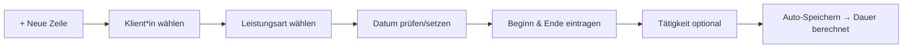

# Leistung erfassen (Grid)

Auf der Seite **Erfassung** trägst du deine erbrachten Leistungen direkt in eine Tabelle ("Grid") ein. Die Tabelle funktioniert wie eine Tabellenkalkulation: Du klickst in eine Zelle, tippst, und die Zeile wird **automatisch gespeichert**. Diese Erfassung ist die Grundlage für die spätere Rechnungsstellung und den amtlichen Druck-Nachweis.

!!! info "Wer sieht welche Klient*innen?"
    Du siehst und bebuchst alle Klient*innen deines Teams bzw. der von dir geleiteten Teams (Vertretungsregelung). Die Erfassung ist also team-, nicht personenbezogen. **Admin-Konten** haben aus Datenschutzgründen keinen Klientenzugriff.

## Die Erfassungsmaske im Überblick

Oben in der Werkzeugleiste findest du:

| Element | Funktion |
|---|---|
| **+ Neue Zeile** | Legt eine neue, leere Leistungszeile mit dem heutigen Datum an. |
| **Monat** | Filter: nur Einträge eines Monats anzeigen (`alle` = ganzes Jahr). |
| **Klient*in** | Filter: nur Einträge einer bestimmten Klient*in anzeigen. |
| **Jahr** | Zahlfeld: das anzuzeigende Jahr (Standard: aktuelles Jahr). |
| **Aktualisieren** | Lädt die Tabelle mit den gewählten Filtern neu. |
| Statusanzeige (rechts) | Zeigt `speichere …`, `✓ gespeichert HH:MM:SS`, die Zahl der Einträge oder Fehlermeldungen. |

## Eine Leistung erfassen – Schritt für Schritt

1. **+ Neue Zeile** klicken. Es erscheint eine Zeile mit dem heutigen Datum und der Leistungsart **FS** als Vorschlag. Der Cursor springt direkt in das Feld **Klient*in**.
2. **Klient*in** auswählen. Es öffnet sich eine Auswahlliste mit Suchfunktion – tippe die ersten Buchstaben des Nachnamens.
3. **Leistungsart** wählen (Kürzel, siehe Tabelle unten).
4. **Datum** prüfen bzw. per Datumsfeld anpassen.
5. **Beginn** und **Ende** als Uhrzeit eintragen (Format `HH:MM`).
6. **Tätigkeit** optional als kurzen Freitext ergänzen (z. B. "Begleitung Amt").

Sobald die Pflichtangaben **Datum**, **Klient*in** und **Leistungsart** vorhanden sind, wird die Zeile beim Verlassen einer Zelle gespeichert. Die Spalte **Dauer** wird dabei **vom Server berechnet** und in die Zeile zurückgeschrieben.

!!! note "Pflichtfelder"
    Fehlt Datum, Klient*in oder Leistungsart, zeigt die Statuszeile `Datum, Klient*in und Leistung nötig …` und speichert (noch) nicht. Ergänze die fehlende Angabe – danach wird automatisch gespeichert.

## Dauer-Berechnung

Die Dauer wird als **Dezimalstunden** aus `Ende − Beginn` gerechnet und auf drei Nachkommastellen kaufmännisch gerundet (angezeigt mit zwei Nachkommastellen).

!!! warning "Ende vor Beginn = 0"
    Liegt das Ende zeitlich vor dem Beginn (Tippfehler) oder fehlt eine der beiden Uhrzeiten, wird die Dauer als **0** gewertet – es entstehen keine negativen Zeiten. Kontrolliere in dem Fall die Uhrzeiten.

## Leistungsarten

Die Auswahl der Leistungsart bestimmt, wie die Zeit im Nachweis und in der Auswertung zählt. Es gibt acht Arten:

| Kürzel | Bedeutung | Zählt als Fachleistungsstunde (FLS)? |
|---|---|---|
| **FS** | Fallspezifische Leistung (direkt am/für Klient*in) | Ja |
| **WFS** | Weitere fallspezifische Leistung (Vor-/Nachbereitung, Fallbesprechung, Doku) | Ja |
| **BAO** | Betreuung am anderen Ort | Ja |
| **FUS** | Fallunspezifische Leistung | Nein |
| **FZ** | Fahrtzeit | Nein |
| **AL** | Assistenzleistung | Nein |
| **KLE** | Kalkulatorische Leistungseinheit (u. a. Teamsitzung) | Nein |
| **FH** | Freihaltung / Abwesenheit (zu 50 % anrechenbar) | Nein |

!!! tip "Merksatz aus der Erfassungsmaske"
    *FS/WFS/BAO zählen als Fachleistungsstunden · FZ = Fahrtzeit · KLE = kalkulatorisch · FH = Freihaltung (50 %).*

Welche Arten in die abrechnungsrelevante **FLS-Summe** eingehen (FS, WFS, BAO), siehst du im Druck-Nachweis farblich hervorgehoben.

## Bearbeiten, Filtern und Löschen

- **Bearbeiten:** In eine beliebige Zelle einer bestehenden Zeile klicken, Wert ändern, Feld verlassen → automatisch gespeichert.
- **Filtern:** Über **Monat**, **Klient*in** und **Jahr** einschränken. Änderungen an Monat/Klient*in laden die Tabelle sofort neu; nach Ändern des Jahres auf **Aktualisieren** klicken.
- **Löschen:** Am Zeilenende auf das rote **✕** klicken. Bereits gespeicherte Einträge müssen mit **OK** bestätigt werden ("Eintrag löschen?"). Neue, noch nicht gespeicherte Zeilen werden ohne Rückfrage entfernt.

!!! note "Automatisch erzeugte Zeilen"
    Neben deinen manuellen Einträgen kann das System Leistungen **automatisch** erzeugen (Anteile aus Gruppenangeboten und der Teamsitzung). Diese erscheinen im Druck-Nachweis mit einem Punkt (•) markiert und werden nicht im Erfassungs-Grid getippt – siehe die Seiten [Gruppen anlegen](gruppen.md) und [Druck-Nachweis](druck-nachweis.md).

## Häufige Fragen

**Muss ich speichern?** Nein. Jede vollständige Zeile speichert beim Verlassen der Zelle. Achte auf die grüne Bestätigung `✓ gespeichert …`.

**Warum steht bei Dauer nichts?** Es fehlt Beginn oder Ende, oder das Ende liegt vor dem Beginn.

**Ich sehe eine Warnung ⚠ in der Statuszeile.** Der Server hat den Eintrag abgelehnt (z. B. unzulässige Klient*in oder ungültiges Datum). Korrigiere die Angabe und tippe erneut.