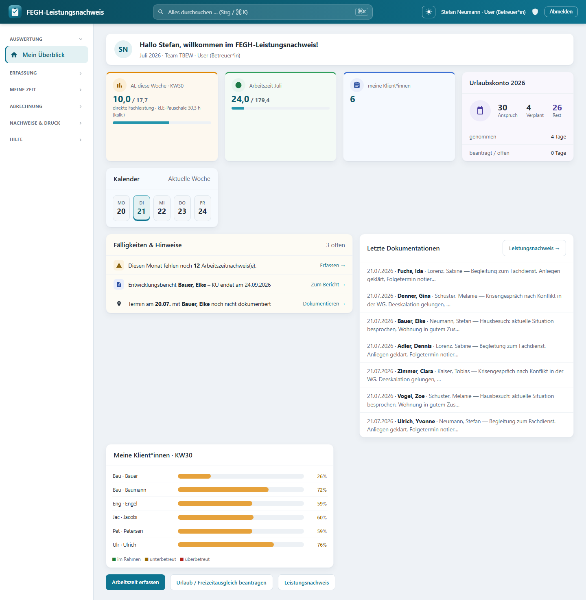
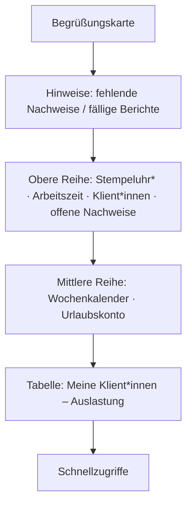

# Mein Überblick (Startseite)

*Startseite „Mein Überblick“: Wochen-Auslastung, Arbeitszeit, Urlaubskonto, Fälligkeiten und die eigene Klient*innen-Liste.*

*Mein Überblick* ist Ihre persönliche Startseite und der erste Bildschirm nach der Anmeldung. Sie bündelt auf einen Blick, was für Sie heute und diesen Monat wichtig ist: offene Aufgaben, Ihre Arbeitszeit, Ihr Urlaubskonto, der Wochenkalender und die Auslastung Ihrer Klient\*innen. Sie erreichen die Seite jederzeit über **Mein Überblick** ganz oben in der Seitenleiste.

!!! note "Ohne Mitarbeiter-Profil"
    Ist Ihrem Login kein Mitarbeiter-Profil zugeordnet, zeigt die Seite nur einen Hinweis. Die Administration kann das Profil im Admin-Bereich unter **Mitarbeiter** zuordnen; danach werden alle persönlichen Kacheln gefüllt.

## Aufbau der Seite

## 1. Begrüßung

Ganz oben begrüßt Sie eine Karte mit Ihren Initialen und dem Text *„Hallo <Vorname>, willkommen im SelfService!"*. Die Unterzeile nennt den **aktuellen Monat und das Jahr**, Ihr **Team** und Ihre **Rolle** – so ist der Kontext der angezeigten Zahlen sofort klar.

## 2. Hinweise (Handlungsbedarf)

Direkt unter der Begrüßung erscheinen bei Bedarf farbige Hinweisbänder:

- **Fehlende Arbeitszeitnachweise** (gelb/Warnung): *„Diesen Monat fehlen noch **N** Arbeitszeitnachweis(e)."* Der Link **Jetzt erfassen →** führt direkt zur Arbeitszeiterfassung. Gezählt werden Werktage (Mo–Fr) des laufenden Monats bis heute, ohne Berliner Feiertage und ohne Tage, an denen Sie abwesend (z. B. im Urlaub) sind.
- **Fälliger Entwicklungsbericht** (blau/Info): *„Entwicklungsbericht für <Klient\*in> fällig – KÜ endet am TT.MM.JJJJ (Vorlauf 10 Wochen)."* Der Hinweis erscheint, sobald das Ende der Kostenübernahme (KÜ) näher als 10 Wochen rückt, und verlinkt zum passenden Klienten-Nachweis. Sind für Sie keine eigenen Klient\*innen betroffen, werden ersatzweise fällige Berichte im Team-Zugriff angezeigt (Vertretung).

!!! tip
    Erscheinen keine Hinweisbänder, ist aktuell nichts Dringendes offen – ein gutes Zeichen.

## 3. Obere Reihe: Kennzahlen (KPIs)

### Stempeluhr (nur Team Verwaltung)

Mitarbeitende im **Team Verwaltung** sehen als erste Kachel eine **Stempeluhr**:

- Eine **live tickende Uhr** zeigt die heute bereits erfasste Arbeitszeit (im Format `HH:MM`). Sie aktualisiert sich automatisch, während Sie eingestempelt sind.
- Der Status lautet **eingestempelt** (mit Startuhrzeit, grüner Punkt) oder **ausgestempelt**.
- Ein großer Knopf schaltet zwischen **KOMMEN** (grün) und **GEHEN** (rot) um. Ein Klick öffnet bzw. schließt die aktuelle Arbeitssitzung; eine kurze Bestätigung erscheint danach.

!!! note
    Die Stempeluhr wird nur für das Team Verwaltung eingeblendet. Betreuer\*innen erfassen ihre Zeiten stattdessen über **Meine Zeit → Arbeitszeit**.

### Arbeitszeit im Monat

Diese grüne Kachel zeigt Ihre **Ist- gegenüber der Soll-Arbeitszeit** des laufenden Monats in Stunden, z. B. `84,0 / 120,0 Std`. Der Fortschrittsbalken darunter veranschaulicht den Erfüllungsgrad. Das Soll ergibt sich aus Ihrem hinterlegten Tagessoll mal den Werktagen des Monats.

### Meine Klient\*innen

Eine blaue Kachel nennt die **Anzahl der Klient\*innen**, für die Sie als Bezugsbetreuer\*in hinterlegt sind.

### Offene Arbeitszeitnachweise

Je nach Stand erscheint eine von zwei Kacheln:

- **Offene Nachweise** (orange): Zahl-Badge mit der Anzahl fehlender Arbeitszeitnachweise und Link **erfassen**.
- **Vollständig erfasst** (grün, mit Häkchen): Für den laufenden Monat fehlt kein Nachweis mehr.

## 4. Mittlere Reihe: Kalender & Urlaubskonto

### Wochenkalender

Das breite Panel **Kalender** zeigt die **aktuelle Woche (Mo–Fr)** als fünf Tageskacheln:

- Der **heutige Tag** ist hervorgehoben.
- **Feiertage** (Berliner gesetzliche Feiertage, inklusive Internationaler Frauentag am 8. März) sind als **„frei"** markiert.

### Urlaubskonto

Das Panel **Urlaubskonto <Jahr>** fasst Ihre Urlaubssituation zusammen:

| Wert | Bedeutung |
|---|---|
| **Gesamtanspruch** | Ihr Jahresurlaubsanspruch in Tagen |
| **Verplant** | Summe aus bereits genommenem und beantragtem Urlaub |
| **Resturlaub** | Gesamtanspruch minus genommen minus beantragt |

Darunter listen zwei Zeilen die Tage **genommen** (genehmigt) und **beantragt / offen** (noch nicht entschieden) einzeln auf. Anträge stellen Sie unter **Meine Zeit → Urlaub & Abwesenheit**.

## 5. Tabelle: Meine Klient\*innen – Auslastung

Die Tabelle zeigt für jede\*n Ihrer Klient\*innen die Jahresauslastung:

| Spalte | Bedeutung |
|---|---|
| **Klient\*in** | Name |
| **Kont./Jahr** | Vertragliches Stunden-Kontingent für das Jahr (Monatswert × 12) |
| **Ist** | Bisher geleistete Fachleistungsstunden (Einzelleistungen + Gruppenanteile + Teamsitzungsanteil) |
| **Rest** | Verbleibendes Kontingent; **negative** Werte (Überschreitung) werden rot dargestellt |
| **Auslastung** | Prozent-Badge mit Ampellogik |

Die **Ampel** in der Spalte *Auslastung*:

- 🟢 **grün** – unter 85 %: im Plan
- 🟠 **orange** – 85 % bis 100 %: Kontingent wird knapp
- 🔴 **rot** – über 100 %: Kontingent überschritten

!!! info "Für die Leitung"
    Als **Leitung** finden Sie oben rechts in diesem Panel die Schaltfläche **Team-Übersicht →**, die zur ausführlichen Auswertung *Fachleistungsstunden* mit Filtern nach Team und Betreuer\*in führt.

Sind Ihnen keine Klient\*innen als Bezugsbetreuer\*in zugeordnet, erscheint der Hinweis *„Dir sind aktuell keine Klient\*innen als Bezugsbetreuer\*in zugeordnet."*

## 6. Schnellzugriffe

Am Seitenende führen drei Schaltflächen direkt zu den häufigsten Aktionen:

- **Arbeitszeit erfassen**
- **Urlaub / Freizeitausgleich beantragen**
- **Leistungsnachweis**

## Weiterführend

- [Erste Schritte](erste-schritte.md) – Anmeldung, Oberfläche und Rollen im Überblick.
- [Zwei-Faktor-Anmeldung](zwei-faktor.md) – Ihren Zugang zusätzlich absichern.
