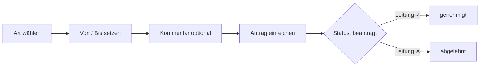

# Urlaub & Abwesenheit

Auf der Seite **Urlaub & Abwesenheiten** beantragst du Urlaub, Freizeitausgleich, Krank- und Fortbildungszeiten. Die **Leitung** genehmigt oder lehnt die Anträge ab. Genehmigte und beantragte Tage fließen automatisch in dein Urlaubskonto und in die Berechnung der fehlenden Arbeitszeittage ein.

## Dein Urlaubskonto

Oben zeigen vier Kacheln den Stand für das gewählte Jahr:

| Kachel | Bedeutung |
|---|---|
| **Resturlaub (Tage)** | Anspruch − genommen − beantragt. |
| **genommen** | Werktage aus **genehmigten** Urlaubsanträgen. |
| **beantragt** | Werktage aus noch offenen (beantragten) Urlaubsanträgen. |
| **Anspruch/Jahr** | Dein hinterlegter Jahresanspruch (Standard 30 Tage). |

!!! info "Werktage, nicht Kalendertage"
    Gezählt werden nur Arbeitstage (Mo–Fr) ohne Berliner Feiertage. Ein Antrag von Freitag bis Montag ergibt also 2 Werktage. Beantragte, aber noch nicht genehmigte Tage mindern den Resturlaub bereits – so wird nicht doppelt geplant.

## Antrag stellen

1. **Art** wählen: Urlaub, Freizeitausgleich, Krank, Fortbildung oder Sonstige.
2. **Von** und **Bis** als Datum angeben (beide Pflicht).
3. **Kommentar** optional ergänzen.
4. **Antrag einreichen** klicken.

Der Antrag erhält den Status **beantragt** und erscheint unten unter "Meine Anträge".

!!! warning "Gültige Daten"
    Fehlt ein Datum oder liegt **Bis vor Von**, weist die App den Antrag mit einer Fehlermeldung zurück. Bei unbekannter/leerer Art wird automatisch "Sonstige" gesetzt.

## Meine Anträge

Die Tabelle listet alle deine Anträge mit **Art**, **Zeitraum**, **Werktagen**, **Status** und **Kommentar**. Der Status ist farbig gekennzeichnet:

| Status | Bedeutung |
|---|---|
| **beantragt** (gelb) | Wartet auf Entscheidung der Leitung. |
| **genehmigt** (grün) | Von der Leitung bewilligt. |
| **abgelehnt** (rot) | Von der Leitung abgelehnt. |

## Genehmigung durch die Leitung

Mitglieder mit der Rolle **Leitung** sehen zusätzlich den Block **"Offene Anträge des Teams (Genehmigung)"** mit allen team-offenen Anträgen (Mitarbeiter*in, Art, Zeitraum, Werktage, Kommentar).

- **✓** genehmigt den Antrag (Status → genehmigt).
- **✕** lehnt ihn ab (Status → abgelehnt).

Nach der Entscheidung erscheint eine Bestätigung, und der Antrag verschwindet aus der Liste der offenen Anträge. Der Antragstellende sieht den neuen Status sofort in "Meine Anträge".

!!! note "Auswirkung auf Kennzahlen"
    Genehmigter **Urlaub** erhöht die Kachel "genommen" und senkt den Resturlaub. Alle nicht abgelehnten Abwesenheiten (auch Krank, Fortbildung, Freizeitausgleich) zählen als abgedeckte Tage und verringern die "fehlenden Tage" in der [Arbeitszeiterfassung](arbeitszeit-stempeluhr.md).

!!! tip "Rollen"
    Nur die Leitung kann Anträge genehmigen/ablehnen; ein direkter Zugriff auf die Statusänderung ohne Leitungsrolle wird vom System abgewiesen.