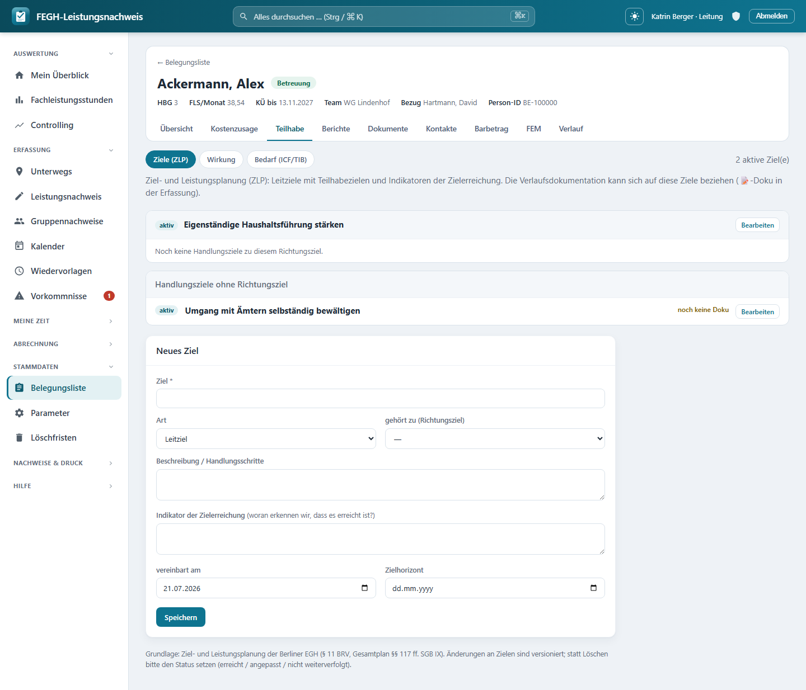

# Ziele der Ziel- und Leistungsplanung (ZLP)

*Ziele (Zielleistungsplanung) mit Status und Zielbezug für die Dokumentation.*

Zu jeder Klient*in kannst du die vereinbarten Ziele aus der **Ziel- und Leistungsplanung (ZLP)** pflegen – die fachliche Grundlage der Betreuung in der Berliner Eingliederungshilfe (§ 11 BRV EGH, Gesamtplan §§ 117 ff. SGB IX). Die App bildet die Berliner Systematik ab: **Leitziele** (die Richtung, im O-Ton der Person) mit darunter hängenden, operationalen **Teilhabezielen**, jeweils mit einem **Indikator der Zielerreichung**, einem **Status** und – für den Bericht – einem **Zielerreichungsgrad in Prozent**. Deine Verlaufsdokumentation kann sich später gezielt auf diese Ziele beziehen, sodass sichtbar wird, an welchen Zielen tatsächlich gearbeitet wurde.

Du erreichst die Seite über die Fallakte einer Klient*in: Reiter **Teilhabe → Ziele (ZLP)**. Daneben liegen dort die Reiter **Wirkung** und **Bedarf (ICF/TIB)**.

!!! note "Berliner Terminologie: Leitziel und Teilhabeziel"
    Die Oberfläche folgt dem offiziellen Berliner ZLP-Formular des Gesamtplanverfahrens: Ein **Leitziel** beschreibt die grobe Richtung, ein **Teilhabeziel (operational)** ist ein konkretes, überprüfbares Unterziel mit Indikator. Intern heißen diese beiden Arten technisch noch `richtungsziel` und `handlungsziel` (Alt-Terminologie) – in der App und in dieser Anleitung siehst du aber die aktuellen Begriffe Leitziel/Teilhabeziel.

---

## Aufbau der Seite

Oben zeigt eine Zeile die Zahl der **aktiven Ziel(e)** und verlinkt zu den Nachbarreitern (Wirkung, Bedarf). Darunter stehen die Ziele in dieser Struktur:

- Jedes **Leitziel** bildet einen Block mit Status-Kennzeichen, Titel und (falls gesetzt) dem Zielhorizont.
- Darunter hängen die zugehörigen **Teilhabeziele** – je mit Status, Titel, Indikator und einer Verlaufsspalte.
- Teilhabeziele ohne übergeordnetes Leitziel sammeln sich in einem eigenen Block **„Teilhabeziele ohne Leitziel“**.

Sind noch gar keine Ziele vereinbart, weist die Seite darauf hin, dass du unten das erste Leitziel anlegen kannst.

### Zielverlauf: „vergessene“ Ziele aufdecken

Rechts an jedem Teilhabeziel steht eine **Verlaufsspalte**. Sie zählt, wie viele Verlaufsdoku-Einträge sich schon auf dieses Ziel beziehen, und zeigt das Datum der letzten Doku:

| Anzeige | Bedeutung |
|---------|-----------|
| **N Doku-Einträge · zuletzt TT.MM.JJJJ** | Zu diesem Ziel gibt es N Verlaufstexte, der letzte vom genannten Datum |
| **noch keine Doku** (orange) | Auf dieses Ziel bezieht sich bisher **kein** Verlaufstext |

!!! tip "Woran erkenne ich unbearbeitete Ziele?"
    Der orange Hinweis **„noch keine Doku“** macht sichtbar, welche Teilhabeziele vereinbart, aber noch nie in der Verlaufsdoku aufgegriffen wurden – nützlich vor Fallbesprechung oder Bericht, um keine Ziele aus dem Blick zu verlieren.

---

## Ein Ziel anlegen oder bearbeiten

Unten auf der Seite liegt das Formular **„Neues Ziel“**. Klickst du bei einem bestehenden Ziel auf **„Bearbeiten“**, füllt sich dasselbe Formular mit dessen Werten (Überschrift **„Ziel bearbeiten“**, dazu ein **„Abbrechen“**-Link).

Diese Felder stehen zur Verfügung:

| Feld | Pflicht | Bedeutung |
|------|---------|-----------|
| **Ziel** | ja | Der Titel/die Formulierung des Ziels (max. 200 Zeichen). Ohne Titel wird nicht gespeichert. |
| **Art** | – | **Leitziel** oder **Teilhabeziel (operational)**. |
| **gehört zu (Richtungsziel)** | – | Ordnet ein Teilhabeziel einem Leitziel unter. Nur wirksam bei Art „Teilhabeziel“; Auswahl aus den vorhandenen Leitzielen. |
| **Beschreibung / Handlungsschritte** | – | Freitext zum Vorgehen. |
| **Indikator der Zielerreichung** | – | Woran erkennen wir, dass das Ziel erreicht ist? (Freitext) |
| **vereinbart am** | – | Datum der Zielvereinbarung (vorbelegt mit heute). |
| **Zielhorizont** | – | Bis wann das Ziel erreicht sein soll. |
| **Status** | – | Nur beim Bearbeiten sichtbar (siehe unten). |
| **Zielerreichung %** | – | Nur beim Bearbeiten sichtbar; 0–100, für den Informationsbericht. |
| **Reihenfolge** | – | Nur beim Bearbeiten sichtbar; steuert die Sortierung (0–999). |

!!! note "Status, Zielerreichung % und Reihenfolge erst nach dem Anlegen"
    Beim **neuen** Ziel siehst du diese drei Felder noch nicht – ein frisch angelegtes Ziel ist automatisch **aktiv**. Sie erscheinen erst, wenn du das Ziel später über **„Bearbeiten“** öffnest.

### Wie Leitziel und Teilhabeziel zusammenhängen

- Ein **Teilhabeziel** kann über **„gehört zu (Richtungsziel)“** einem Leitziel zugeordnet werden. Ohne Zuordnung landet es im Block „Teilhabeziele ohne Leitziel“.
- Änderst du die Art eines Leitziels, unter dem bereits Teilhabeziele hängen, auf **Teilhabeziel**, werden dessen Unterziele automatisch **freigestellt** (sie rutschen in „ohne Leitziel“). Die App meldet das ausdrücklich, damit nichts unbemerkt aus der Anzeige verschwindet.
- Ein Ziel kann niemals sich selbst übergeordnet sein – das verhindert die App.

---

## Status setzen und Zielerreichung

Der **Status** dokumentiert den Stand eines Ziels. Es gibt vier Werte:

| Status | Bedeutung |
|--------|-----------|
| **aktiv** | Ziel wird aktuell verfolgt |
| **erreicht** | Ziel ist erreicht |
| **angepasst (fortgeschrieben)** | Ziel wurde inhaltlich fortgeschrieben |
| **nicht weiterverfolgt** | Ziel wird nicht weiter bearbeitet |

Für den schnellen Wechsel gibt es direkt an jedem Teilhabeziel Knöpfe:

- Ist das Ziel **aktiv**, erscheint **„✓ erreicht“** – ein Klick markiert es als erreicht.
- Sonst erscheint **„↻ aktiv“** – ein Klick setzt es wieder auf aktiv.

Feiner steuerst du den Status im Bearbeiten-Formular über das Auswahlfeld **„Status“**.

Das Feld **„Zielerreichung %“** (0–100) hältst du beim Bearbeiten fest. Es speist den **Informationsbericht** des örtlichen Trägers, der auswertet, inwieweit am Ende des Leistungszeitraums die Teilhabeziele erreicht wurden.

!!! warning "Löschen ist der Leitung vorbehalten – und selten der richtige Weg"
    Fachlich korrekt ist fast immer, den **Status** zu setzen (erreicht / angepasst / nicht weiterverfolgt), statt zu löschen – so bleibt die Historie der Ziel- und Leistungsplanung nachvollziehbar. Das **Löschen** (✕) sieht daher nur die **Leitung**, und die App fragt vor dem endgültigen Entfernen noch einmal nach. Für normale Betreuer*innen gibt es keinen Löschknopf.

---

## Zielbezug der Verlaufsdokumentation

Der eigentliche Nutzen der Ziele entsteht, wenn sich die **Verlaufsdoku** darauf bezieht. Beim Schreiben eines Doku-Textes (📝 im Erfassungs-Grid, siehe [Dokumentation](dokumentation.md)) kannst du die **aktiven Ziele** der Klient*in auswählen, auf die sich der Eintrag bezieht. Diese Verknüpfung ist optional – Doku ohne Zielbezug bleibt möglich.

Genau aus diesen Verknüpfungen speist sich die Verlaufsspalte auf der Ziele-Seite (Anzahl Doku-Einträge, letztes Datum). So schließt sich der Kreis: geplante Ziele ↔ dokumentierte Arbeit.

!!! note "Nur aktive Ziele im Doku-Bezug"
    Im Doku-Modal werden ausschließlich **aktive** Ziele zur Auswahl angeboten. Bereits erreichte oder nicht weiterverfolgte Ziele erscheinen dort nicht – der Zielbezug bleibt so auf die aktuell laufende Planung fokussiert.

---

## Zugriff und Datenschutz

!!! warning "Team-Scoping"
    Die Ziele-Seite ist – wie die Verlaufsdoku – nur für Personen mit **Klienten-Zugriff** zu erreichen: Bezugsbetreuer*in, Vertretung und Leitung des Teams (`klienten_fuer(request.user)`). Rollen **ohne Klientenbezug** – **Verwaltung und Admin** – haben hier keinen Zugriff, weil ihre Klientenliste bewusst leer ist (DSGVO-Trennung). Der Versuch, Ziele einer fremden Klient*in zu öffnen oder zu speichern, wird serverseitig abgewiesen.

!!! danger "Besonders schützenswerte Daten (Art. 9 DSGVO)"
    Ziel-Freitexte (Titel, Beschreibung, Indikator) sind personenbezogene Gesundheits-/Sozialdaten. Sie werden **datensparsam** behandelt: Änderungen an Zielen sind zwar versioniert (Fortschreibung nachvollziehbar), die schützenswerten **Freitexte werden aber bewusst NICHT in die Historientabelle geschrieben** – so überdauern sie das Löschkonzept nicht. Wird eine Klient*in anonymisiert, verschwinden mit ihr auch die Ziele, ohne Freitext-Rückstände in der History.

---

## Für Neugierige: Technik dahinter

!!! note "Nur zur Nachvollziehbarkeit"
    Diese Seite dient dem Verständnis; für die Bedienung brauchst du sie nicht. Die Namen unten entsprechen dem echten Code.

- **Seiten-View:** `nachweis/views_ziele.py` → `ziele(request, pk)`. Lädt die Klient*in über `services.klienten_fuer(request.user)`, gruppiert die Ziele in Leitziele (`ZielArt.RICHTUNGSZIEL`) mit Kindern und „freie“ Teilhabeziele, zählt aktive Ziele (`n_aktiv`) und annotiert je Ziel `doku_anzahl` / `doku_zuletzt` (Aggregat über `leistungen` mit `dokumentation__gt=""`).
- **Speichern:** `ziel_speichern` (POST). Validiert Titel, setzt Art/Übergeordnetes (verhindert Selbstzyklus per `.exclude(pk=z.pk)`), stellt Unterziele beim Art-Wechsel frei, begrenzt `erreicht_grad` auf 0–100 und `reihenfolge` auf 0–999.
- **Schnell-Status:** `ziel_status` (POST) für „✓ erreicht“ / „↻ aktiv“; schreibt nur `status` + `geaendert`.
- **Löschen:** `ziel_loeschen` (POST) – hinter `services.ist_leitung(request.user)`, sonst `HttpResponseForbidden`.
- **Doku-Bezug:** `api_ziele` (GET) liefert dem Doku-Modal die **aktiven** Ziele (`id`, `titel`, `art`) via `klient.ziele.filter(status=ZielStatus.AKTIV)`.
- **Modelle:** `nachweis/models.py` → `Ziel` (`klient`, `art`, `uebergeordnet` als Selbst-FK, `titel`, `beschreibung`, `indikator`, `status`, `erreicht_grad`, `gueltig_von`/`gueltig_bis`, `reihenfolge`; `HistoricalRecords(excluded_fields=["titel", "beschreibung", "indikator"])`). Auswahllisten: `ZielArt` (Leitziel/Teilhabeziel) und `ZielStatus` (aktiv/erreicht/angepasst/nicht weiterverfolgt). Der Zielbezug der Doku hängt an `Leistung.ziele` (`ManyToManyField("Ziel")`).
- **Template:** `nachweis/templates/nachweis/ziele.html` (Blöcke pro Leitziel, Verlaufsspalte, Anlege-/Bearbeiten-Formular). Reiter Wirkung/Bedarf über die `fa-subnav`.
- **URLs:** `nachweis/urls.py` → `nachweis:ziele`, `nachweis:ziel_speichern`, `nachweis:ziel_status`, `nachweis:ziel_loeschen`, `nachweis:api_ziele`.
