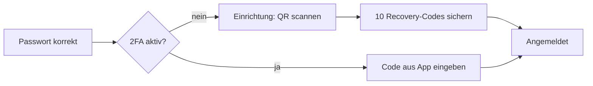
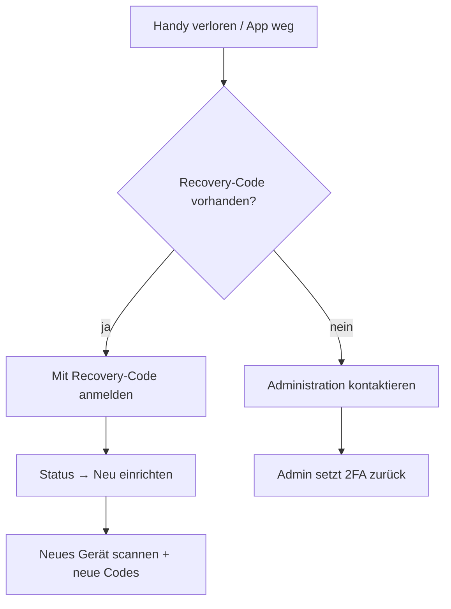

# Zwei-Faktor-Anmeldung (2FA)

Die Zwei-Faktor-Authentifizierung schützt Ihren Zugang zusätzlich zum Passwort mit einem **Einmalcode**, der alle 30 Sekunden neu in einer App auf Ihrem Smartphone erzeugt wird. Selbst wenn jemand Ihr Passwort kennt, kann er sich ohne dieses zweite Element nicht anmelden – ein wichtiger Schutz für die sensiblen Betreuungsdaten.

Technisch basiert 2FA auf dem verbreiteten **TOTP**-Verfahren (Time-based One-Time Password) und ist mit jeder gängigen Authenticator-App kompatibel. QR-Codes werden lokal auf dem Server erzeugt – es werden keine Daten an externe Dienste übertragen.

## 1. Zwei-Faktor einrichten

Sie erreichen die Einrichtung über das **Schild-Symbol** oben rechts in der Kopfleiste → **Jetzt einrichten**, oder Sie werden nach dem Login automatisch dorthin geführt, falls 2FA für Sie verpflichtend ist.

### Schritt 1 – Authenticator-App installieren

Installieren Sie auf Ihrem Smartphone eine Authenticator-App. Bewährt haben sich:

- **Aegis** (Android, quelloffen – Empfehlung)
- **Google Authenticator** (Android/iOS)
- **FreeOTP** (Android/iOS)

### Schritt 2 – QR-Code scannen

Die Einrichtungsseite zeigt einen **QR-Code**. Öffnen Sie in der App die Funktion „Konto hinzufügen" und scannen Sie den Code. Damit kennt die App das gemeinsame Geheimnis und erzeugt fortan passende Codes.

!!! tip "Kein Scan möglich?"
    Unter dem QR-Code steht der **Schlüssel im Klartext**. Diesen können Sie in der App auch manuell eintippen, falls die Kamera nicht funktioniert.

### Schritt 3 – Code bestätigen

Geben Sie den aktuell in der App angezeigten **6-stelligen Code** in das Feld *„Code aus der App"* ein und klicken Sie auf **Aktivieren**.

- Ist der Code korrekt, wird 2FA aktiviert und Ihre laufende Sitzung sofort als verifiziert markiert.
- Ist der Code falsch/abgelaufen, erscheint *„Code ungültig – bitte den aktuellen 6-stelligen Code eingeben."* Warten Sie den nächsten Code ab und versuchen Sie es erneut.

Mit **Später** können Sie die Einrichtung überspringen, sofern 2FA für Sie noch nicht verpflichtend ist.

### Schritt 4 – Recovery-Codes sichern

Nach erfolgreicher Aktivierung zeigt die App **einmalig** eine Liste mit **10 Recovery-Codes** an.

!!! warning "Diese Codes werden nie wieder angezeigt!"
    Recovery-Codes sind Ihr Notfall-Zugang, falls Ihr Smartphone verloren geht oder nicht erreichbar ist. **Jeder Code funktioniert genau einmal.**

    - **Drucken** Sie die Liste über die Schaltfläche *Drucken*, oder
    - speichern Sie die Codes in einem **Passwort-Manager**.

    Bewahren Sie die Codes sicher und getrennt vom Smartphone auf. Bestätigen Sie anschließend mit **„Ich habe sie notiert"**.

## 2. Anmelden mit Code

Bei aktiver 2FA läuft die Anmeldung in zwei Stufen ab:

1. Benutzername und Passwort eingeben.
2. Auf der Folgeseite den aktuellen **6-stelligen Code** aus Ihrer Authenticator-App eingeben und auf **Anmelden** klicken.

Statt eines App-Codes können Sie hier auch einen Ihrer **Recovery-Codes** eingeben (das Eingabefeld akzeptiert auch die längeren Backup-Codes). Bei falschem Code erscheint *„Code ungültig. Bitte erneut versuchen (auch Recovery-Code möglich)."*

Über **Abmelden** gelangen Sie zurück zur Anmeldemaske, falls Sie den Vorgang abbrechen möchten.

## 3. Statusseite: verwalten & Gerät wechseln

Das **Schild-Symbol** in der Kopfleiste führt zur Seite *Zwei-Faktor-Authentifizierung*. Dort sehen Sie:

| Kachel / Aktion | Bedeutung |
|---|---|
| **Status** | *aktiviert* (grün) oder *nicht aktiviert* (orange) |
| **Verbleibende Recovery-Codes** | Wie viele Ihrer 10 Notfallcodes noch ungenutzt sind |
| **Neu einrichten (Gerät wechseln)** | Startet die Einrichtung erneut – z. B. bei neuem Smartphone. Es werden dabei frische Recovery-Codes erzeugt. |
| **Deaktivieren** | Schaltet 2FA ab (Sicherheitsabfrage). |

!!! tip "Gehen Ihnen die Recovery-Codes aus?"
    Sinkt die Zahl der verbleibenden Recovery-Codes gegen null, richten Sie 2FA über **Neu einrichten** einmal frisch ein – dabei erhalten Sie wieder 10 neue Codes.

## 4. Smartphone verloren – was tun?

1. **Wenn Sie noch einen Recovery-Code haben:** Melden Sie sich wie gewohnt mit Benutzername und Passwort an und geben Sie auf der Code-Seite einen **Recovery-Code** statt des App-Codes ein. Öffnen Sie danach die 2FA-Statusseite und wählen Sie **Neu einrichten (Gerät wechseln)**, um das neue Smartphone zu hinterlegen. Sie erhalten dabei neue Recovery-Codes.
2. **Wenn Sie keinen Recovery-Code mehr haben:** Wenden Sie sich an die **Administration**. Diese kann Ihr Zwei-Faktor-Gerät im Admin-Bereich zurücksetzen, sodass Sie 2FA neu einrichten können.

!!! warning "Für Admins: 2FA eines Nutzers zurücksetzen"
    Im Django-Admin unter *TOTP devices* (bzw. *Static devices* für die Recovery-Codes) lässt sich das bestätigte Gerät des betroffenen Kontos löschen. Nach dem nächsten Login wird der/die Nutzer\*in erneut durch die Einrichtung geführt. Prüfen Sie die Identität der Person vor dem Zurücksetzen sorgfältig.
