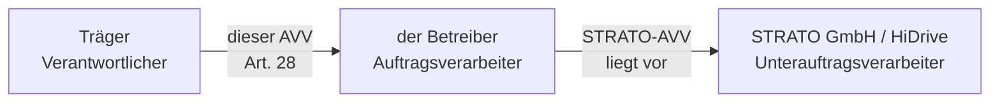

# Auftragsverarbeitungsvertrag Träger ↔ Betreiber (Art. 28)

!!! abstract "Ausfüllbare Vorlage"
    **Dokumenttyp:** Vertrag zur Auftragsverarbeitung nach Art. 28 Abs. 3 DSGVO
    **Parteien:** Träger (Verantwortlicher) ↔ der Betreiber (Betreiber / Auftragsverarbeiter)
    **Gegenstand:** Betrieb der Webanwendung „FEGH-Leistungsnachweis" (Team TBEW)
    **Stand / Version:** **[AUSFUELLEN: Versions-Nr. + Datum, z. B. 1.0 / 2026-__-__ ]**
    **Verantwortlich für dieses Dokument:** **[AUSFUELLEN: Name, Funktion beim Träger ]**
    **Freigabe / Unterzeichnung:** **[AUSFUELLEN: Datum + Unterschrift beider Parteien ]**

    Dies ist ein **Template**. Die technisch/betrieblichen Felder (Betreiberdaten, TOM,
    Unterauftragsverarbeiter) sind aus dem verifizierten Systemstand **vorausgefüllt**. Alle mit
    **[AUSFUELLEN: … ]** markierten Felder entscheidet und ergänzt der **Träger (Verantwortlicher)
    gemeinsam mit der/dem Datenschutzbeauftragten (DSB)**. Suchen Sie im Dokument nach dem Token
    `[AUSFUELLEN` , um alle offenen Punkte zu finden.

!!! warning "Rechtsprüfung erforderlich"
    Diese Vorlage bildet die Pflichtklauseln des Art. 28 Abs. 3 DSGVO ab und ist auf den konkreten
    Systemstand zugeschnitten. Die **finale, rechtsverbindliche Fassung** ist vor Unterzeichnung mit
    der/dem **Datenschutzbeauftragten des Trägers abzustimmen und juristisch zu prüfen**. Sie ersetzt
    keine Rechtsberatung.

!!! danger "Voraussetzung vor dem Echtbetrieb"
    Das System befindet sich derzeit im **Prototyp-Stadium mit ausschließlich fiktiven Demodaten**.
    Dieser AVV ist – zusammen mit den übrigen Pflichtdokumenten – **vor dem ersten echten
    Klientendatensatz** abzuschließen und von beiden Parteien zu unterzeichnen.

---

## 0. Warum dieser AVV zusätzlich zum STRATO-AVV nötig ist

!!! note "Zwei Verträge, zwei Ebenen"
    Für den datenschutzkonformen Betrieb existieren **zwei** getrennte Auftragsverarbeitungsverträge
    auf unterschiedlichen Ebenen der Verarbeitungskette:

    1. **STRATO-AVV (liegt vor):** regelt das Verhältnis **Betreiber (der Betreiber) ↔ STRATO GmbH**.
       STRATO stellt die Infrastruktur (vServer, HiDrive-Backup-Speicher). Dieser AVV betrifft
       ausschließlich das Hosting und macht STRATO zum Auftragsverarbeiter des Betreibers.
    2. **Dieser AVV (Träger ↔ Betreiber):** Der **Träger ist der Verantwortliche** der
       Klientendaten. Er beauftragt den Betreiber mit dem Betrieb der Anwendung. Erst dieser Vertrag
       stellt die nach Art. 28 DSGVO erforderliche **Weisungs- und Haftungskette vom Verantwortlichen
       bis zur eingesetzten Infrastruktur** her.

    In diesem Vertrag werden **STRATO und STRATO HiDrive als genehmigte Unterauftragsverarbeiter**
    (Sub-Prozessoren) des Betreibers gegenüber dem Träger benannt (siehe Anhang 3). Die Kette lautet
    damit:

    **Träger (Verantwortlicher) → der Betreiber (Auftragsverarbeiter) → STRATO / HiDrive
    (Unterauftragsverarbeiter).**

---

## 1. Vertragsparteien

### 1.1 Verantwortlicher (Auftraggeber)

| Feld | Eintrag |
|------|---------|
| Name des Verantwortlichen (Träger) | **[AUSFUELLEN: vollständiger Name der Einrichtung / des Trägers ]** |
| Anschrift | **[AUSFUELLEN: Straße, PLZ, Ort ]** |
| Gesetzlich vertreten durch | **[AUSFUELLEN: Geschäftsführung / vertretungsberechtigte Person ]** |
| Ansprechpartner Datenschutz / DSB | **[AUSFUELLEN: Name, Kontaktdaten der/des DSB ]** |

### 1.2 Auftragsverarbeiter (Betreiber)

| Feld | Eintrag |
|------|---------|
| Name | der Betreiber |
| Anschrift | **[AUSFUELLEN: Anschrift ]** |
| Funktion | Betrieb, technische Administration und Wartung der Anwendung „FEGH-Leistungsnachweis" |
| Beschäftigungs- / Beauftragungsverhältnis zum Träger | **[AUSFUELLEN: z. B. angestellt, freiberuflich beauftragt, o. Ä. — Grundlage der Beauftragung ]** |
| Kontakt für Datenschutzangelegenheiten | **[AUSFUELLEN: E-Mail / Telefon für Meldungen und Weisungen ]** |

– nachstehend gemeinsam „**die Parteien**", einzeln „**Verantwortlicher**" bzw. „**Auftragsverarbeiter**".

---

## 2. Gegenstand, Art und Zweck der Verarbeitung (Art. 28 Abs. 3 S. 1)

| Punkt | Inhalt |
|-------|--------|
| **Gegenstand** | Betrieb, Hosting-Verwaltung, technische Administration, Wartung und Datensicherung der Webanwendung „FEGH-Leistungsnachweis" zur Dokumentation und Abrechnung von Fachleistungsstunden (FLS/kLE) im Team TBEW (Therapeutisch Betreutes Einzelwohnen). |
| **Art der Verarbeitung** | Erheben, Erfassen, Speichern, Ordnen, Anpassen, Auslesen, Abfragen, Verwenden, Bereitstellen (Anzeige/Export für den Nachweis), Sichern, Löschen/Anonymisieren – im Rahmen des Betriebs der Anwendung auf dem vom Auftragsverarbeiter verwalteten Server. |
| **Zweck** | Dokumentation erbrachter Fachleistungen, Nachweis und Abrechnung gegenüber dem Kostenträger (Bezirksamt / Senat Berlin), interne Steuerung des Teams. Der Auftragsverarbeiter verarbeitet die Daten **ausschließlich** zur Erbringung der vereinbarten Betriebs- und Wartungsleistung und **nicht** für eigene Zwecke. |
| **Dauer** | Für die Laufzeit dieses Vertrages (siehe Ziff. 14). |

Kategorien betroffener Personen und personenbezogener Daten: siehe **Anhang 1**.

---

## 3. Weisungsgebundenheit (Art. 28 Abs. 3 lit. a)

1. Der Auftragsverarbeiter verarbeitet personenbezogene Daten **ausschließlich auf dokumentierte
   Weisung** des Verantwortlichen, einschließlich hinsichtlich einer etwaigen Übermittlung in ein
   Drittland – sofern er nicht durch Unionsrecht oder das Recht der Mitgliedstaaten, dem er
   unterliegt, hierzu verpflichtet ist. In einem solchen Fall teilt er dem Verantwortlichen diese
   rechtliche Anforderung vor der Verarbeitung mit, sofern das Recht dies nicht wegen eines wichtigen
   öffentlichen Interesses verbietet.
2. Weisungen werden grundsätzlich in **Textform** (E-Mail genügt) erteilt und dokumentiert.
   Mündliche Weisungen sind unverzüglich in Textform zu bestätigen.
3. Ist der Auftragsverarbeiter der Auffassung, dass eine Weisung **gegen Datenschutzrecht**
   (DSGVO / BDSG / SGB) verstößt, informiert er den Verantwortlichen **unverzüglich**. Er ist
   berechtigt, die Ausführung der betreffenden Weisung bis zu deren Bestätigung oder Änderung
   auszusetzen (Art. 28 Abs. 3 S. 3 DSGVO).
4. Weisungsbefugte Personen aufseiten des Verantwortlichen: **[AUSFUELLEN: Namen/Funktionen der
   weisungsbefugten Personen beim Träger ]**.
   Weisungsempfänger aufseiten des Auftragsverarbeiters: der Betreiber (Kontakt siehe Ziff. 1.2).

---

## 4. Vertraulichkeit & Sozialgeheimnis (Art. 28 Abs. 3 lit. b)

1. Der Auftragsverarbeiter gewährleistet, dass sich die zur Verarbeitung befugten Personen zur
   **Vertraulichkeit verpflichtet** haben oder einer angemessenen gesetzlichen Verschwiegenheitspflicht
   unterliegen.
2. Da es sich um Daten der Eingliederungshilfe handelt, gelten zusätzlich die besonderen
   Geheimnisschutzpflichten:

    !!! warning "Sozialgeheimnis und Berufsgeheimnis"
        - **§ 35 SGB I** (Sozialgeheimnis) und **§§ 67 ff. SGB X** (Schutz von Sozialdaten) sind zu
          wahren; Sozialdaten dürfen nur im gesetzlich zulässigen Rahmen verarbeitet werden.
        - **§ 203 StGB** (Verletzung von Privatgeheimnissen) erstreckt sich auf die beim
          Auftragsverarbeiter tätigen, „mitwirkenden Personen"; Verstöße sind strafbewehrt.
        - Der Auftragsverarbeiter und alle von ihm eingesetzten Personen werden hierauf **schriftlich
          verpflichtet**; die Verpflichtungserklärung(en) sind dem Verantwortlichen auf Verlangen
          vorzulegen.

3. Die Verpflichtung besteht **über das Ende dieses Vertrages hinaus** fort.
4. Der Auftragsverarbeiter setzt derzeit **[AUSFUELLEN: „keine weiteren Personen" / Liste weiterer
   eingesetzter Personen mit Funktion ]** ein. Der Einsatz weiterer Personen ist dem Verantwortlichen
   anzuzeigen; für Unterauftragsverarbeiter gilt Ziff. 7.

---

## 5. Technische und organisatorische Maßnahmen (Art. 28 Abs. 3 lit. c i.V.m. Art. 32)

Der Auftragsverarbeiter trifft die zur Sicherheit der Verarbeitung erforderlichen technischen und
organisatorischen Maßnahmen (TOM). Die konkret umgesetzten Maßnahmen sind in **Anhang 2** beschrieben
und aus dem verifizierten Systemstand vorausgefüllt. Änderungen dürfen das Schutzniveau nicht
absenken und sind zu dokumentieren.

---

## 6. Wahrung von Betroffenenrechten (Art. 28 Abs. 3 lit. e)

1. Der Auftragsverarbeiter unterstützt den Verantwortlichen mit **geeigneten technischen und
   organisatorischen Maßnahmen** dabei, seiner Pflicht zur Beantwortung von Anträgen betroffener
   Personen auf Wahrnehmung ihrer Rechte nach Kapitel III DSGVO nachzukommen (Auskunft, Berichtigung,
   Löschung/Einschränkung, Datenübertragbarkeit, Widerspruch — Art. 15–22 DSGVO).
2. Wendet sich eine betroffene Person **unmittelbar** an den Auftragsverarbeiter, leitet er das
   Anliegen **unverzüglich** an den Verantwortlichen weiter und beantwortet es nicht selbst.
3. Für die Erfüllung stellt der Auftragsverarbeiter u. a. bereit: Auslese-/Exportmöglichkeiten aus
   der Anwendung, das lückenlose Änderungsprotokoll (Auditlog) sowie Unterstützung bei
   Berichtigung/Anonymisierung (siehe Anhang 2, Ziff. „Löschung/Anonymisierung").

    !!! note "Bekannte Einschränkung"
        Ein Klientendatensatz ist wegen Fremdschlüssel-Bezügen (Leistungen, Termine, Nachweise)
        technisch **nicht ersatzlos löschbar**; vorgesehen ist eine **Anonymisierung** über einen
        Verwaltungs-Command. Die Umsetzung der Lösch-/Anonymisierungs-Routine ist derzeit **in
        Arbeit** und vor Echtbetrieb fertigzustellen.

---

## 7. Unterauftragsverarbeiter / Sub-Prozessoren (Art. 28 Abs. 2 & 4)

1. Der Verantwortliche erteilt seine **allgemeine schriftliche Genehmigung** zum Einsatz der in
   **Anhang 3** benannten Unterauftragsverarbeiter. Bei Vertragsschluss genehmigt: **STRATO GmbH**
   (Hosting vServer) und **STRATO HiDrive** (verschlüsselter Offsite-Backup-Speicher).
2. Der Auftragsverarbeiter hat mit STRATO einen den Anforderungen des Art. 28 DSGVO genügenden
   Vertrag geschlossen (**STRATO-AVV [AUSFUELLEN: Version ], Kundennr. [AUSFUELLEN: Kundennr. ], abgeschlossen am [AUSFUELLEN: Vertragsdatum ]**);
   die Datenschutzpflichten dieses Vertrages werden dem Unterauftragsverarbeiter **auferlegt**.
3. **Genehmigungsverfahren für weitere Unterauftragsverarbeiter:** Beabsichtigt der
   Auftragsverarbeiter, **weitere** Unterauftragsverarbeiter hinzuzuziehen oder bestehende zu
   ersetzen, informiert er den Verantwortlichen **vorab** in Textform. Der Verantwortliche kann
   **binnen [AUSFUELLEN: Frist, z. B. 14 Tage]** aus wichtigem, datenschutzbezogenem Grund
   **widersprechen**. Ohne fristgerechten Widerspruch gilt die Änderung als genehmigt.
4. Dem Unterauftragsverarbeiter werden **dieselben Datenschutzpflichten** auferlegt, die in diesem
   Vertrag festgelegt sind (Art. 28 Abs. 4 DSGVO). Kommt der Unterauftragsverarbeiter seinen
   Datenschutzpflichten nicht nach, **haftet der Auftragsverarbeiter** gegenüber dem Verantwortlichen
   für die Einhaltung dieser Pflichten in vollem Umfang.
5. Die **jeweils aktuelle Liste** der von STRATO eingesetzten Unter-Unterauftragsverarbeiter kann sich
   ändern (STRATO-Anhang 2); der Auftragsverarbeiter überwacht Änderungsmitteilungen von STRATO und
   informiert den Verantwortlichen, falls sich hieraus ein Drittlandbezug oder ein wesentlich
   verändertes Risiko ergibt.

    !!! tip "Kein Drittlandtransfer für vServer + HiDrive"
        Laut STRATO-Anhang 2 sitzen die für vServer und HiDrive eingesetzten
        Unter-Unterauftragsverarbeiter in **DE / EU / EWR bzw. der Schweiz**; für die hier genutzten
        Dienste (vServer + HiDrive) findet **keine Übermittlung in ein Drittland** statt. Die Rechenzentren
        stehen in Deutschland und sind **ISO-27001-zertifiziert**.

---

## 8. Unterstützung bei Sicherheit, DSFA & Meldepflichten (Art. 28 Abs. 3 lit. f i.V.m. Art. 32–36)

Der Auftragsverarbeiter unterstützt den Verantwortlichen unter Berücksichtigung der Art der
Verarbeitung und der ihm zur Verfügung stehenden Informationen bei der Einhaltung der Pflichten aus:

- **Art. 32** – Sicherheit der Verarbeitung (Umsetzung und Nachweis der TOM, siehe Anhang 2);
- **Art. 33/34** – Meldung von Verletzungen an die Aufsichtsbehörde und Benachrichtigung Betroffener
  (Zuarbeit technischer Informationen, siehe Ziff. 9);
- **Art. 35** – Datenschutz-Folgenabschätzung (Bereitstellung von System-/TOM-Informationen);
- **Art. 36** – vorherige Konsultation der Aufsichtsbehörde.

Zuständige Aufsichtsbehörde des Verantwortlichen: **Berliner Beauftragte für Datenschutz und
Informationsfreiheit (BlnBDI)** (Datenpannen über deren Online-Meldeformular).

---

## 9. Meldung von Datenschutzverletzungen (Art. 28 Abs. 3 lit. f, Art. 33)

1. Der Auftragsverarbeiter meldet dem Verantwortlichen **jede** ihm bekannt gewordene Verletzung des
   Schutzes personenbezogener Daten **unverzüglich** – **spätestens innerhalb von [AUSFUELLEN:
   z. B. 24 Stunden]** nach Kenntniserlangung.
2. Die Meldung erfolgt an: **[AUSFUELLEN: Melde-Kontakt beim Träger — Name, E-Mail, Telefon (24/7?) ]**
   und enthält, soweit möglich: Art der Verletzung, betroffene Kategorien und ungefähre Zahl der
   Betroffenen und Datensätze, wahrscheinliche Folgen sowie ergriffene / vorgeschlagene
   Gegenmaßnahmen.
3. Die Meldung an die Aufsichtsbehörde (BlnBDI) und ggf. an die Betroffenen obliegt dem
   **Verantwortlichen**; der Auftragsverarbeiter liefert die dafür erforderliche Zuarbeit.

    !!! note "Unterstützende Systemmaßnahmen"
        Das lückenlose Änderungsprotokoll (django-auditlog) sowie Monitoring/Alarmierung
        (Healthcheck, Uptime-Monitoring, Dead-Man's-Switch für Backups) unterstützen die zeitnahe
        Erkennung. **Bekannte Lücke:** rein **lesende** Zugriffe werden derzeit **nicht** protokolliert
        (nur Anlegen/Ändern/Löschen).

---

## 10. Löschung oder Rückgabe nach Vertragsende (Art. 28 Abs. 3 lit. g)

1. Nach Abschluss der Erbringung der Verarbeitungsleistungen **löscht** der Auftragsverarbeiter nach
   Wahl des Verantwortlichen alle personenbezogenen Daten oder **gibt sie zurück** und löscht
   vorhandene Kopien, sofern nicht nach Unionsrecht oder mitgliedstaatlichem Recht eine
   Aufbewahrungspflicht besteht.
2. Wahl des Verantwortlichen: **[AUSFUELLEN: „Rückgabe (Datenexport) und anschließende Löschung" ODER
   „Löschung" — Format/Weg der Rückgabe festlegen ]**.
3. Zu berücksichtigende **sozialrechtliche Aufbewahrungsfristen**: **[AUSFUELLEN: einschlägige Fristen,
   vom Träger/DSB festzulegen ]**. Solange Aufbewahrungspflichten bestehen, werden die betreffenden
   Daten **gesperrt/eingeschränkt** statt gelöscht.
4. Auch **Backups** (verschlüsselter Offsite-Spiegel, 7-Tage-Rotation) werden im Rahmen der
   Rotation bzw. gesondert bereinigt; die Löschung ist dem Verantwortlichen auf Verlangen zu
   **bestätigen** (Löschprotokoll).

---

## 11. Nachweise & Kontrollrechte (Art. 28 Abs. 3 lit. h)

1. Der Auftragsverarbeiter stellt dem Verantwortlichen **alle erforderlichen Informationen** zum
   Nachweis der Einhaltung der Pflichten aus Art. 28 DSGVO zur Verfügung und ermöglicht sowie fördert
   **Überprüfungen** (einschließlich Inspektionen), die vom Verantwortlichen oder einem von diesem
   beauftragten Prüfer durchgeführt werden.
2. Nachweise umfassen insbesondere: diese Dokumentation, die TOM-Beschreibung (Anhang 2), die
   Verpflichtungserklärungen (Ziff. 4), den STRATO-AVV sowie Protokolle getesteter Restores.
3. Kontrollen erfolgen mit **angemessener Vorankündigung**, während der üblichen Betriebszeiten und
   ohne unverhältnismäßige Störung des Betriebs. Der Auftragsverarbeiter informiert den
   Verantwortlichen **unverzüglich**, falls er der Auffassung ist, dass eine Weisung gegen
   Datenschutzrecht verstößt (Art. 28 Abs. 3 S. 3 DSGVO).

    !!! info "Unabhängiges Audit vorhanden"
        Für das System liegt ein **unabhängiges Audit** vor. Es bestehen dokumentierte Restrisiken:
        Betrieb durch eine **Einzelperson** (Bus-Faktor 1), **ein einzelner Server** ohne
        Hochverfügbarkeit sowie **keine ISO-27001-Zertifizierung des Systems selbst** (nur der
        Infrastruktur). Gemindert durch: verschlüsselte Offsite-Backups, getesteter Restore,
        Zugriffstrennung, Protokollierung und einen beim Träger zu hinterlegenden **Notfallzugang**
        (siehe Ziff. 12).

---

## 12. Notfallzugang / Betriebskontinuität

1. Zur Absicherung des Restrisikos „Einzelbetreiber" hinterlegt der Auftragsverarbeiter beim
   Verantwortlichen einen **versiegelten Notfallzugang** (Zugangsdaten / Wiederherstellungsschlüssel),
   der es dem Träger im Ausfall des Betreibers ermöglicht, mit fachkundiger Hilfe auf die Daten
   zuzugreifen bzw. sie wiederherzustellen.
2. Ort/Form der Hinterlegung und Zugriffsberechtigte: **[AUSFUELLEN: z. B. verschlossener Umschlag /
   Passwort-Manager beim Träger; benannte Person(en) ]**.
3. Der age-Backup-Privatschlüssel wird **offline** verwahrt; die Regelung zur Notfall-Verwahrung ist
   hier festzulegen: **[AUSFUELLEN: Verwahrort und Zugriff im Notfall ]**.

---

## 13. Haftung

1. Für die Haftung gilt **Art. 82 DSGVO**. Im Innenverhältnis haftet jede Partei für die von ihr zu
   vertretenden Verstöße; der Verantwortliche bleibt gegenüber den Betroffenen und der
   Aufsichtsbehörde primär verantwortlich.
2. Ergänzende Haftungsregelungen (Haftungsumfang, -begrenzung, Versicherung): **[AUSFUELLEN: nach
   juristischer Prüfung — insb. Abstimmung mit etwaigem Dienst-/Arbeitsvertrag und
   Betriebshaftpflicht ]**.

---

## 14. Laufzeit & Kündigung

| Punkt | Regelung |
|-------|----------|
| **Beginn** | **[AUSFUELLEN: Datum des Inkrafttretens ]** |
| **Laufzeit** | **[AUSFUELLEN: unbefristet / befristet bis … — gekoppelt an den zugrunde liegenden Dienst-/Beauftragungsvertrag ]** |
| **Ordentliche Kündigung** | **[AUSFUELLEN: Frist ]** |
| **Außerordentliche Kündigung** | aus wichtigem Grund, insbesondere bei schwerwiegenden, nicht abgestellten Datenschutzverstößen des Auftragsverarbeiters |
| **Folgen** | Abwicklung nach Ziff. 10 (Löschung/Rückgabe) |

Dieser AVV ist **akzessorisch** zum zugrunde liegenden Betriebs-/Beauftragungsverhältnis und endet
spätestens mit diesem.

---

## 15. Schlussbestimmungen

1. Dieser Vertrag wird **schriftlich** geschlossen; das **elektronische Format** (Art. 28 Abs. 9 DSGVO)
   ist ausreichend.
2. Änderungen und Ergänzungen bedürfen der **Textform**; das gilt auch für die Aufhebung dieses
   Formerfordernisses.
3. Bei Widerspruch zwischen diesem AVV und dem zugrunde liegenden Hauptvertrag gehen hinsichtlich des
   Datenschutzes die Regelungen dieses AVV vor.
4. Sollte eine Bestimmung unwirksam sein, bleibt die Wirksamkeit der übrigen Bestimmungen unberührt;
   an ihre Stelle tritt eine Regelung, die dem Zweck der Art. 28 DSGVO am nächsten kommt.
5. Es gilt das Recht der Bundesrepublik Deutschland. Gerichtsstand: **[AUSFUELLEN: Ort ]**.

---

## 16. Unterschriften

| Verantwortlicher (Träger) | Auftragsverarbeiter (Betreiber) |
|---------------------------|----------------------------------|
| Ort, Datum: **[AUSFUELLEN]** | Ort, Datum: **[AUSFUELLEN]** |
| Name: **[AUSFUELLEN: vertretungsberechtigte Person ]** | Name: der Betreiber |
| Funktion: **[AUSFUELLEN]** | Funktion: Betreiber / Auftragsverarbeiter |
| Unterschrift: **[AUSFUELLEN]** | Unterschrift: **[AUSFUELLEN]** |

Zur Kenntnis genommen (empfohlen) — Datenschutzbeauftragte(r) des Trägers:
**[AUSFUELLEN: Name, Datum, Unterschrift ]**

---

# Anhang 1 – Betroffenenkategorien & Datenarten

!!! note "Vorausgefüllt aus dem verifizierten Datenmodell"
    Ausdrücklich **NICHT** gespeichert werden: **Diagnosen, Adressen, Kostenträger-Korrespondenz**.

## A1.1 Kategorien betroffener Personen

| Kategorie | Beschreibung |
|-----------|--------------|
| Leistungsberechtigte Klient*innen | Betreute Personen der Eingliederungshilfe (Team TBEW) |
| Mitarbeitende des Teams | Betreuer*innen, Leitung, administrative Nutzer*innen |

## A1.2 Kategorien personenbezogener Daten

| Objekt | Datenarten |
|--------|------------|
| **Klient** | Name, Geburtsdatum, Hilfebedarfsgruppe (HBG), bewilligte Leistung (AL + kLE, FLS/Monat), Person-ID, Betreuungs-/Berichtsfristen (KUE/BRP), Kürzel, Kommentar, Team, Bezugsbetreuer, Status |
| **Leistung** | Datum/Uhrzeit, Leistungsart, Betreuer, Verlaufs-/Dokumentationstext, Notiz |
| **Termine** | Terminplanung mit Klienten-/Betreuerbezug |
| **Arbeitszeit** | Arbeitszeiterfassung der Beschäftigten |
| **Abwesenheit** | Art der Abwesenheit inkl. **„Krank"** → Gesundheitsdatum der Beschäftigten |
| **Gruppennachweise** | Nachweise über Gruppenleistungen |
| **Team-Handkasse** | Kassenbuchungen, Zählprotokoll |
| **Mitarbeiterdaten** | Stammdaten der Mitarbeitenden |

## A1.3 Besondere Kategorien (Art. 9 DSGVO)

!!! warning "Art. 9 DSGVO – JA"
    Es werden **besondere Kategorien** personenbezogener Daten verarbeitet: Sozial- und
    Gesundheitsbezug der Eingliederungshilfe (bei Klient*innen) sowie Gesundheitsdaten Beschäftigter
    (Abwesenheitsart „Krank").

    **Rechtsgrundlage** (vom DSB zu bestätigen): **Art. 9 Abs. 2 lit. h DSGVO** i. V. m. **SGB IX/X**
    (Leistungserbringung/Abrechnung), **§ 22 BDSG**; für Beschäftigtendaten **§ 26 BDSG**.

---

# Anhang 2 – Technische und organisatorische Maßnahmen (Art. 32)

!!! note "Vorausgefüllt aus dem verifizierten Systemstand"
    Verweis auf die ausführliche Dokumentation im Wiki: [Datenschutz](../sicherheit/datenschutz.md),
    [Härtung](../sicherheit/haertung.md), [Row-Level-Security](../sicherheit/rls.md),
    [Backup & Restore](../sicherheit/backup-restore.md).

## A2.1 Vertraulichkeit (Zugriffs-/Zugangskontrolle)

- **Passwort-Hashing mit Argon2**; Django-Passwortprüfungen.
- **Zwei-Faktor-Pflicht (TOTP)** in Produktion, inkl. gesichertem **Break-Glass-Konto** mit
  Recovery-Codes.
- **Brute-Force-Sperre** (django-axes).
- **Automatische Abmeldung** nach 15 Min Inaktivität (serverseitig erzwungen, `SESSION_IDLE_TIMEOUT`);
  Session zusätzlich an den Arbeitstag gekoppelt (max. 8 h, Ende beim Schließen des Browsers).
- **Team-Datentrennung** auf Anwendungsebene **und** datenbank-erzwungen über **PostgreSQL
  Row-Level-Security (FORCE)**.
- Rolle **„Admin" ohne Klientenzugriff** (Trennung Verwaltung ↔ Fachdaten).
- Interne **Isolations-Regressionstests**.

## A2.2 Integrität

- **Lückenloses Änderungsprotokoll** (django-auditlog: wer / wann / was).
- **HTTPS/HSTS**, sichere Cookies, **X-Frame: DENY**, MIME-Sniffing-Schutz.
- **DEBUG fail-closed** (kein versehentlicher Debug-Betrieb in Produktion).

    !!! warning "Bekannte Lücke"
        **Lesende** Zugriffe werden derzeit **nicht** protokolliert (nur Anlegen/Ändern/Löschen).

## A2.3 Verfügbarkeit & Belastbarkeit

- **Verschlüsselte Backups** (age; Privatschlüssel **offline**), **getesteter Restore**,
  **Offsite-Spiegel** auf STRATO HiDrive, **7-Tage-Rotation**, **Dead-Man's-Switch-Alarm**.
- Container **non-root**, **Healthcheck** + **/healthz-Uptime-Monitoring**.

## A2.4 Löschung / Anonymisierung

- Anonymisierungs-Command **geplant / in Umsetzung**; ein Klient ist wegen Fremdschlüssel-Schutz
  **nicht ersatzlos löschbar** (siehe Ziff. 6).

## A2.5 Auftragskontrolle / Sub-Prozessoren

- **STRATO-AVV** ([AUSFUELLEN: Version ]) liegt vor; Rechenzentrum **Deutschland**, **ISO-27001**-zertifiziert;
  für vServer + HiDrive **kein Drittlandtransfer**.

---

# Anhang 3 – Genehmigte Unterauftragsverarbeiter

| Sub-Prozessor | Leistung | Ort der Verarbeitung | Vertragsgrundlage | Status |
|---------------|----------|----------------------|-------------------|--------|
| **STRATO GmbH** | Hosting vServer | Deutschland (ISO-27001-RZ) | STRATO-AVV v3.6, Kundennr. [AUSFUELLEN: Kundennr. ], [AUSFUELLEN: Vertragsdatum ] | **genehmigt** |
| **STRATO HiDrive** | Verschlüsselter Offsite-Backup-Speicher | Deutschland | wie oben (deckt vServer + HiDrive) | **genehmigt** |
| Unter-Unterauftragsverarbeiter STRATO | laut STRATO-Anhang 2 | DE / EU / EWR / Schweiz | STRATO-Anhang 2 | für vServer+HiDrive **kein Drittlandtransfer** |

!!! tip "Weitere Sub-Prozessoren"
    Der Einsatz **weiterer** Unterauftragsverarbeiter richtet sich nach dem Genehmigungsverfahren in
    **Ziff. 7 Abs. 3** (Vorabinformation, Widerspruchsrecht des Verantwortlichen).

---

!!! abstract "Offene Punkte finden"
    Alle noch zu entscheidenden Felder sind mit **[AUSFUELLEN: … ]** markiert. Vor Unterzeichnung:
    im Dokument nach `[AUSFUELLEN` suchen, alle Felder ausfüllen und die Fassung **mit der/dem DSB
    des Trägers und juristisch prüfen** lassen.
