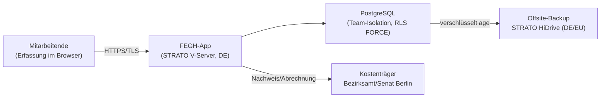

# Datenschutz-Folgenabschätzung (Art. 35)

!!! abstract "Ausfüllbare Vorlage – Stand, Verantwortlich, Freigabe"
    Dies ist eine **ausfüllbare Vorlage** für die Datenschutz-Folgenabschätzung (DSFA)
    nach **Art. 35 DSGVO**. Die technischen und betrieblichen Teile (Beschreibung der
    Verarbeitung, technische und organisatorische Maßnahmen, Restrisiko-Minderung) sind
    aus dem verifizierten Systemstand **vorausgefüllt**. Alles, was der **Träger**
    (Verantwortlicher) gemeinsam mit der/dem **Datenschutzbeauftragten (DSB)** entscheiden,
    einstufen oder freigeben muss, ist einheitlich mit **[AUSFUELLEN: … ]** markiert
    (per Suche/`grep` auffindbar). Insbesondere die eigentliche **Risiko-Einstufung**
    (Eintrittswahrscheinlichkeit × Schwere) und die **Freigabe** trifft die/der DSB bzw.
    der Träger – die Vorlage enthält dazu nur **Vorschläge**.

    | Feld | Eintrag |
    |------|---------|
    | **Titel** | Datenschutz-Folgenabschätzung – FEGH-Leistungsnachweis (Team TBEW) |
    | **Verantwortlicher (Träger)** | **[AUSFUELLEN: Name und Anschrift des Trägers]** |
    | **Betreiber / Auftragsverarbeiter** | **[AUSFUELLEN: Betreiber - Name, Anschrift, Kontakt ]** |
    | **Beauftragung/Beschäftigungsverhältnis** | **[AUSFUELLEN: Art des Verhältnisses Betreiber ↔ Träger]** |
    | **Datenschutzbeauftragte*r (DSB)** | **[AUSFUELLEN: Name, Kontakt der/des DSB]** |
    | **Version / Stand** | **[AUSFUELLEN: Version, Datum]** |
    | **Erstellt von** | **[AUSFUELLEN: Name, Rolle]** |
    | **Geprüft (DSB)** | **[AUSFUELLEN: Name, Datum]** |
    | **Freigegeben (Verantwortlicher)** | **[AUSFUELLEN: Name, Datum, Unterschrift]** |
    | **Nächste Überprüfung** | **[AUSFUELLEN: Datum / Ereignis (spätestens bei wesentlicher Änderung)]** |

!!! danger "Prototyp mit fiktiven Daten – DSFA ist Voraussetzung vor dem Echtbetrieb"
    Der aktuelle Systemstand ist ein **Prototyp mit ausschließlich fiktiven Demodaten**.
    Diese DSFA ist – neben dem Verzeichnis der Verarbeitungstätigkeiten und der Freigabe
    durch Träger und DSB – **Voraussetzung vor dem ersten echten Klientendatensatz**
    (geplanter, zeitlich und im Umfang begrenzter **Pilotbetrieb**).

---

## 1. Anlass und DSFA-Pflicht

### 1.1 Anlass

Der FEGH-Leistungsnachweis ist eine Webanwendung zur **Dokumentation und Abrechnung von
Fachleistungsstunden** (FLS/kLE, Berliner Systematik 2026) im **Therapeutisch Betreuten
Einzelwohnen (TBEW)** der Berliner Eingliederungshilfe. Verarbeitet werden Daten von
**leistungsberechtigten Klient\*innen** sowie von **Mitarbeitenden** des Teams. Da die
Verarbeitung Rückschlüsse auf Gesundheit und soziale Lage der Betroffenen zulässt, handelt
es sich um **besondere Kategorien personenbezogener Daten nach Art. 9 DSGVO**.

### 1.2 Ist eine DSFA erforderlich?

Nach **Art. 35 Abs. 1 DSGVO** ist eine DSFA durchzuführen, wenn eine Form der Verarbeitung
– insbesondere bei Verwendung neuer Technologien – aufgrund von Art, Umfang, Umständen und
Zwecken **voraussichtlich ein hohes Risiko** für die Rechte und Freiheiten natürlicher
Personen zur Folge hat.

Einschlägige Auslöser hier:

- **Art. 35 Abs. 3 lit. b DSGVO** – umfangreiche Verarbeitung **besonderer Kategorien**
  (Art. 9) bzw. sozial- und gesundheitsbezogener Daten.
- **DSK-„Muss-Liste“** (Liste der Verarbeitungstätigkeiten, für die eine DSFA
  durchzuführen ist, der Datenschutzkonferenz / zuständigen Aufsichtsbehörde): u. a.
  **umfangreiche Verarbeitung von Gesundheits-/Sozialdaten** durch nicht-öffentliche
  Stellen im Auftrag/Rahmen sozialrechtlicher Leistungserbringung.

!!! note "Einordnung – vom DSB zu bestätigen"
    Der Betrieb wird auf **eine** Einrichtung/ein Team begrenzt gestartet (siehe Umfang,
    Abschnitt 2). Ob die Verarbeitung im Sinne der Kriterien „umfangreich“ ist, ist eine
    Wertungsfrage. Wegen der **Sensibilität der Art-9-Daten** und zur Absicherung des
    Pilotbetriebs wird die DSFA **vorsorglich durchgeführt**, unabhängig vom Ausgang der
    Umfangsprüfung. **[AUSFUELLEN: Bestätigung der DSFA-Pflicht bzw. Begründung durch DSB]**

### 1.3 Rolle der/des Datenschutzbeauftragten (Art. 35 Abs. 2)

Der Verantwortliche holt bei der Durchführung der DSFA den **Rat der/des DSB** ein
(Art. 35 Abs. 2 DSGVO). Die/der DSB überwacht zudem die Durchführung (Art. 39 Abs. 1 lit. c).

- **[AUSFUELLEN: DSB wurde beteiligt am … (Datum) / Form der Beteiligung]**
- Die abschließende **Stellungnahme der/des DSB** ist in Abschnitt 6 zu dokumentieren.

### 1.4 Standpunkt der betroffenen Personen (Art. 35 Abs. 9)

Der Verantwortliche holt **gegebenenfalls** den Standpunkt der betroffenen Personen oder
ihrer Vertreter zu der beabsichtigten Verarbeitung ein (Art. 35 Abs. 9 DSGVO). In Betracht
kommen hier insbesondere **Beschäftigtenvertretung** (z. B. Betriebs-/Personalrat, sofern
vorhanden) und – soweit angemessen und praktikabel – Rückmeldungen der Klient\*innen bzw.
ihrer gesetzlichen Vertretung.

- **[AUSFUELLEN: Wurde der Standpunkt der Betroffenen eingeholt? ja/nein]**
- **[AUSFUELLEN: falls ja – wie (Form), von wem, Ergebnis; falls nein – Begründung, warum
  nicht angemessen/erforderlich (durch Verantwortlichen, ggf. mit DSB)]**

---

## 2. Systematische Beschreibung der Verarbeitung

*(Art. 35 Abs. 7 lit. a DSGVO – vorausgefüllt aus dem verifizierten Systemstand.)*

### 2.1 Zwecke der Verarbeitung

- **Dokumentation** der tatsächlich erbrachten Fachleistungen (Leistungsnachweis).
- **Nachweis und Abrechnung** gegenüber dem Kostenträger (Bezirksamt/Senat Berlin).
- **Interne Steuerung** (Belegung, Berichtsfristen, Personaleinsatz, Handkasse).

### 2.2 Rechtsgrundlage

| Betroffenengruppe | Rechtsgrundlage |
|-------------------|-----------------|
| Klient\*innen (Art.-9-Daten) | **Art. 9 Abs. 2 lit. h DSGVO** i. V. m. **SGB IX / SGB X** (Leistungserbringung, Abrechnung) und **§ 22 BDSG** |
| Beschäftigte | **§ 26 BDSG** (Beschäftigtendatenverarbeitung), Art. 9 Abs. 2 lit. h/b für Gesundheitsbezug (z. B. Abwesenheitsart „Krank“) |

!!! note "Vom DSB zu bestätigen"
    **[AUSFUELLEN: Bestätigung/Präzisierung der Rechtsgrundlagen durch DSB]**

### 2.3 Umfang

| Merkmal | Wert |
|---------|------|
| Betroffene Klient\*innen | **[AUSFUELLEN: Anzahl im Pilot (ein Team, TBEW)]** |
| Betroffene Mitarbeitende | **[AUSFUELLEN: Anzahl Team-Mitarbeitende]** |
| Anzahl Teams (Start) | **1** (Pilot) – **[AUSFUELLEN: geplante Ausweitung?]** |
| Verarbeitungsfrequenz | arbeitstäglich (Leistungsdokumentation, Arbeitszeit) |
| Automatisierte Einzelentscheidungen (Art. 22) | **nein** |
| Profiling | **nein** |

### 2.4 Kontext

Berliner Eingliederungshilfe, Therapeutisch Betreutes Einzelwohnen. Fachkräfte
dokumentieren erbrachte Leistungen; Leitung steuert; Verwaltung führt die Handkasse.
Betrieb auf **eigenem STRATO V-Server** (Rechenzentrum Deutschland). Ablösung einer
bisherigen Excel-Lösung durch eine mehrbenutzerfähige, zugriffsgetrennte Webanwendung.

### 2.5 Datenarten

**Klient\*innen (`Klient`):** Name, Geburtsdatum, Hilfebedarfsgruppe (HBG), bewilligte
Leistung (AL + kLE, FLS/Monat), Person-ID, Betreuungs-/Berichtsfristen (KÜ/BRP), Kürzel,
Kommentar, Team, Bezugsbetreuer, Status.

**Leistungen (`Leistung`):** Datum/Uhrzeit, Leistungsart, Betreuer, Verlaufs-/
Dokumentationstext, Notiz.

**Weitere Kategorien:** Termine, Arbeitszeit, Abwesenheit (inkl. Art **„Krank“** =
**Gesundheitsdatum der Beschäftigten**), Gruppennachweise, Team-Handkasse
(Kassenbuchung/Zählprotokoll), Mitarbeiterdaten.

!!! tip "Bewusste Datenminimierung – ausdrücklich NICHT gespeichert"
    **Keine Diagnosen**, **keine Adressen**, **keine Kostenträger-Korrespondenz**. Die
    Art-9-Sensibilität ergibt sich aus dem Sozial-/Leistungsbezug (HBG, FLS, Verläufe),
    nicht aus medizinischen Diagnosedaten.

### 2.6 Datenflüsse

### 2.7 Empfänger

| Empfänger | Zweck | Rechtsrahmen |
|-----------|-------|--------------|
| **Kostenträger** (Bezirksamt/Senat Berlin) | Nachweis/Abrechnung | im Abrechnungsrahmen, SGB IX/X |
| **STRATO GmbH** (Hosting) | Betrieb V-Server + HiDrive | Auftragsverarbeitung (AVV, s. 2.8) |

**Keine** sonstige Weitergabe an Dritte.

### 2.8 Auftragsverarbeitung

- **STRATO-AVV [AUSFUELLEN: Version ]**, Kundennr. [AUSFUELLEN: Kundennr. ], abgeschlossen **[AUSFUELLEN: Vertragsdatum ]**,
  Vertragspartner **der Betreiber ↔ STRATO GmbH**; deckt **vServer + HiDrive**.
- Rechenzentrum **Deutschland**, Infrastruktur **ISO-27001-zertifiziert**.
- Unterauftragsverarbeiter laut **STRATO-Anhang 2** in **DE/EU/EWR bzw. Schweiz**; für
  vServer + HiDrive **keine Drittlandübermittlung**.
- Offsite-Backup läuft **verschlüsselt** auf STRATO HiDrive.

!!! warning "AVV Betreiber ↔ Träger"
    Der STRATO-AVV besteht zwischen **Betreiber und STRATO**. Zwischen **Träger
    (Verantwortlicher)** und **Betreiber (Auftragsverarbeiter)** ist ein eigener
    **AVV nach Art. 28 DSGVO** erforderlich. **[AUSFUELLEN: AVV Träger ↔ Betreiber
    abgeschlossen am … / liegt vor: ja/nein]**

### 2.9 Aufbewahrung und Löschung

- Aufbewahrungsfristen richten sich nach **abrechnungs- und sozialrechtlichen Vorgaben**
  sowie Trägervorgaben. **[AUSFUELLEN: konkrete Fristen je Datenart, festgelegt durch Träger/DSB]**
- **Technischer Stand:** Anonymisierungs-Command **geplant/in Umsetzung**; ein Klient ist
  wegen Fremdschlüssel-Schutz (`on_delete=PROTECT`) **nicht ersatzlos löschbar** →
  Anonymisierung statt Löschung. **Status** ausdrücklich als **Lücke** ausgewiesen.

---

## 3. Bewertung von Notwendigkeit und Verhältnismäßigkeit

*(Art. 35 Abs. 7 lit. b DSGVO.)*

| Kriterium | Bewertung |
|-----------|-----------|
| **Rechtsgrundlage** | Art. 9 Abs. 2 lit. h DSGVO i. V. m. SGB IX/X, § 22 BDSG; Beschäftigte § 26 BDSG (s. 2.2). |
| **Erforderlichkeit** | Nachweis/Abrechnung der Eingliederungshilfe ist ohne Dokumentation der erbrachten FLS **nicht möglich**; die App ersetzt eine fehleranfällige Excel-Lösung durch ein zugriffsgetrenntes System. |
| **Datenminimierung** | **Keine Diagnosen, keine Adressen, keine Kostenträger-Korrespondenz**; nur abrechnungs-/nachweisrelevante Felder (s. 2.5). |
| **Zweckbindung** | Nutzung ausschließlich für Dokumentation, Nachweis/Abrechnung und interne Steuerung; keine Zweckänderung vorgesehen. |
| **Speicherbegrenzung** | Fristen sozialrechtlich vorgegeben; Anonymisierung geplant (s. 2.9). **[AUSFUELLEN: Löschkonzept final]** |
| **Betroffenenrechte** | Auskunft/Berichtigung/Löschung/Einschränkung müssen erfüllbar sein – auch in Backups (dokumentierter Prozess, Löschvormerkung beim Wiedereinspielen). **[AUSFUELLEN: Zuständigkeit und Prozess beim Träger festlegen]** |
| **Transparenz** | Information der Betroffenen (Klient\*innen, Beschäftigte) nach Art. 13/14. **[AUSFUELLEN: Datenschutzinformation/-hinweis vorhanden?]** |
| **Auftragsverarbeitung** | STRATO-AVV liegt vor; AVV Träger ↔ Betreiber **[AUSFUELLEN]** (s. 2.8). |

!!! note "Zwischenergebnis Verhältnismäßigkeit (Vorschlag)"
    Die Verarbeitung erscheint für den Zweck **erforderlich und verhältnismäßig**; die
    Datenminimierung ist strukturell verankert. Offene Punkte: finales Löschkonzept,
    AVV Träger ↔ Betreiber, Betroffeneninformation. **[AUSFUELLEN: Bewertung durch DSB]**

---

## 4. Risikobewertung aus Sicht der Betroffenen

*(Art. 35 Abs. 7 lit. c DSGVO. Betrachtet werden die Risiken für die Rechte und Freiheiten
der **betroffenen Personen** – nicht die Risiken der Organisation.)*

**Bewertungsschema (Vorschlag):** Eintrittswahrscheinlichkeit (EW) und Schwere (S) je
**gering / mittel / hoch**; Risiko = Kombination beider. Die Einstufung nimmt die/der
**DSB** vor; die Spalten **EW**, **S** und **Risiko** sind daher **[AUSFUELLEN]** mit
beigefügtem **Vorschlag** (kursiv).

| # | Risiko für Betroffene | EW | S | Risiko (brutto, vor Maßnahmen) |
|---|-----------------------|----|----|-------------------------------|
| R1 | **Unbefugter Zugriff / Vertraulichkeitsverlust** (Fremdeinsicht in Gesundheits-/Sozialdaten, teamfremder Zugriff, Kontoübernahme) | **[AUSFUELLEN]** *(Vorschlag: mittel)* | **[AUSFUELLEN]** *(Vorschlag: hoch)* | **[AUSFUELLEN]** *(Vorschlag: hoch)* |
| R2 | **Datenverlust / Nichtverfügbarkeit** (Verlust der Dokumentation, dadurch fehlender Leistungsnachweis, Nachteile in laufender Hilfe) | **[AUSFUELLEN]** *(Vorschlag: mittel)* | **[AUSFUELLEN]** *(Vorschlag: mittel–hoch)* | **[AUSFUELLEN]** *(Vorschlag: mittel–hoch)* |
| R3 | **Unbefugte Veränderung / Integritätsverlust** (unbemerkte oder manipulierte Änderung von Verläufen/Nachweisen) | **[AUSFUELLEN]** *(Vorschlag: gering–mittel)* | **[AUSFUELLEN]** *(Vorschlag: hoch)* | **[AUSFUELLEN]** *(Vorschlag: mittel–hoch)* |
| R4 | **Zweckentfremdung** (Nutzung der Daten über Nachweis/Abrechnung hinaus, z. B. Leistungs-/Verhaltenskontrolle Beschäftigter) | **[AUSFUELLEN]** *(Vorschlag: gering)* | **[AUSFUELLEN]** *(Vorschlag: mittel–hoch)* | **[AUSFUELLEN]** *(Vorschlag: mittel)* |
| R5 | **Unbefugte Offenlegung an Dritte** (Weitergabe/Abfluss an Stellen außerhalb Träger/Kostenträger, z. B. über Auftragsverarbeiter/Drittland) | **[AUSFUELLEN]** *(Vorschlag: gering)* | **[AUSFUELLEN]** *(Vorschlag: hoch)* | **[AUSFUELLEN]** *(Vorschlag: mittel–hoch)* |

!!! warning "Besondere Schwere wegen Art. 9"
    Für **alle** Risiken ist die **Schwere** wegen des Art.-9-Charakters der Daten
    (Gesundheits-/Sozialbezug) grundsätzlich **erhöht** anzusetzen. Ein
    Vertraulichkeitsverlust kann für Klient\*innen zu **Stigmatisierung, Diskriminierung
    oder sozialen Nachteilen** führen.

---

## 5. Abhilfemaßnahmen und Restrisiko

*(Art. 35 Abs. 7 lit. d DSGVO – vorhandene technische und organisatorische Maßnahmen je
Risiko, dann Restrisiko nach Maßnahmen.)*

### 5.1 Maßnahmen je Risiko (vorausgefüllt, verifiziert)

#### R1 – Unbefugter Zugriff / Vertraulichkeitsverlust

- Passwort-Hashing **Argon2** + Django-Passwortprüfungen.
- **Zwei-Faktor-Pflicht (TOTP)** in Produktion, inkl. Break-Glass-Konto; lokal gerenderter
  QR-Code (kein CDN), Recovery-Codes.
- **Brute-Force-Sperre** (django-axes).
- **Automatische Abmeldung** nach 15 Min Inaktivität; kurze Session-Lebensdauer.
- **Team-Datentrennung** doppelt: App-Ebene **und** datenbank-erzwungen
  (**PostgreSQL Row-Level-Security, FORCE**).
- Rolle **„Admin“ ohne Klientenzugriff** (DSGVO-Rollentrennung).
- **HTTPS/HSTS**, sichere Cookies, `X-Frame-Options: DENY`.
- Interne **Isolations-Regressionstests**.

#### R2 – Datenverlust / Nichtverfügbarkeit

- **Verschlüsselte Backups** (age, Privatschlüssel **offline**), **getesteter Restore**,
  **Offsite-Spiegel** (STRATO HiDrive, DE/EU), **7-Tage-Rotation**,
  **Dead-Man's-Switch-Alarm**.
- Container **non-root**, **Healthcheck** + **/healthz-Uptime-Monitoring**.
- **DEBUG fail-closed** (kein versehentlicher Debug-Betrieb in Produktion).

#### R3 – Unbefugte Veränderung / Integritätsverlust

- **Lückenloses Änderungsprotokoll** (django-auditlog: wer/wann/was) für
  Anlegen/Ändern/Löschen.
- Rollen-/Rechtetrennung, RLS FORCE (auch schreibend teamgebunden).
- TLS/Transport-Integrität, sichere Cookies, CSRF-Schutz.

#### R4 – Zweckentfremdung

- **Zweckbindung** organisatorisch (nur Nachweis/Abrechnung/Steuerung).
- **Rollentrennung** (Admin ohne Klientenzugriff; Verwaltung nur Kasse).
- **Änderungsprotokoll** macht abweichende Nutzung nachvollziehbar.
- **[AUSFUELLEN: organisatorische Zweckbindungs-/Kontrollregelung, Betriebsvereinbarung
  zur Beschäftigtendatenverarbeitung § 26 BDSG]**

#### R5 – Unbefugte Offenlegung an Dritte

- **STRATO-AVV** (v3.6) liegt vor; Unterauftragsverarbeiter DE/EU/EWR/CH; für
  vServer + HiDrive **keine Drittlandübermittlung**.
- **Keine** sonstige Weitergabe außer an den Kostenträger im Abrechnungsrahmen.
- Verschlüsselung von Transport (TLS) und Backups (age).
- **[AUSFUELLEN: AVV Träger ↔ Betreiber, Regelung Datenweitergabe an Kostenträger]**

### 5.2 Bekannte Lücken / geplante Maßnahmen (ehrlich ausgewiesen)

!!! warning "Offene Punkte"
    - **Keine Protokollierung LESENDER Zugriffe** – das Audit-Log erfasst nur
      Anlegen/Ändern/Löschen, **nicht** reine Einsichtnahme. Unbefugtes **Lesen** ist
      damit nicht nachweisbar. **[AUSFUELLEN: Bewertung/Kompensation durch DSB]**
    - **Lösch-/Anonymisierungs-Routine in Umsetzung** – noch nicht produktiv abgeschlossen
      (s. 2.9).
    - **AVV Träger ↔ Betreiber** und **Betroffeneninformation** noch **[AUSFUELLEN]**.

### 5.3 Restrisiken aus unabhängigem Audit und deren Minderung

| Restrisiko (Audit) | Minderung |
|--------------------|-----------|
| **Bus-Faktor 1** – Betrieb durch **Einzelperson** | verschlüsselte Offsite-Backups, getesteter Restore, **Notfallzugang beim Träger** (Break-Glass/Shell-Zugang **[AUSFUELLEN: hinterlegt bei … ]**), Dokumentation |
| **Einzelner Server ohne Hochverfügbarkeit** | Monitoring (/healthz), Backups + getesteter Restore, überschaubare Nutzerzahl; **kein** HA-Cluster |
| **Keine externe ISO-27001-Zertifizierung des Systems** (nur der STRATO-Infrastruktur) | Zugriffstrennung, RLS FORCE, Protokollierung, verschlüsselte Backups, interne Regressionstests; **keine** unabhängige System-Zertifizierung |

!!! note "Ehrliche Einordnung"
    Diese Restrisiken werden **gemindert, nicht beseitigt**. Insbesondere der **Bus-Faktor 1**
    und das **Fehlen von Hochverfügbarkeit** bleiben strukturelle Restrisiken eines
    Einzelbetreiber-Modells. Sie sind bei der Freigabeentscheidung und beim Zuschnitt des
    Pilotbetriebs (Umfang, Dauer, Notfallregelung) zu berücksichtigen.

### 5.4 Restrisiko je Risiko (nach Maßnahmen)

| # | Restrisiko nach Maßnahmen | Einstufung |
|---|---------------------------|------------|
| R1 | Zugriff durch mehrschichtige Auth + doppelte Team-Isolation stark reduziert; Lesezugriffe jedoch nicht protokolliert | **[AUSFUELLEN]** *(Vorschlag: mittel)* |
| R2 | Verfügbarkeit durch Backups/Restore/Monitoring reduziert; Bus-Faktor 1 + Single-Server bleiben | **[AUSFUELLEN]** *(Vorschlag: mittel)* |
| R3 | Änderungen protokolliert; Integrität gut abgesichert | **[AUSFUELLEN]** *(Vorschlag: gering–mittel)* |
| R4 | Zweckbindung/Rollen organisatorisch; Beschäftigtenschutz § 26 BDSG offen | **[AUSFUELLEN]** *(Vorschlag: gering–mittel)* |
| R5 | AVV/Standort DE/EU mindern; AVV Träger ↔ Betreiber offen | **[AUSFUELLEN]** *(Vorschlag: gering–mittel)* |

---

## 6. Ergebnis, Empfehlung und Freigabe

### 6.1 Gesamt-Restrisiko (Vorschlag)

Nach Umsetzung der vorhandenen TOM erscheint das **Gesamt-Restrisiko** für einen
**begrenzten Pilotbetrieb** als **tragfähig, aber nicht vernachlässigbar**. Die wesentlichen
verbleibenden Punkte sind: fehlende Protokollierung **lesender** Zugriffe, noch nicht
finalisierte **Lösch-/Anonymisierungsroutine**, struktureller **Bus-Faktor 1** ohne
Hochverfügbarkeit sowie offene **organisatorische** Punkte (AVV Träger ↔ Betreiber,
Betroffeneninformation, Löschfristen).

**[AUSFUELLEN: Gesamt-Restrisiko-Einstufung durch DSB – gering / mittel / hoch]**

!!! danger "Art. 36 – vorherige Konsultation"
    Verbleibt trotz Maßnahmen ein **hohes Restrisiko**, ist vor Beginn der Verarbeitung die
    **Aufsichtsbehörde (BlnBDI)** nach **Art. 36 DSGVO** zu konsultieren.
    **[AUSFUELLEN: Konsultation erforderlich? ja/nein – Begründung DSB]**

### 6.2 Empfehlung (Vorschlag)

**Pilotbetrieb unter Auflagen** – Freigabe für einen **zeitlich und im Umfang begrenzten**
Pilotbetrieb (ein Team, TBEW) unter folgenden **Auflagen vor dem ersten echten
Klientendatensatz**:

1. **2FA-Pflicht** (`OTP_REQUIRED=1`) produktiv aktiv, Break-Glass-Konto gesichert.
2. **RLS FORCE** auf Postgres-Staging getestet und produktiv scharf geschaltet.
3. **Getesteter Restore** dokumentiert; Backup-Rotation + Dead-Man's-Switch aktiv.
4. **AVV Träger ↔ Betreiber** (Art. 28) abgeschlossen.
5. **Notfallzugang beim Träger** hinterlegt (Bus-Faktor-1-Minderung).
6. **Löschfristen** festgelegt; **Anonymisierungs-Command** produktiv oder terminiert.
7. **Betroffeneninformation** (Art. 13/14) für Klient\*innen und Beschäftigte bereitgestellt.
8. **[AUSFUELLEN: weitere Auflagen des DSB/Trägers]**

**[AUSFUELLEN: finale Empfehlung – Freigabe / Freigabe unter Auflagen / Ablehnung / Art.-36-Konsultation]**

### 6.3 Stellungnahme der/des Datenschutzbeauftragten (Art. 35 Abs. 2)

> **[AUSFUELLEN: Stellungnahme der/des DSB – Bewertung der Risiken, Angemessenheit der
> Maßnahmen, Empfehlung.]**

- Name DSB: **[AUSFUELLEN]**
- Datum: **[AUSFUELLEN]**
- Unterschrift: **[AUSFUELLEN]**

### 6.4 Freigabe durch den Verantwortlichen (Träger)

Der Verantwortliche entscheidet auf Grundlage dieser DSFA und der DSB-Stellungnahme:

- [ ] Verarbeitung **freigegeben** (ggf. unter den Auflagen in 6.2)
- [ ] Verarbeitung **freigegeben unter Auflagen** – siehe 6.2
- [ ] **Aufsichtsbehörde konsultieren** (Art. 36)
- [ ] **nicht freigegeben**

- Name (Träger/Verantwortlicher): **[AUSFUELLEN]**
- Datum: **[AUSFUELLEN]**
- Unterschrift: **[AUSFUELLEN]**

### 6.5 Überprüfung

Die DSFA ist **fortlaufend** und **spätestens bei wesentlichen Änderungen** (neue Teams,
neue Datenarten, neue Auftragsverarbeiter, geänderte Rechtslage) zu überprüfen
(Art. 35 Abs. 11). **[AUSFUELLEN: Turnus / nächster Überprüfungstermin]**

---

## Anhang: Bezugsdokumente

- [Datenschutz & TOM](../sicherheit/datenschutz.md)
- [Datentrennung & Row-Level-Security](../sicherheit/rls.md)
- [Härtung](../sicherheit/haertung.md)
- [Backup & Restore](../sicherheit/backup-restore.md)
- [Backups & Löschkonzept](../sicherheit/backups-loeschkonzept.md)
- [Deployment](../sicherheit/deployment.md)
- Verzeichnis der Verarbeitungstätigkeiten (VVT) – **[AUSFUELLEN: Verweis/Link]**
- STRATO-AVV v3.6 (Kundennr. [AUSFUELLEN: Kundennr. ], [AUSFUELLEN: Vertragsdatum ]) – **[AUSFUELLEN: Ablageort]**
- AVV Träger ↔ Betreiber (Art. 28) – **[AUSFUELLEN: Ablageort]**

!!! info "Aufsichtsbehörde"
    **Berliner Beauftragte für Datenschutz und Informationsfreiheit (BlnBDI)** – zuständige
    Aufsichtsbehörde; Meldung von Datenpannen (Art. 33) über das **Online-Meldeformular**
    der BlnBDI.
