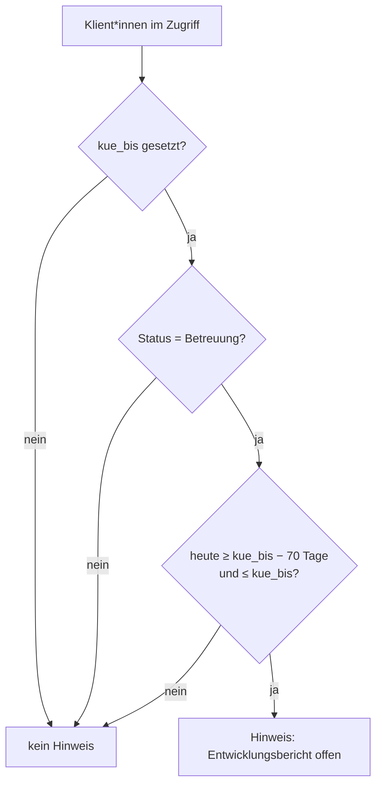

# Berichtsfristen: Entwicklungsbericht vor KÜ-Ende

Für jede*n Klient*in läuft die **Kostenübernahme (KÜ)** des Leistungsträgers befristet. Bevor sie endet, muss der **Entwicklungsbericht** geschrieben und an den Träger übermittelt werden, damit die Weiterbewilligung rechtzeitig beantragt werden kann. Die App erinnert automatisch an diese Frist.

## Die 10-Wochen-Regel

!!! abstract "Regel"
    Der Entwicklungsbericht soll **10 Wochen (= 70 Tage) vor dem Ende der Kostenübernahme** fertig sein. Maßgeblich ist das Feld **`kue_bis`** ("KÜ bis") in den Stammdaten des/der Klient*in.

Im Code ist der Vorlauf als Konstante hinterlegt:

```python
class Klient(models.Model):
    # 10 Wochen (70 Tage) vor Ende der Kostenübernahme muss der Bericht geschrieben sein.
    BERICHT_VORLAUF_TAGE = 70

    @property
    def bericht_faellig_am(self):
        if not self.kue_bis:
            return None
        return self.kue_bis - timedelta(self.BERICHT_VORLAUF_TAGE)
```

!!! note "Fälligkeitsdatum"
    ```
    bericht_faellig_am = kue_bis − 70 Tage
    ```
    Ist kein `kue_bis` gepflegt, gibt es kein Fälligkeitsdatum (Rückgabe `None`) – die Klient*in taucht dann nicht in der Erinnerungsliste auf.

## Wann gilt ein Bericht als "offen"?

Ein Hinweis wird angezeigt, solange der aktuelle Tag **im Zeitfenster** zwischen Fälligkeitsdatum und KÜ-Ende liegt **und** der/die Klient*in im Status *Betreuung* ist.

```python
def bericht_offen(self, stichtag=None):
    if not self.kue_bis or self.status != Status.BETREUUNG:
        return False
    stichtag = stichtag or date.today()
    start = self.kue_bis - timedelta(self.BERICHT_VORLAUF_TAGE)
    return start <= stichtag <= self.kue_bis
```

!!! abstract "Bedingung für 'offen'"
    ```
    bericht_offen  ⇔  (kue_bis − 70 Tage) ≤ Stichtag ≤ kue_bis
                      UND  Status = Betreuung
                      UND  kue_bis ist gesetzt
    ```

!!! warning "Zwei Ausschlüsse"
    - **Kein `kue_bis`:** ohne Enddatum keine Frist, kein Hinweis.
    - **Status Beendigung:** endet die Betreuung ohnehin, wird kein Entwicklungsbericht mehr angemahnt.

## Wie der Hinweis entsteht

Die Serviceschicht filtert aus einer Menge von Klient*innen genau jene heraus, deren Bericht gerade offen ist:

```python
def berichte_faellig(klienten, stichtag=None):
    return [k for k in klienten.exclude(kue_bis__isnull=True) if k.bericht_offen(stichtag)]
```

Diese Liste speist die Erinnerung im Dashboard. Der **Stichtag** ist normalerweise *heute*, kann aber (z. B. für Tests oder Vorschauen) explizit gesetzt werden.



## Rechenbeispiel

!!! example "Beispiel (fiktiv)"
    KÜ-Ende **`kue_bis` = 30.09.2026**, Status *Betreuung*.

    | Größe | Rechnung | Ergebnis |
    |-------|----------|----------|
    | Vorlauf | 10 Wochen = 70 Tage | 70 Tage |
    | Fällig ab | 30.09.2026 − 70 Tage | **22.07.2026** |
    | Fenster | 22.07.2026 … 30.09.2026 | ca. 10 Wochen |

    - Am **01.07.2026** (heute): Stichtag liegt **vor** dem 22.07. → **kein** Hinweis.
    - Am **01.08.2026**: Stichtag liegt **im** Fenster → **Hinweis "Entwicklungsbericht offen"**.
    - Ab **01.10.2026**: Stichtag liegt **nach** `kue_bis` → Fenster verlassen, kein Hinweis mehr.

!!! tip "Weitere Fristfelder"
    Die Stammdaten enthalten zusätzlich `brp_bis` (Bericht zur Teamleitung bis) und `versendet_am` (versendet am). Diese dienen der internen Nachverfolgung; die automatische 10-Wochen-Erinnerung stützt sich ausschließlich auf `kue_bis`.
