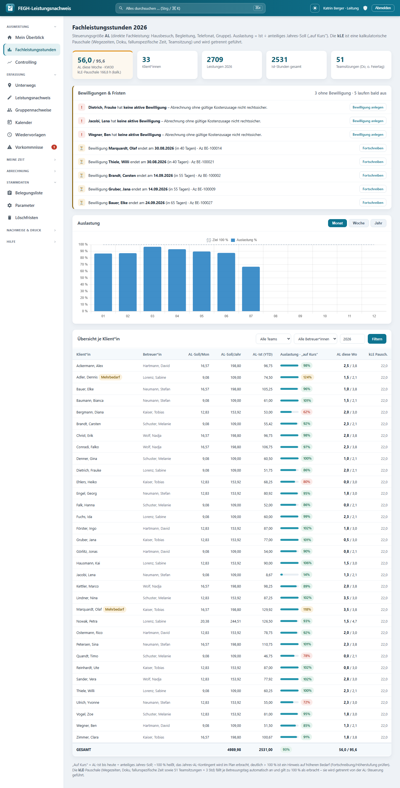
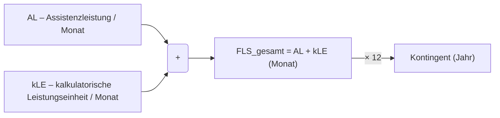
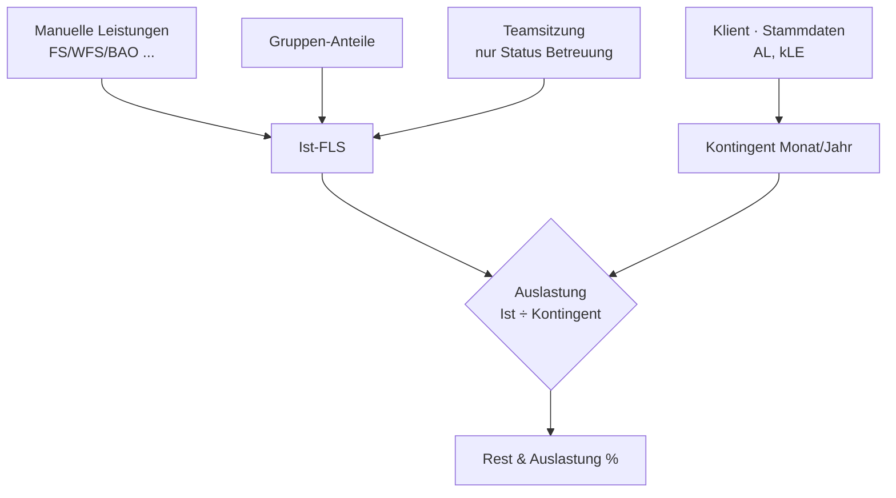

# Fachleistungsstunden (FLS) & kalkulatorische Leistungseinheit (kLE)



*Fachleistungsstunden-Dashboard: AL-Auslastung (Ist gegen anteiliges Jahres-Soll) je Klient*in.*


Diese Seite erklärt die zentrale Abrechnungslogik der App: Was zählt als **Fachleistungsstunde (FLS)**, wie sich die **bewilligte Leistung** aus **AL** und **kLE** zusammensetzt, wie der **kLE-Anteil** berechnet wird und wie die **Auslastung** (Ist gegen Kontingent) ermittelt wird.

!!! info "Fachliche Grundlage"
    Berlin, gültig ab **01.01.2026**, **Beschluss 3/2026** (Rahmenvertrag Eingliederungshilfe). Alle Zeit- und Betragsgrößen werden in der App als `Decimal` geführt (keine Fließkommazahlen), weil sie abrechnungsrelevant sind. Rundung erfolgt kaufmännisch (`ROUND_HALF_UP`) auf **3 Nachkommastellen** (`Q3 = 0.001`).

## Senats-Systematik (Umrechnungstool „ab März 2026")

Der Senat (SenASGIVA) stellt je Angebot ein **Umrechnungstool** bereit, das die alte
Tagessatz-Vergütung (Maßnahmepauschale je HBG 1–12) **erlösneutral** in die neue
FLS-Systematik überführt. Die App bildet diese Logik formelgetreu nach
(`nachweis/services_senatstool.py`, verifiziert in `tests_senatstool.py` gegen die
Original-Zellwerte des Tools). Drei Ausgabegrößen steuern die Abrechnung:

| Größe | Bedeutung | Wo in der App |
|---|---|---|
| **FLS-Satz** (€/Std) | ein Satz für alles: Ø-Personalkosten ÷ (Netto-Jahresarbeitsstunden × Auslastung) | Parameter-Tab „FLS-Satz" |
| **individuelle FLS je HBG, pro Woche** | fallspezifische Zeiten, über Personalschlüssel-Gewichtung (HBG 1 = 0,136 … HBG 12 = 0,755) auf die HBG verteilt | Parameter-Tab HBG-Tabelle → Vorbelegung Belegungsliste |
| **kLE je Tag** | **einheitlich für alle Klient*innen**, je **Kalendertag**; deckt fallunspezifische Zeiten, Erreichbarkeit, Wegezeiten, Sonstiges | Parameter-Tab „kLE je Tag" |

!!! abstract "Abrechnungsformel (Monat, je Klient*in)"
    ```
    Betrag = dokumentierte individuelle FLS × FLS-Satz
           + kLE/Tag × Kalendertage des Monats × FLS-Satz
    ```
    Die kLE ist eine **Pauschale** – sie erfordert keine Einzeldokumentation und ist
    HBG-unabhängig. Umrechnung Woche ↔ Monat: **× 4,3482** (= 365,25 ÷ 7 ÷ 12).

!!! note "Was ist fallspezifisch, was fallunspezifisch? (Handreichung, Beschluss 3/2026 Anlage)"
    **WFS** (weitere fallspezifische Leistungen, zählen als FLS): Vor-/Nachbereitung
    individueller Termine (2.1), **Fallbesprechungen** (2.2), **Fallsupervision** (2.3),
    **Dokumentation** inkl. Verlaufsdoku, Leistungsnachweis, THFD-Berichte (2.4).
    **Fallunspezifisch** (durch die kLE-Pauschale abgedeckt, NICHT als FLS dokumentierbar):
    **Teambesprechungen/Teamsitzung**, **Teamsupervision**, Erreichbarkeit, **Wegezeiten**.

## Leistungsarten im Überblick

In der App ist jede erfasste Leistung genau einer Leistungsart zugeordnet (`Leistungsart` in `models.py`).

| Kürzel | Bezeichnung | Zählt als FLS? |
|--------|-------------|:--------------:|
| **FS** | fallspezifische Leistung | ✅ ja |
| **WFS** | weitere fallspezifische Leistung | ✅ ja |
| **BAO** | Betreuung am anderen Ort | ✅ ja |
| FUS | fallunspezifische Leistung | ❌ nein |
| FZ | Fahrtzeit | ❌ nein |
| AL | Assistenzleistung | ❌ nein |
| KLE | kalkulatorische Leistungseinheit | ❌ nein |
| FH | Freihaltung/Abwesenheit (50 %) | ❌ nein |

!!! note "FLS = FS + WFS + BAO"
    Als **Fachleistungsstunden** zählen ausschließlich die drei Arten **FS**, **WFS** und **BAO**. Im Code ist das die Menge:
    ```python
    FLS_ARTEN = {Leistungsart.FS, Leistungsart.WFS, Leistungsart.BAO}
    ```
    Diese Definition ist die **einzige Quelle der Wahrheit** – sowohl die Jahres-Auswertung als auch der amtliche Monatsnachweis (`druck_nachweis`) summieren die FLS über genau diese Menge.

## Bewilligte Leistung: AL + kLE = FLS pro Monat

Jede*r Klient*in hat in der Belegungsliste zwei bewilligte Monatswerte (Stammdaten, `models.Klient`):

- **AL** – bewilligte Assistenzleistung pro Monat (Feld `al`, "bewilligt FLS/Monat (AL)")
- **kLE** – davon kalkulatorische Leistungseinheit pro Monat (Feld `kle`, "davon kLE/Monat")

Daraus ergibt sich das **monatliche Kontingent**:

!!! abstract "Formel: bewilligte FLS pro Monat"
    ```
    FLS_gesamt (Monat) = AL + kLE
    ```
    ```python
    @property
    def fls_gesamt(self) -> Decimal:
        return (self.al or Decimal("0")) + (self.kle or Decimal("0"))
    ```

Der **Jahreswert** ist schlicht das Zwölffache des Monatswerts:

!!! abstract "Formel: Kontingent pro Jahr"
    ```
    Kontingent (Jahr) = FLS_gesamt (Monat) × 12
    ```
    Im Code: `kontingent_j = kontingent_m * 12` (in `fachleistungsstunden`) bzw. die Property `fls_gesamt_jahr`.



## kLE-Anteil

Der **kLE-Anteil** gibt an, welcher Bruchteil des bewilligten Monatskontingents auf die kalkulatorische Leistungseinheit entfällt. Er wird auf 3 Nachkommastellen gerundet.

!!! abstract "Formel: kLE-Anteil"
    ```
    kLE_Anteil = kLE / (AL + kLE)          (0, falls Kontingent = 0)
    ```
    ```python
    @property
    def kle_anteil(self) -> Decimal:
        g = self.fls_gesamt
        return (self.kle / g).quantize(Decimal("0.001")) if g else Decimal("0")
    ```

!!! tip "Interpretation"
    Ein kLE-Anteil von z. B. `0.250` bedeutet: **25 %** des bewilligten Monatskontingents sind kalkulatorische Leistungseinheit (u. a. Teamsitzung, siehe [Teamsitzung & Gruppen](teamsitzung-gruppen.md)), die restlichen 75 % sind direkte Assistenzleistung.

## Ist-Leistung: Woraus sie sich zusammensetzt

Die **Ist-FLS** eines/einer Klient*in in einem Jahr ist die Summe aus drei Quellen (siehe `fachleistungsstunden` in `services.py`):

1. **Manuelle Leistungen** – alle im Leistungsnachweis erfassten Zeilen des Jahres, die **nicht** automatisch erzeugt wurden (`exclude(auto=True)`). Deren Dauer ergibt sich aus Beginn/Ende (`dauer_stunden`).
2. **Gruppen-Anteile** – der auf den/die Klient*in entfallende Zeitanteil aus Gruppenangeboten (`zeit_pro_klient`, siehe Gruppen-Seite).
3. **Teamsitzung** – der anteilige Teamsitzungs-Wert, aber **nur** für Klient*innen im Status *Betreuung*.

!!! abstract "Formel: Ist (Jahr)"
    ```
    Ist = Σ manuelle Leistungen + Σ Gruppen-Anteile + Teamsitzungs-Anteil
    ```
    ```python
    ts_row = ts_pro if k.status == Status.BETREUUNG else Decimal("0")
    ist = (ist_manual + g["gesamt"] + ts_row).quantize(Q3, ROUND_HALF_UP)
    ```

!!! warning "Beendete Klient*innen"
    Steht der Status auf **Beendigung**, erhält der/die Klient*in **keinen** Teamsitzungs-Anteil (`ts_row = 0`). Der Teiler der Teamsitzung bleibt davon unberührt (siehe Teamsitzung-Seite).

## Auslastung = Ist ÷ Kontingent

Die **Auslastung** setzt die tatsächlich geleisteten Stunden ins Verhältnis zum bewilligten **Jahres**-Kontingent.

!!! abstract "Formel: Auslastung"
    ```
    Auslastung = Ist / Kontingent (Jahr)      (0, falls Kontingent = 0)
    Rest       = Kontingent (Jahr) − Ist
    ```
    ```python
    rest = (kontingent_j - ist).quantize(Q3, ROUND_HALF_UP)
    auslastung = (ist / kontingent_j) if kontingent_j else Decimal("0")
    ```

In der Zeitreihen-Auswertung (`auslastung_zeitreihe`) wird die Auslastung zusätzlich pro **Monat** und pro **Kalenderwoche** ausgewiesen und dort als Prozentwert dargestellt:

- Monats-Kontingent = Summe der `fls_gesamt` aller (gefilterten) Klient*innen
- Jahres-Kontingent = Monats-Kontingent × 12
- Wochen-Kontingent = Jahres-Kontingent ÷ 52
- Prozent = `ist / kontingent × 100`, gerundet auf 1 Nachkommastelle

!!! tip "Lesart"
    - **< 100 %**: Es besteht noch Rest-Kontingent (Feld `rest` ist positiv).
    - **= 100 %**: Kontingent exakt ausgeschöpft.
    - **> 100 %**: Überschreitung – hier lohnt ein Blick, ob eine Anpassung der Bewilligung nötig ist.

## Rechenbeispiel

!!! example "Beispiel-Klient*in (fiktiv)"
    Bewilligt: **AL = 9,000 h/Monat**, **kLE = 3,000 h/Monat**.

    | Größe | Rechnung | Ergebnis |
    |-------|----------|----------|
    | FLS_gesamt (Monat) | 9,000 + 3,000 | **12,000 h** |
    | Kontingent (Jahr) | 12,000 × 12 | **144,000 h** |
    | kLE-Anteil | 3,000 / 12,000 | **0,250** (25 %) |
    | Ist (Jahr, angenommen) | — | 120,000 h |
    | Rest | 144,000 − 120,000 | **24,000 h** |
    | Auslastung | 120,000 / 144,000 | **0,833** (83,3 %) |

## Woher kommen die Werte?



!!! note "Verwandte Seiten"
    - [Teamsitzung & Gruppen](teamsitzung-gruppen.md) – wie die automatischen KLE-Anteile entstehen
    - [Berichtsfristen](berichtsfristen.md) – Entwicklungsbericht vor KÜ-Ende
