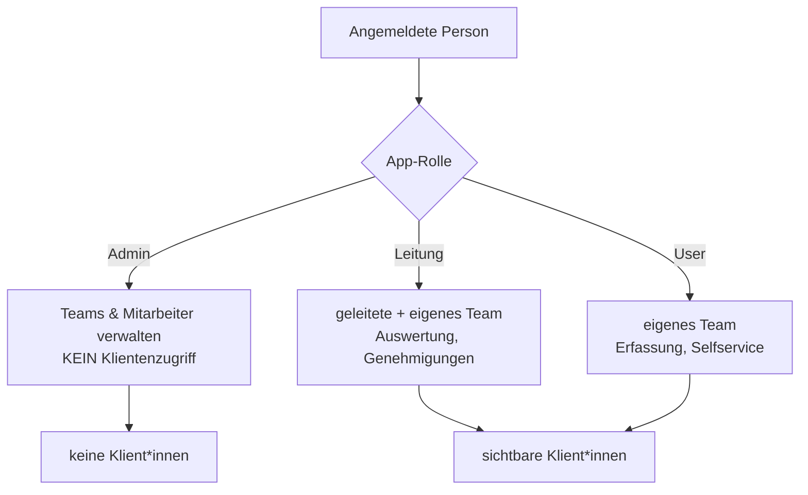

# Rollen & Team-Typen: Wer sieht und darf was

Die App unterscheidet drei **Systemrollen** (User, Leitung, Admin) und drei **Team-Typen** (BEW, WG, Verwaltung). Rolle und Team zusammen bestimmen, welche Klient*innen und Funktionen eine angemeldete Person sehen und bearbeiten darf. Grundlage ist die Sichtbarkeitslogik in `services.py` und das Datenmodell in `models.py`.

## Die drei Rollen

```python
class Rolle(models.TextChoices):
    USER = "user", "User (Betreuer*in)"
    LEITUNG = "leitung", "Leitung"
    ADMIN = "admin", "Administration"
```

| Rolle | Aufgabe | Klientenzugriff |
|-------|---------|-----------------|
| **User** | Betreuer*in – erfasst Leistungen, nutzt Selfservice | eigenes Team (alle Klient*innen darin, Vertretung) |
| **Leitung** | Team-Auswertung & Genehmigungen | geleitete Team(s) **+** eigenes Team |
| **Admin** | verwaltet Teams & Mitarbeiter*innen | **keiner** (DSGVO-Trennung) |

!!! warning "DSGVO-Trennung bei Admin"
    Die Rolle **Admin** hat **grundsätzlich keinen Zugriff auf Klientendaten** – auch nicht als technischer Superuser. Administration bedeutet ausschließlich Verwaltung von Teams und Mitarbeiter*innen. Diese Trennung ist bewusst und wird im Code erzwungen:
    ```python
    def ist_admin(user) -> bool:
        m = mitarbeiter_fuer(user)
        return bool(m and m.rolle == Rolle.ADMIN)

    def klienten_fuer(user):
        if not user.is_authenticated or ist_admin(user):
            return Klient.objects.none()
        ...
    ```

### Wer sieht welche Klient*innen?

Die zentrale Funktion ist `teams_fuer(user)`; darauf baut `klienten_fuer(user)` auf: **innerhalb eines sichtbaren Teams sieht jede*r alle Klient*innen** (Vertretungsprinzip).

```python
def teams_fuer(user):
    m = mitarbeiter_fuer(user)
    if m is None:
        return Team.objects.all() if _superuser_ohne_profil(user) else Team.objects.none()
    if m.rolle == Rolle.ADMIN:
        return Team.objects.none()
    ids = set(m.leitet.values_list("id", flat=True)) if m.rolle == Rolle.LEITUNG else set()
    if m.team_id:
        ids.add(m.team_id)
    return Team.objects.filter(id__in=ids)
```

| | User | Leitung | Admin |
|---|:---:|:---:|:---:|
| sichtbare Teams | nur eigenes | geleitete + eigenes | keine |
| sichtbare Klient*innen | alle des eigenen Teams | alle der geleiteten/eigenen Teams | keine |
| Filter nach Mitarbeiter/Team | – | ✅ | – |
| Genehmigungen (z. B. Urlaub) | – | ✅ | – |
| Teams/Mitarbeiter verwalten | – | – | ✅ |

!!! note "Eigene vs. sichtbare Klient*innen"
    - `klienten_fuer(user)` = **alle** Klient*innen der sichtbaren Teams (Vertretung).
    - `eigene_klienten(user)` = nur die, für die man **Bezugsbetreuer*in** ist (`bezugsbetreuer`). Das Dashboard zeigt für User standardmäßig die eigenen Klient*innen, ermöglicht über die Teamsicht aber die Vertretung.

### Break-Glass-Superuser

!!! tip "Technischer Notzugang"
    Ein Django-**Superuser ohne Mitarbeiter-Profil** gilt als technischer *Break-Glass*-Zugang und darf ausnahmsweise **alle** Teams und Klient*innen sehen (`_superuser_ohne_profil`). Sobald einem Superuser ein Mitarbeiter-Profil zugeordnet ist, gilt dessen App-Rolle – die **App-Rolle ist immer maßgeblich**.

## Die drei Team-Typen

```python
class Teamtyp(models.TextChoices):
    BEW = "BEW", "Betreutes Einzelwohnen (BEW)"
    WG = "WG", "Wohngemeinschaft (WG)"
    VERWALTUNG = "Verwaltung", "Verwaltung"
```

| Typ | Bedeutung | Besonderheit |
|-----|-----------|--------------|
| **BEW** | Betreutes Einzelwohnen | Regel-Team der Leistungserbringung |
| **WG** | Wohngemeinschaft | Leistungserbringung im WG-Kontext |
| **Verwaltung** | Verwaltung / Backoffice | fester Arbeitsplatz → **Stempeluhr** (Kommen/Gehen) |

!!! note "Verwaltung & Stempeluhr"
    Der Team-Typ steuert u. a. die Zeiterfassung: Für die **Verwaltung** (fester Arbeitsplatz) ist die **Stempeluhr** (`Stempelung`, Kommen/Gehen) vorgesehen, während Betreuer*innen in BEW/WG ihre Arbeitszeit im Selfservice erfassen. Im Modell prüfbar über `Team.ist_verwaltung` bzw. `Mitarbeiter.ist_verwaltung`.

## Mitarbeiter, Team-Zugehörigkeit und Leitung

Ein*e Mitarbeiter*in gehört zu **einem** Team (`team`) und kann als Leitung **mehrere** Teams leiten (`leitet`, Many-to-Many):

```python
class Mitarbeiter(models.Model):
    rolle = models.CharField(choices=Rolle.choices, default=Rolle.USER)
    team = models.ForeignKey(Team, related_name="mitglieder", null=True, blank=True)
    leitet = models.ManyToManyField(Team, related_name="leitungen")
```

- **`team`** – Zugehörigkeit; bestimmt für User die Klientensicht.
- **`leitet`** – nur für die Rolle *Leitung* relevant; ergänzt die sichtbaren Teams.



!!! warning "Grundprinzipien"
    1. **App-Rolle schlägt Django-Rechte** – ein Admin bleibt ohne Klientenzugriff, selbst als Superuser mit Profil.
    2. **Team = Sichtgrenze** – User sehen ausschließlich das eigene Team, Leitung zusätzlich die geleiteten Teams.
    3. **Vertretung innerhalb des Teams** – jede*r im Team sieht alle Klient*innen des Teams, damit Vertretung möglich ist.

!!! note "Verwandte Seiten"
    - [Fachleistungsstunden & kLE](fls-kle.md)
    - [Teamsitzung & Gruppen](teamsitzung-gruppen.md)
