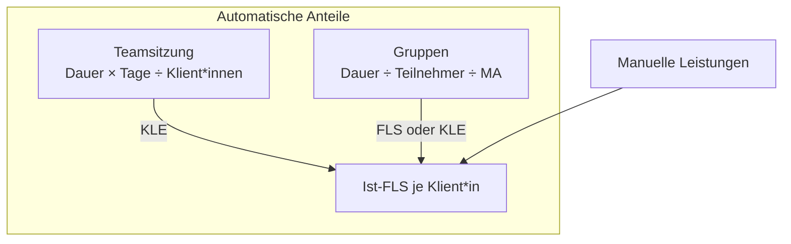

# Teamsitzung & Gruppen: automatische Verteilung

Neben den manuell erfassten Leistungen erzeugt die App zwei **automatische** Zeitanteile, die auf einzelne Klient*innen umgelegt werden: den **Teamsitzungs-Anteil** und die **Gruppen-Anteile**. Diese Seite erklärt beide Formeln mit Rechenbeispielen.

!!! info "Rundung"
    Beide Berechnungen runden kaufmännisch (`ROUND_HALF_UP`) auf **3 Nachkommastellen** (`Q3 = 0.001`).

---

## Teamsitzung

Die wöchentliche Teamsitzung ist eine **fallunspezifische** Leistung, die auf alle betreuten Klient*innen gleichmäßig umgelegt wird. Sie zählt als **KLE** (kalkulatorische Leistungseinheit).

### Sitzungstage: Donnerstage ohne Berliner Feiertage

Die Teamsitzung findet standardmäßig **donnerstags** statt (`teamsitzung_wochentag = 3`; 0 = Montag … 3 = Donnerstag). Als Sitzungstage gelten **alle Donnerstage eines Jahres, an denen kein Berliner Feiertag liegt**.

```python
def teamsitzungstage(jahr, wochentag=3):
    fs = berliner_feiertage(jahr)
    return [d for d in wochentage_im_jahr(jahr, wochentag) if d not in fs]
```

!!! note "Berliner Feiertage"
    Es werden die **gesetzlichen Feiertage Berlins** verwendet (`holidays.Germany(subdiv="BE")`) – inklusive des **Internationalen Frauentags am 8. März**. Fällt ein Donnerstag auf einen solchen Feiertag, entfällt er als Sitzungstag.

### Teiler: nur Klient*innen in Betreuung

Der Teiler ist die Anzahl der Klient*innen **im Status Betreuung**. Klient*innen im Status *Beendigung* zählen **nicht** in den Teiler und erhalten auch **keinen** Anteil.

```python
def anzahl_klienten() -> int:
    return Klient.objects.filter(status=Status.BETREUUNG).count()
```

### Formel

!!! abstract "Teamsitzungs-Anteil je Klient*in / Jahr"
    ```
    Anteil_pro_Klient (Jahr) = Sitzungsdauer × Anzahl Sitzungstage ÷ Anzahl Klient*innen (Betreuung)
    ```
    ```python
    pro = (p.teamsitzung_dauer_std * Decimal(len(tage)) / Decimal(n)).quantize(Q3, ROUND_HALF_UP)
    ```
    Die Standard-Sitzungsdauer ist **3,00 Stunden** (`teamsitzung_dauer_std`, im Team-Parameter je Jahr pflegbar). Es gibt zusätzlich eine monatliche Variante (`teamsitzung_pro_klient_monat`), die nur die Sitzungstage des jeweiligen Monats zählt.

!!! warning "Wichtig: Teiler ist immer die Gesamtzahl"
    Die Teamsitzung wird **immer durch ALLE** in Betreuung befindlichen Klient*innen geteilt – auch dann, wenn die Auswertung (z. B. im Dashboard) nur auf die eigenen Klient*innen gefiltert ist. Der Filter schränkt nur die angezeigten Zeilen ein, nicht den Teiler.

### Rechenbeispiel Teamsitzung

!!! example "Beispiel (fiktiv)"
    Annahmen: **50 Donnerstage** im Jahr, davon **2** an Berliner Feiertagen → **48 Sitzungstage**. Sitzungsdauer **3,00 h**. **24 Klient*innen** in Betreuung.

    | Schritt | Rechnung | Ergebnis |
    |---------|----------|----------|
    | Gesamtstunden Teamsitzung | 3,00 × 48 | 144,000 h |
    | Anteil je Klient*in (Jahr) | 144,000 ÷ 24 | **6,000 h** |

    Dieser Wert (6,000 h) fließt bei **jedem/jeder** betreuten Klient*in als **KLE** in die Ist-FLS ein. Im amtlichen Monatsnachweis (`druck_nachweis`) erscheint pro Sitzungstag eine eigene Zeile mit dem Tagesanteil (`Sitzungsdauer ÷ Anzahl Klient*innen`).

---

## Gruppen

Ein **Gruppenangebot** (`models.Gruppe`) bündelt mehrere Klient*innen (Teilnehmer) zu einem Termin. Die Gesamtdauer wird gleichmäßig auf die Teilnehmer **und** die anwesenden Mitarbeiter*innen verteilt.

### Formel

!!! abstract "Zeit pro Klient*in in einer Gruppe"
    ```
    Zeit_pro_Klient = Gesamtdauer ÷ (Anzahl Teilnehmer × Anzahl Mitarbeiter)
    ```
    ```python
    @property
    def zeit_pro_klient(self) -> Decimal:
        n = self.anzahl_teilnehmer
        ma = max(self.anz_ma or 1, 1)
        if not n:
            return Decimal("0")
        return (self.dauer_stunden / (Decimal(n) * Decimal(ma))).quantize(Q3, ROUND_HALF_UP)
    ```

- **Gesamtdauer** ergibt sich aus Beginn/Ende der Gruppe (`dauer_stunden`).
- **Anzahl Teilnehmer** = Anzahl der zugeordneten Klient*innen.
- **Anzahl Mitarbeiter** (`anz_ma`) = Zahl der Mitarbeiter*innen, die die Gruppe geleitet haben (mindestens 1).

!!! note "Leistungsart der Gruppe"
    Jede Gruppe hat eine eigene Leistungsart (Standard: **FS**). Ist sie **FS/WFS/BAO**, zählt der Anteil als **FLS**; ist sie **KLE**, zählt er als kLE. Die Auswertung `gruppen_anteile` unterscheidet je Klient*in nach `gesamt`, `fls` und `kle`.

### Rechenbeispiel Gruppe

!!! example "Beispiel (fiktiv)"
    Eine Kochgruppe dauert **90 Minuten** (= 1,500 h), hat **5 Teilnehmer** und wird von **2 Mitarbeiter*innen** geleitet.

    | Schritt | Rechnung | Ergebnis |
    |---------|----------|----------|
    | Gesamtdauer | 1,500 h | 1,500 h |
    | Teiler | 5 × 2 | 10 |
    | Zeit je Klient*in | 1,500 ÷ 10 | **0,150 h** |

    Jede*r der 5 Teilnehmer*innen erhält also **0,150 h** in der jeweiligen Leistungsart gutgeschrieben.

!!! tip "Warum durch die Mitarbeiterzahl teilen?"
    Leiten zwei Mitarbeiter*innen dieselbe Gruppe, wird die Betreuungszeit **nicht doppelt** gezählt. Die Aufteilung auf die Mitarbeiterzahl verhindert eine Doppelberechnung derselben Kalenderstunde.

---

## Zusammenspiel in der Ist-FLS



!!! note "Verwandte Seite"
    Wie aus der Ist-FLS die Auslastung wird, steht unter [Fachleistungsstunden & kLE](fls-kle.md).
