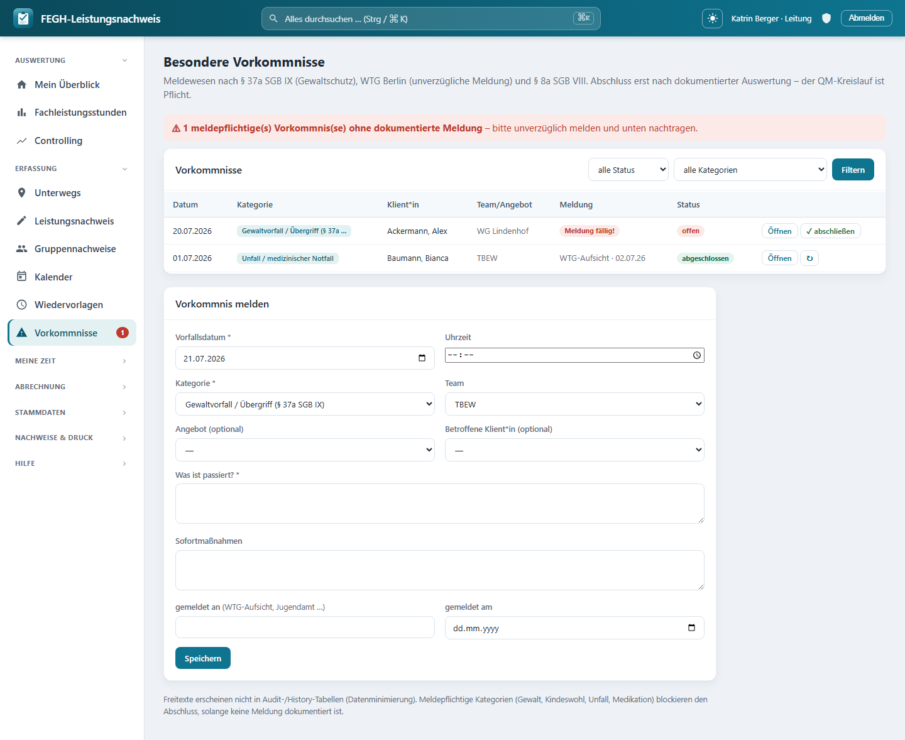

# Vorkommnis-Meldewesen (QM)

*Vorkommnis-Meldewesen mit erzwungenem QM-Kreislauf.*

Besondere Vorkommnisse (Gewaltvorfaelle, Kindeswohlgefaehrdungen, Unfaelle,
Medikationsfehler, Beschwerden) werden hier **erfasst, gemeldet und ausgewertet** –
und zwar mit einem **erzwungenen QM-Kreislauf**: Ein Vorkommnis kann erst dann
abgeschlossen werden, wenn die Auswertung/Massnahmen dokumentiert sind und – bei
meldepflichtigen Kategorien – die Meldung an die zustaendige Stelle nachgewiesen ist.
Der Ablauf folgt § 37a SGB IX (Gewaltschutz), dem WTG Berlin (unverzuegliche Meldung
an die Aufsicht) und § 8a SGB VIII (Kindeswohl).

Aufruf ueber die Navigation **„Vorkommnisse"** (`/vorkommnisse/`).

!!! note "Wer arbeitet mit dem Meldewesen?"
    Vorfaelle passieren im Dienst – deshalb **erfassen alle Mitarbeitenden mit
    Klientenarbeit** Vorkommnisse und sehen ihre **eigenen**. Die **Leitung** sieht und
    bearbeitet **alle** Vorkommnisse ihrer Teams und ist die einzige Rolle, die
    **abschliessen** darf. **Verwaltung** und **Admin** haben **keinen** Zugriff –
    die Beschreibungsfelder sind Art-9-Freitexte (Gesundheits- und Sozialdaten), auf
    die nur die fachlich zustaendigen Personen zugreifen sollen.

---

## Ueberblick der Rollen

| Rolle | Vorkommnisse sehen | Erfassen / bearbeiten | Abschliessen / wieder oeffnen |
|-------|--------------------|-----------------------|-------------------------------|
| **User** (mit Klientenarbeit) | nur **selbst erfasste** | ja | nein |
| **Leitung** | **alle** der geleiteten Teams | ja | **ja** |
| **Verwaltung** | – | – | – |
| **Admin** | – | – | – |

Die Sichtbarkeit steuert die interne Funktion `_sichtbare(request)`: Leitung erhaelt
alle Vorkommnisse der Teams aus `services.teams_fuer(user)`, alle anderen nur die
Datensaetze mit `erstellt_von = ich`. Wer keine Klientenarbeit hat
(`services.ohne_klientenarbeit`), sieht die Seite gar nicht.

---

## Kategorien

Die Kategorie steuert, ob ein Vorkommnis **meldepflichtig** ist. Vier der sechs
Kategorien loesen die Meldepflicht aus (Spalte „meldepflichtig").

| Kategorie | Bedeutung | Meldepflichtig |
|-----------|-----------|:--------------:|
| **Gewaltvorfall / Uebergriff** | Gewaltschutz nach § 37a SGB IX | **ja** |
| **Gefaehrdungseinschaetzung** | Kindeswohl nach § 8a SGB VIII | **ja** |
| **Unfall / medizinischer Notfall** | Unfall oder akuter medizinischer Vorfall | **ja** |
| **Medikationsfehler** | Fehler bei Gabe/Dosierung von Medikamenten | **ja** |
| **Beschwerde** | Beschwerde einer Klient*in oder Dritter | nein |
| **sonstiges besonderes Vorkommnis** | alles Weitere, das dokumentiert gehoert | nein |

!!! warning "Meldepflicht = Meldung dokumentieren"
    Bei den meldepflichtigen Kategorien musst du die Meldung **unverzueglich**
    absetzen (WTG) und sie anschliessend hier belegen: **„gemeldet an"** (z. B.
    WTG-Aufsicht, Jugendamt, Kostentraeger, Polizei) und **„gemeldet am"**. Solange
    „gemeldet am" leer ist, gilt das Vorkommnis als **meldung faellig** und blockiert
    den Abschluss.

---

## Ein Vorkommnis melden

Ueber das Formular **„Vorkommnis melden"** unter der Liste. Pflichtfelder sind mit
`*` markiert.

| Feld | Pflicht | Bedeutung |
|------|:-------:|-----------|
| **Vorfallsdatum** | ja | Tag des Vorfalls (vorbelegt mit heute) |
| **Uhrzeit** | nein | Uhrzeit des Vorfalls |
| **Kategorie** | ja | eine der sechs Kategorien (siehe oben) |
| **Team** | – | Zuordnung; vorbelegt mit deinem Team, Leitung kann geleitete Teams waehlen |
| **Angebot** | nein | betroffenes Angebot (optional) |
| **Betroffene Klient*in** | nein | optional; nur Klient*innen aus deinem Zugriff |
| **Was ist passiert?** | ja | Sachverhaltsbeschreibung (Art-9-Freitext) |
| **Sofortmassnahmen** | nein | was unmittelbar getan wurde |
| **gemeldet an** | nein* | Empfaenger der Meldung, max. 160 Zeichen |
| **gemeldet am** | nein* | Datum der Meldung |
| **Auswertung / abgeleitete Massnahmen** | nein* | erst beim Bearbeiten sichtbar; **Pflicht vor dem Abschluss** |

\* Formal keine HTML-Pflichtfelder, fachlich aber Voraussetzung: „gemeldet an/am" fuer
meldepflichtige Kategorien, „Auswertung/Massnahmen" fuer jeden Abschluss.

!!! tip "Status ergibt sich automatisch"
    Ein neues Vorkommnis startet als **offen**. Sobald du Sofortmassnahmen erfasst
    **oder** ein „gemeldet am" eintraegst, springt der Status auf **in Bearbeitung**.
    Auf **abgeschlossen** setzt ausschliesslich die Leitung (siehe naechster Abschnitt).

Das Feld **„Auswertung / abgeleitete Massnahmen"** erscheint erst, wenn du ein bereits
gespeichertes Vorkommnis ueber **„Oeffnen"** erneut bearbeitest – die Auswertung ist
bewusst ein zweiter Schritt („Was aendern wir?").

---

## Abschliessen (nur Leitung)

Der QM-Kreislauf endet mit dem Abschluss durch die **Leitung**. Beim Klick auf
**„✓ abschliessen"** prueft die App zwei Bedingungen:

1. Es ist eine **Auswertung / Massnahmen** dokumentiert (Feld `massnahmen` nicht leer).
2. Ist die Kategorie **meldepflichtig**, muss eine **Meldung** dokumentiert sein
   („gemeldet am" gesetzt).

!!! danger "Kein Abschluss ohne Auswertung und Meldung"
    Fehlt die Auswertung, meldet die App: *„Bitte zuerst die Auswertung/Massnahmen
    dokumentieren – erst dann kann abgeschlossen werden (QM-Kreislauf)."* Fehlt bei
    meldepflichtiger Kategorie die Meldung: *„Meldepflichtiges Vorkommnis ohne
    dokumentierte Meldung – bitte zuerst die Meldung nachtragen."* In beiden Faellen
    bleibt das Vorkommnis offen.

Beim Abschluss vermerkt die App **abgeschlossen am** und **abgeschlossen von**
automatisch. Ein abgeschlossenes Vorkommnis kann die Leitung mit **„↻"** wieder
oeffnen (Status: **in Bearbeitung**); das Abschlussdatum wird dabei zurueckgesetzt.
Erfasser*innen ohne Leitungsrolle koennen ein bereits abgeschlossenes Vorkommnis
nicht mehr aendern.

---

## Der rote Nav-Badge

Neben dem Menuepunkt **„Vorkommnisse"** erscheint ein **rotes Signal**, sobald es ein
**meldepflichtiges** Vorkommnis gibt, das **noch nicht gemeldet** wurde und **nicht
abgeschlossen** ist. Der Badge zaehlt genau diese Faelle in deinem Sichtbereich
(Leitung: teamweit, sonst deine eigenen Erfassungen).

!!! warning "Rotes Signal = handeln"
    Der Badge ist die Erinnerung an die WTG-Pflicht zur **unverzueglichen** Meldung.
    Er verschwindet erst, wenn zu jedem betroffenen Vorkommnis „gemeldet am" gesetzt
    (oder das Vorkommnis abgeschlossen) ist. Auf der Vorkommnis-Seite selbst siehst du
    zusaetzlich einen roten Hinweisbalken oben und in der Liste die Markierung
    **„Meldung faellig!"** in der Spalte *Meldung*.

---

## Filtern und wiederfinden

Die Liste laesst sich oben nach **Status** und **Kategorie** filtern. Jede Zeile zeigt
Datum/Uhrzeit, Kategorie, betroffene Klient*in, Team/Angebot, den Meldestand und den
Status. Ueber **„Oeffnen"** gelangst du ins Bearbeitungsformular.

---

## Datenschutz & Datensparsamkeit

!!! note "Art-9-Daten bleiben im Fachkreis"
    Die Freitexte **„Was ist passiert?"**, **„Sofortmassnahmen"** und
    **„Auswertung/Massnahmen"** enthalten besondere Kategorien personenbezogener Daten
    (Art. 9 DSGVO). Deshalb:

    - **Zugriff nur im Fachkreis:** Erfasser*innen sehen ihre eigenen Vorkommnisse,
      die Leitung die des Teams. Verwaltung und Admin haben **keinen** Zugriff.
    - **Team-Scoping:** Jeder Datensatz haengt an einem Team; die Sichtbarkeit ist auf
      die eigenen bzw. geleiteten Teams begrenzt.
    - **Datenminimierung in der Historie:** Die drei Art-9-Freitexte werden **nicht**
      in der Aenderungshistorie (Audit-Trail) mitgeschrieben. Protokolliert wird nur
      der Workflow (Kategorie, Status, Melde- und Abschlussdaten) – nicht der Inhalt.

---

## Fuer Neugierige: Technik dahinter

!!! note "Nur zur Nachvollziehbarkeit"
    Dieser Abschnitt ist optional und richtet sich an Interessierte, die verstehen
    wollen, wie das Meldewesen intern umgesetzt ist. Fuer die taegliche Bedienung
    brauchst du ihn nicht.

- **View-Modul:** `nachweis/views_qm.py`. Die Liste rendert `vorkommnisse(request)`,
  das Speichern `vorkommnis_speichern` (POST), der Statuswechsel
  `vorkommnis_status` (POST). Routen: `/vorkommnisse/`,
  `/vorkommnisse/speichern/`, `/vorkommnisse/status/` (`nachweis/urls.py`).
- **Sichtbarkeit:** `_sichtbare(request)` in `views_qm.py` – Leitung
  (`services.ist_leitung`) sieht alle Vorkommnisse aus `services.teams_fuer(user)`,
  sonst Filter auf `erstellt_von`. Ohne Klientenarbeit
  (`services.ohne_klientenarbeit`) kein Zugriff.
- **Modelle:** `Vorkommnis`, `VorkommnisKategorie`, `VorkommnisStatus`
  (`nachweis/models.py`). Kategorien: `gewalt`, `kindeswohl`, `unfall`, `medikation`,
  `beschwerde`, `sonstig`. Status: `offen`, `in_bearbeitung`, `abgeschlossen`.
- **Meldepflicht:** `Vorkommnis.MELDEPFLICHTIG = ("gewalt", "kindeswohl", "unfall",
  "medikation")`; die Property `Vorkommnis.meldung_faellig` ist `True`, wenn die
  Kategorie meldepflichtig ist, `gemeldet_am` fehlt und der Status nicht
  `abgeschlossen` ist.
- **Abschluss-Zwang:** `vorkommnis_status` blockiert die Aktion `abschliessen`, solange
  `massnahmen` leer ist oder `meldung_faellig` gilt; erst dann werden
  `status=abgeschlossen`, `abgeschlossen_am` und `abgeschlossen_von` gesetzt. Die
  Aktion `oeffnen` setzt zurueck auf `in_bearbeitung`.
- **Auto-Status:** In `vorkommnis_speichern` wechselt `offen` → `in_bearbeitung`,
  sobald `sofortmassnahmen` oder `gemeldet_am` vorliegt.
- **Nav-Badge:** `nav_vork_meldung` aus `nachweis/context.py` (`globale`) zaehlt
  `Vorkommnis`-Datensaetze mit `kategorie__in=MELDEPFLICHTIG`, `gemeldet_am__isnull=True`
  und Status ungleich `abgeschlossen`, gescopt wie die Liste (Leitung = Team, sonst
  `erstellt_von`).
- **Datenminimierung:** `history = HistoricalRecords(excluded_fields=["beschreibung",
  "sofortmassnahmen", "massnahmen"])` haelt die Art-9-Freitexte aus dem Audit-Trail
  heraus.
- **Template:** `nachweis/templates/nachweis/vorkommnisse.html` (Liste, Melde-/
  Bearbeitungsformular, roter Hinweisbalken `n_meldung_faellig`, Markierung
  „Meldung faellig!").
