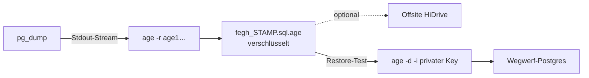

# Backup & Wiederherstellung (verschlüsselt)

Diese Seite beschreibt, **wie** die Datenbank des Leistungsnachweises nächtlich gesichert wird und **warum** die Sicherungen so aufgebaut sind, dass selbst ein kompromittierter Server oder ein abgegriffenes Offsite-Backup keine Klientendaten preisgibt. Sie ist so geschrieben, dass ein Restore-Test von Grund auf nachgebaut werden kann.

!!! danger "Warum das hier ernst ist"
    Die Datenbank enthält Gesundheits- und Sozialdaten von Klient\*innen – besondere Kategorien personenbezogener Daten nach **Art. 9 DSGVO**. Ein unverschlüsseltes `pg_dump` auf einer Festplatte, einem Cloud-Speicher oder in einem Chat ist ein meldepflichtiger Datenschutzvorfall. Deshalb: **Es verlässt kein Backup den Server unverschlüsselt.**

---

## Prinzip

Jede Nacht wird ein logischer Datenbank-Dump (`pg_dump`) erstellt und **sofort im Datenstrom** mit [`age`](https://github.com/FiloSottile/age) verschlüsselt. `age` wird hier **asymmetrisch** eingesetzt:

- Der **öffentliche Schlüssel** (Recipient, `age1…`) liegt auf dem Server und wird nur zum **Verschlüsseln** verwendet. Er ist unkritisch – wer ihn hat, kann damit nur Backups erzeugen, nicht lesen.
- Der **private Schlüssel** (`AGE-SECRET-KEY-…`) liegt **niemals auf dem Server**. Er wird offline (Passwort-Manager) aufbewahrt und nur für einen Restore kurzzeitig eingespielt.



!!! note "Konsequenz"
    Selbst mit vollem Root-Zugriff auf den Server kann ein Angreifer die Backups **nicht** entschlüsseln. Der einzige Weg zurück zu Klartext führt über den privaten Schlüssel, den nur die verantwortliche Person offline besitzt.

Betroffene Dateien im Repo:

| Datei | Zweck | Im Git? |
|---|---|---|
| `deploy/backup.sh` | Nächtliches Backup + Rotation | ja |
| `deploy/restore-test.sh` | Vierteljährlicher Restore-Test | ja |
| `deploy/age-recipient.txt` | Öffentlicher age-Key (Recipient) | **nein** (gitignored) |
| `deploy/backups/*.sql.age` | Verschlüsselte Backups | **nein** (gitignored) |
| `~/age-key.txt` | Privater Schlüssel (nur temporär beim Restore) | **niemals** |

Die `.gitignore` sperrt diese Pfade explizit:

```gitignore
# Deployment-Secrets / Backups (niemals committen)
deploy/.env.prod
deploy/backups/
deploy/logs/
deploy/age-recipient.txt
*.age
*.key
```

---

## Einrichtung Schritt für Schritt (Server, als root)

### 1. age installieren

```bash
apt update
apt install -y age
```

### 2. Schlüsselpaar erzeugen

`age-keygen` gibt den **privaten** Schlüssel auf Stdout aus und schreibt in `stderr` den zugehörigen **öffentlichen** Schlüssel (Recipient).

```bash
age-keygen
```

Beispielausgabe:

```text
# created: 2026-07-04T02:15:00Z
# public key: age1ql3z7hjy54pw3hyww5ayyfg7zqgvc7w3j2elw8zmrj2kg5sfn9aqmcac8p
AGE-SECRET-KEY-1QYQSZQGPQYQSZQGPQYQSZQGPQYQSZQGPQYQSZQGPQYQSZQGPQYQ...
```

- Die Zeile `# public key: age1…` ist dein **Recipient** (öffentlich, unkritisch).
- Die Zeile `AGE-SECRET-KEY-…` ist dein **privater Schlüssel** (streng geheim).

!!! danger "Der private Schlüssel darf den sicheren Ort nie verlassen"
    - **Sofort** in den Passwort-Manager (z. B. als sicheres Notizfeld) kopieren.
    - **Niemals** in Git committen, in einen Chat, ein Ticket oder eine E-Mail einfügen.
    - **Nicht** dauerhaft auf dem Server ablegen. Er wird nur für den Restore-Test kurz gebraucht (siehe Abschnitt *Restore-Test*).
    - Ohne diesen Schlüssel sind alle Backups unwiederbringlich verloren. Bewahre ihn deshalb an **mindestens zwei** getrennten sicheren Orten auf.

### 3. Öffentlichen Schlüssel auf dem Server hinterlegen

Zwei Varianten – das Backup-Script akzeptiert beide, die Env-Variable hat Vorrang:

**Variante A – Datei (empfohlen):**

```bash
echo 'age1ql3z7hjy54pw3hyww5ayyfg7zqgvc7w3j2elw8zmrj2kg5sfn9aqmcac8p' \
  > /srv/fegh/deploy/age-recipient.txt
```

**Variante B – Umgebungsvariable** (z. B. in der Cron-Umgebung oder `.env`):

```bash
export AGE_RECIPIENT='age1ql3z7hjy54pw3hyww5ayyfg7zqgvc7w3j2elw8zmrj2kg5sfn9aqmcac8p'
```

Das Script liest den Recipient in dieser Reihenfolge (siehe `deploy/backup.sh`):

```bash
AGE_RECIPIENT="${AGE_RECIPIENT:-$(cat "$(dirname "$0")/age-recipient.txt" 2>/dev/null || true)}"
```

!!! warning "Platzhalter zählt nicht"
    Das Script bricht bewusst ab, wenn kein Recipient gesetzt ist **oder** noch der Platzhalter `age1DEIN_PUBLIC_KEY` drinsteht. So kann kein „Backup" entstehen, das in Wahrheit gar nicht sinnvoll verschlüsselt wurde.

---

## Backup-Script `deploy/backup.sh`

Das Script läuft als `deploy`-User, liest den Recipient aus Env oder Datei, streamt `pg_dump` durch `age` in eine Datei und rotiert alte Sicherungen nach 7 Tagen.

```bash
#!/bin/bash
set -euo pipefail
cd "$(dirname "$0")"

STAMP=$(date +%F_%H%M)
OUT="$(pwd)/backups"
AGE_RECIPIENT="${AGE_RECIPIENT:-$(cat "$(dirname "$0")/age-recipient.txt" 2>/dev/null || true)}"
if [ -z "${AGE_RECIPIENT:-}" ] || [ "$AGE_RECIPIENT" = "age1DEIN_PUBLIC_KEY" ]; then
  echo "FEHLER: age-Recipient fehlt. Lege deploy/age-recipient.txt an (age1…)." >&2
  exit 1
fi
mkdir -p "$OUT"

docker compose exec -T db pg_dump -U fegh fegh \
  | age -r "$AGE_RECIPIENT" > "$OUT/fegh_$STAMP.sql.age"

# Rotation: tägliche Backups 7 Tage behalten
find "$OUT" -name 'fegh_*.sql.age' -mtime +7 -delete

echo "Backup ok: fegh_$STAMP.sql.age"
```

Wichtige Details:

- `docker compose exec -T db` spricht den `db`-Service aus `deploy/docker-compose.yml` an (Image `postgres:16`, User/DB heißen jeweils `fegh`). Das `-T` schaltet die Pseudo-TTY-Zuweisung ab, damit der Stream sauber durch die Pipe läuft.
- Die Verschlüsselung passiert **im Stream** – zu keinem Zeitpunkt liegt ein unverschlüsselter Dump auf der Platte.
- Dateiname: `fegh_<YYYY-MM-DD_HHMM>.sql.age`.
- `set -euo pipefail` sorgt dafür, dass ein Fehler in `pg_dump` **nicht** in einer leeren, aber scheinbar erfolgreichen `.age`-Datei endet.

### Testlauf

```bash
cd /srv/fegh/deploy
./backup.sh
ls -lh backups/
```

Erwartete Ausgabe: `Backup ok: fegh_2026-07-04_0230.sql.age` und eine `.age`-Datei mit mehreren KB/MB Größe. Eine **0-Byte-Datei** ist ein Fehler – dann Recipient/Docker prüfen.

---

## Cron einrichten

Falls `cron` fehlt:

```bash
apt install -y cron
systemctl enable --now cron
```

Crontab des `deploy`-Users bearbeiten (`crontab -e`) und eintragen:

```cron
30 2 * * * /srv/fegh/deploy/backup.sh >> /srv/fegh/deploy/logs/backup.log 2>&1
```

Das bedeutet: **täglich um 02:30 Uhr**, Ausgabe (inkl. Fehler via `2>&1`) an `deploy/logs/backup.log` angehängt.

!!! tip "Log-Verzeichnis anlegen und Lauf prüfen"
    ```bash
    mkdir -p /srv/fegh/deploy/logs
    # am Folgetag kontrollieren:
    tail -n 20 /srv/fegh/deploy/logs/backup.log
    ```
    Sowohl `deploy/backups/` als auch `deploy/logs/` sind gitignored – sie landen nie versehentlich im Repo.

---

## Restore-Test `deploy/restore-test.sh` (vierteljährlich!)

!!! warning "Ein Backup ohne getesteten Restore ist kein Backup"
    Führe diesen Test **mindestens vierteljährlich** durch und dokumentiere Datum + Ergebnis. Nur so ist sichergestellt, dass die Verschlüsselung, der private Schlüssel und der Dump tatsächlich zusammenpassen.

Der Test spielt ein Backup in eine **Wegwerf-Postgres-Instanz** (Docker) ein, listet die Tabellen und räumt anschließend restlos auf. Die Produktivdatenbank wird dabei **nicht** berührt.

```bash
#!/bin/bash
set -euo pipefail
FILE="${1:?Backup-Datei angeben}"
NAME=fegh_restore_test

cleanup() { docker rm -f "$NAME" >/dev/null 2>&1 || true; }
trap cleanup EXIT          # Wegwerf-DB IMMER entfernen (auch bei Abbruch/Fehler)
cleanup

docker run -d --name "$NAME" -e POSTGRES_PASSWORD=testpw postgres:16 >/dev/null
sleep 5
docker exec "$NAME" psql -U postgres -c "CREATE ROLE fegh;" >/dev/null 2>&1 || true
age -d -i ~/age-key.txt "$FILE" | docker exec -i "$NAME" psql -U postgres >/dev/null
echo "Restore OK – Tabellen:"
docker exec "$NAME" psql -U postgres -c '\dt' | head -40
echo "Restore-Test erfolgreich. Wegwerf-DB wird entfernt. Ergebnis mit Datum dokumentieren."
```

### Ablauf des Tests

1. **Privaten Schlüssel kurzzeitig bereitstellen.** Aus dem Passwort-Manager holen und temporär als `~/age-key.txt` ablegen:

    ```bash
    # Inhalt aus dem Passwort-Manager einfügen:
    nano ~/age-key.txt        # Zeile 'AGE-SECRET-KEY-…' einfügen, speichern
    chmod 600 ~/age-key.txt
    ```

2. **Test ausführen** mit der zu prüfenden Backup-Datei:

    ```bash
    cd /srv/fegh/deploy
    ./restore-test.sh backups/fegh_2026-07-04_0230.sql.age
    ```

    Erwartet: `Restore OK – Tabellen:` gefolgt von einer Tabellenliste (`\dt`), z. B. `nachweis_leistung`, `nachweis_klient`, `auth_user` usw.

3. **Privaten Schlüssel sofort wieder entfernen:**

    ```bash
    rm ~/age-key.txt
    ```

!!! danger "Privaten Schlüssel nach dem Test löschen"
    Für den Restore-Test **muss** der private Schlüssel kurz auf dem Server liegen. Das ist der einzige Moment, in dem das der Fall sein darf. Direkt danach `rm ~/age-key.txt` – der Schlüssel gehört nur in den Passwort-Manager. Die Wegwerf-DB entfernt das Script über den `trap cleanup EXIT` in jedem Fall selbst.

### Warum die Rolle `fegh` angelegt wird

Der Dump enthält `OWNER`- und `GRANT`-Zeilen für die Produktions-Rolle `fegh`. In der frischen Wegwerf-Instanz existiert diese Rolle nicht. Deshalb legt das Script sie vorab an (`CREATE ROLE fegh;`), damit diese Zeilen nicht als Fehler auflaufen. Der Rollen-Befehl ist mit `|| true` abgesichert, falls sie bereits existiert.

---

## Offsite-Spiegel (HiDrive) — Pflicht vor Echtbetrieb

!!! danger "Ohne Offsite = Totalverlust bei Serververlust"
    Liegen die Backups nur auf demselben Server wie die Datenbank, vernichtet ein Serverdefekt, Diebstahl oder Ransomware **Datenbank UND Backups gleichzeitig**. Der Offsite-Spiegel ist daher vor dem ersten echten Klientendatensatz zwingend zu aktivieren.

Weil die `.age`-Datei bereits verschlüsselt ist, kann sie gefahrlos auch **extern** liegen. `deploy/backup.sh` spiegelt sie automatisch, sobald die Umgebungsvariable `RCLONE_REMOTE` gesetzt ist:

```bash
apt install -y rclone
rclone config          # Remote 'hidrive' (WebDAV) einrichten
```

Dann in der Cron-Umgebung (bzw. vor dem Skriptaufruf) setzen:

```bash
export RCLONE_REMOTE="hidrive:fegh-backups/"
```

Ist `RCLONE_REMOTE` gesetzt, lädt das Skript jede Sicherung hoch; **schlägt der Upload fehl, bricht `backup.sh` ab** (kein „Backup ok", kein Erfolg-Ping → der Monitor alarmiert). Ist die Variable nicht gesetzt, warnt das Skript ausdrücklich, dass nur lokal gesichert wird. Der private Schlüssel bleibt weiterhin ausschließlich offline.

### Überwachung (Dead-Man's-Switch)

Ein stillschweigend fehlschlagendes Backup ist gefährlicher als ein lautes. Setze `HEALTHCHECK_URL` auf einen Ping-Dienst (z. B. healthchecks.io, EU-Hosting wählbar):

```bash
export HEALTHCHECK_URL="https://hc-ping.com/<deine-uuid>"
```

`backup.sh` pingt diese URL **nur bei Erfolg**. Bleibt der Ping zur erwarteten Zeit aus, alarmiert der Dienst automatisch. Ergänzend einen externen Uptime-Monitor auf `https://<domain>/healthz` richten (liefert `ok` und prüft die DB-Verbindung).

!!! note "3-2-1-Regel"
    Mit lokalem Backup (7-Tage-Rotation) + HiDrive-Spiegel + dem Produktivsystem sind Sie an der 3-2-1-Regel: drei Kopien, zwei Medien, eine außer Haus.

---

## In-App-Wiederherstellung einzelner Datensätze

Für den Alltag – versehentlich gelöschte oder falsch bearbeitete **einzelne** Leistungsnachweise – ist ein vollständiger DB-Restore das falsche Werkzeug. Dafür gibt es die **In-App-Wiederherstellung** (Soft-Delete / Versionierung innerhalb der Anwendung).

!!! tip "Richtiges Werkzeug wählen"
    - **Einzelner Datensatz** versehentlich gelöscht → [In-App-Wiederherstellung](wiederherstellung.md).
    - **Datenbank komplett verloren / Server-Neuaufbau / Datenschutz-Notfall** → verschlüsselter Restore wie oben.

---

## Checkliste

- [ ] `age` installiert, Schlüsselpaar erzeugt
- [ ] Privater Schlüssel offline im Passwort-Manager (2 Orte), **nicht** auf dem Server
- [ ] Öffentlicher Key in `deploy/age-recipient.txt` oder `AGE_RECIPIENT`
- [ ] Testlauf `./backup.sh` liefert nicht-leere `.age`-Datei
- [ ] Cron-Job `30 2 * * *` aktiv, Log wächst
- [ ] Restore-Test vierteljährlich, danach `rm ~/age-key.txt`, Ergebnis dokumentiert
- [ ] **Offsite-Spiegel** (`RCLONE_REMOTE`) aktiv und einmal von der Offsite-Kopie zurückgespielt
- [ ] **Backup-Überwachung**: `HEALTHCHECK_URL` (Dead-Man's-Switch) + externer Uptime-Monitor auf `/healthz`
