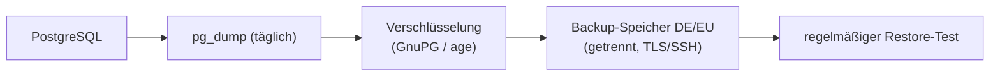

# Backups & Löschkonzept

Da die App perspektivisch **Art.-9-DSGVO-Daten** verarbeitet, brauchen Backup und Löschung ein klares, dokumentiertes Konzept. Diese Seite beschreibt das Zielbild für den Produktivbetrieb.

!!! note "Prototyp"
    Im Prototyp (SQLite, fiktive Demodaten) genügt eine einfache Kopie der `db.sqlite3`. Die folgenden Anforderungen gelten für den **Echtbetrieb** mit PostgreSQL.

## Verschlüsselte Backups

| Anforderung | Umsetzung |
|-------------|-----------|
| **Regelmäßigkeit** | täglicher automatischer Dump der PostgreSQL-Datenbank (`pg_dump`) |
| **Verschlüsselung at rest** | Dumps **verschlüsselt** ablegen (z. B. GnuPG/`age`); Schlüssel getrennt von den Backups aufbewahren |
| **Standort** | Speicherung ausschließlich in **DE/EU** |
| **Transport** | Übertragung nur über **TLS/SSH** |
| **Trennung** | Backups getrennt vom Produktivsystem (anderer Datenträger/Standort) |
| **Zugriff** | nur technische Administration; Zugriff protokolliert |

!!! tip "Media-/Logdateien nicht vergessen"
    Neben der Datenbank gehören auch hochgeladene Dateien und die **rotierenden Logs** (`DJANGO_LOG_FILE`, 5 MB × 10) zum Sicherungsumfang – und ebenso zum Löschkonzept.

## Restore-Test

Ein Backup ist nur so viel wert wie seine **nachgewiesene** Wiederherstellbarkeit.

1. In **regelmäßigen Abständen** (z. B. vierteljährlich) einen Dump auf ein **Test-/Staging-System** zurückspielen.
2. Anmeldung, Belegungsliste und eine Beispiel-Auswertung prüfen.
3. Ergebnis (Datum, Backup-Stand, Erfolg/Fehler) **dokumentieren**.
4. Bei Fehlern Ursache beheben und Test wiederholen.

!!! warning "Ungetestete Backups zählen nicht"
    Ohne erfolgreichen Restore-Test kann im Ernstfall nicht auf die Sicherung vertraut werden. Der Restore-Test ist Teil der TOM.

## Aufbewahrung & Löschung

Aufbewahrungsfristen richten sich nach den **abrechnungs- und sozialrechtlichen Vorgaben** sowie den Trägervorgaben. Grundprinzip: so lange wie nötig, so kurz wie möglich.

| Datenart | Leitlinie |
|----------|-----------|
| **Abrechnungsrelevante Nachweise** | Aufbewahrung gemäß gesetzlicher/handelsrechtlicher Frist |
| **Beendete Betreuungen** | Klient auf Status *Beendigung* setzen; Löschung nach Ablauf der Aufbewahrungsfrist |
| **Backups** | rollierende Aufbewahrung (z. B. tägliche X Tage, wöchentliche X Wochen), danach sicher vernichten |
| **Logs** | automatische Rotation; keine unbegrenzte Vorhaltung |

### Löschung umsetzen

- **Regulär**: Datensatz erst auf Status *Beendigung* (bleibt für Abrechnung/Revision erhalten), echte Löschung erst nach Fristablauf.
- **Bezugsbetreuung geschützt**: Mitarbeitende mit noch verknüpften Klient*innen lassen sich wegen `on_delete=PROTECT` nicht löschen → zuerst umhängen/deaktivieren.
- **Backups**: abgelaufene, verschlüsselte Sicherungen sicher und nachweisbar vernichten (auch beim Backup-Dienstleister).
- **Betroffenenrechte**: Auskunfts-/Löschbegehren nach DSGVO müssen erfüllbar sein – auch in Backups (dokumentierter Prozess, z. B. Löschvormerkung, die beim nächsten Wiedereinspielen erneut angewandt wird).

!!! info "Vor Echtbetrieb festlegen"
    Konkrete Fristen, Verantwortlichkeiten und der Backup-Turnus sind **mit Träger und Datenschutzbeauftragten** abzustimmen und im Verzeichnis der Verarbeitungstätigkeiten zu dokumentieren. Siehe auch [Datenschutz](datenschutz.md) und [Deployment](deployment.md).
