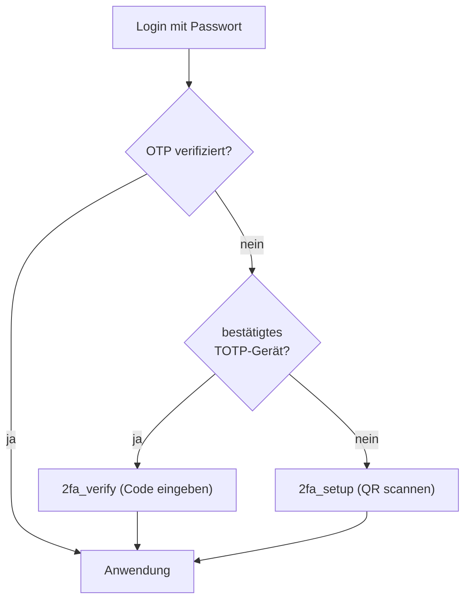

# Datenschutz

Die App verarbeitet Daten aus der Eingliederungshilfe. Dazu gehören **Gesundheits- und Sozialdaten**, die nach **Art. 9 DSGVO** zu den *besonderen Kategorien personenbezogener Daten* zählen und einem erhöhten Schutz unterliegen. Diese Seite beschreibt die technischen und organisatorischen Maßnahmen (TOM) der Anwendung.

!!! danger "Prototyp mit fiktiven Daten"
    Der aktuelle Stand ist ein **Prototyp mit ausschließlich fiktiven Demodaten**. So wird ohne Datenschutzrisiko entwickelt. **Vor** dem Einsatz mit echten Klientendaten sind erforderlich: Hosting in **DE/EU**, **Freigabe** durch Träger und Datenschutzbeauftragte, ein **Verzeichnis von Verarbeitungstätigkeiten**, ggf. eine **Datenschutz-Folgenabschätzung (DSFA)** sowie Revisionssicherheit. Nennen Sie in Demodaten **keine echten Personen**.

## Art. 9 DSGVO – besondere Kategorien

Bewilligte Fachleistungsstunden, Hilfebedarfsgruppen, Bezugsbetreuung und Betreuungsverläufe lassen Rückschlüsse auf Gesundheit und soziale Lage zu. Grundsätze:

- **Datenminimierung**: nur erfassen, was für Leistungsnachweis und Abrechnung nötig ist.
- **Zweckbindung**: Nutzung ausschließlich für Nachweis/Abrechnung und Selfservice.
- **Erforderlichkeit**: keine sensiblen Freitexte über das notwendige Maß hinaus.

## Rollen-Trennung als Schutzmaßnahme

Die App trennt fachliche und administrative Rechte bewusst:

| Rolle | Klientendaten | Struktur/Zugänge |
|-------|:---:|:---:|
| **User (Betreuer*in)** | nur **eigene** Klient*innen | – |
| **Leitung** | Team-Klient*innen | – |
| **Administration** | **kein Zugriff** | Teams, Mitarbeitende, 2FA-Reset |

!!! note "Warum Administration keinen Klientenzugriff hat"
    Wer Benutzerkonten verwaltet, muss keine Gesundheitsdaten sehen. Diese Trennung (im Code als Kommentar an der `Rolle`-Definition dokumentiert: *„Admin = Teams/Mitarbeiter verwalten (KEIN Klientenzugriff, DSGVO-Trennung)“*) begrenzt den Kreis der Zugriffsberechtigten auf die tatsächlich fachlich Beteiligten.

## Authentisierung: Passwörter & 2FA

**Passwörter** werden mit **Argon2** gehasht (`Argon2PasswordHasher`, Fallback PBKDF2) und unterliegen den Django-Passwortprüfungen (Mindestlänge, keine reinen Zahlen, kein Allerweltspasswort, keine Ähnlichkeit zum Benutzernamen).

**Zwei-Faktor (2FA / TOTP)** auf Basis von **django-otp**:

- Einrichtung per QR-Code, der **lokal als SVG** gerendert wird (kein CDN, keine Datenweitergabe an Dritte).
- Beim Einrichten werden **10 Recovery-Codes** erzeugt (Static device „backup“).
- Die `OTPErzwingenMiddleware` leitet eingeloggte, aber **nicht** OTP-verifizierte Nutzer auf die 2FA-Seite um.

!!! info "Opt-in im Prototyp, Pflicht in Produktion"
    Über `OTP_REQUIRED` (Umgebungsvariable `DJANGO_OTP_REQUIRED`) wird gesteuert, ob 2FA für **alle** Pflicht ist. Im Prototyp = `0` (optional/Opt-in: wer ein Gerät einrichtet, wird künftig gefragt). In Produktion `1` setzen → **Pflicht für alle – inkl. des Break-Glass-Superusers**.

!!! tip "Break-Glass-Superuser"
    Auch der **Superuser ohne Mitarbeiter-Profil** unterliegt bei `OTP_REQUIRED=1` der 2FA-Pflicht (TOTP + gedruckte Recovery-Codes, sicher verwahrt) – so ist nicht ausgerechnet das mächtigste Konto (Vollzugriff, RLS-Bypass, Django-Admin) nur passwortgeschützt. Die letzte Rückfallebene im Notfall ist der **Server-Shell-Zugang** (`manage.py`), nicht der Web-Login. Der Zugang bleibt der technischen Administration vorbehalten und wird nicht für die tägliche Arbeit genutzt.

## Transportverschlüsselung (TLS)

In Produktion (`DEBUG=False`) erzwingt die App HTTPS und setzt sichere Cookie- und Header-Optionen:

| Maßnahme | Setting |
|----------|---------|
| HTTP → HTTPS-Weiterleitung | `SECURE_SSL_REDIRECT = True` |
| HSTS (bis zu 1 Jahr, inkl. Subdomains, Preload) | `SECURE_HSTS_SECONDS`, `…_INCLUDE_SUBDOMAINS`, `…_PRELOAD` |
| Cookies nur über HTTPS | `SESSION_COOKIE_SECURE`, `CSRF_COOKIE_SECURE` |
| Session-Cookie nicht per JS lesbar | `SESSION_COOKIE_HTTPONLY` |
| SameSite = Lax | `SESSION_COOKIE_SAMESITE`, `CSRF_COOKIE_SAMESITE` |
| MIME-Sniffing aus, Clickjacking-Schutz | `SECURE_CONTENT_TYPE_NOSNIFF`, `X_FRAME_OPTIONS = DENY` |
| Proxy-TLS erkennen (hinter Caddy) | `SECURE_PROXY_SSL_HEADER` |

!!! note "Sitzungsdauer an den Arbeitstag gekoppelt"
    Die Session läuft nach **8 Stunden** ab (`SESSION_COOKIE_AGE = 8h`) und endet beim Schließen des Browsers (`SESSION_EXPIRE_AT_BROWSER_CLOSE`). Das begrenzt das Risiko offener Sitzungen an geteilten Arbeitsplätzen.

## Protokollierung

In Produktion werden sicherheitsrelevante Ereignisse in eine **rotierende Logdatei** geschrieben (`django.security` INFO, `django.request` WARNING; 5 MB × 10 Dateien). Logs dürfen keine sensiblen Inhalte enthalten und unterliegen ebenfalls dem Löschkonzept.

## Zusammenfassung der Maßnahmen

- [x] Rollen-Trennung (Administration ohne Klientenzugriff)
- [x] Argon2-Passwort-Hashing + Passwortprüfungen
- [x] 2FA/TOTP, lokaler QR-Code, Recovery-Codes, erzwingbar
- [x] TLS/HSTS, sichere Cookies, Clickjacking-/Sniffing-Schutz
- [x] kurze Session-Lebensdauer
- [ ] vor Echtbetrieb: Hosting DE/EU, Freigabe, DSFA, Audit-Trail, Löschkonzept ([Backups & Löschkonzept](backups-loeschkonzept.md))
