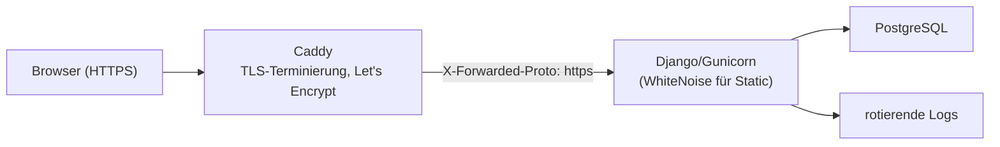

# Deployment (Produktivbetrieb)

Diese Seite fasst den Produktivbetrieb **kurz** zusammen. Die ausführliche Schritt-für-Schritt-Anleitung steht in **[deploy/deploy.md](https://github.com/miri2577/FEGH-Leistungsnachweis/blob/main/deploy/deploy.md)**.

## Zielarchitektur

Betrieb auf einem **Strato V-Server** (Deutschland/EU) mit **Docker**, **Caddy** als Reverse-Proxy (automatisches HTTPS) und **PostgreSQL** als Datenbank.



## Wesentliche Bausteine

| Baustein | Umsetzung |
|----------|-----------|
| **Host** | Strato V-Server, Standort DE/EU |
| **Container** | Docker / Compose: App + PostgreSQL + Caddy |
| **TLS** | Caddy terminiert HTTPS; Django erkennt es via `SECURE_PROXY_SSL_HEADER` |
| **Static Files** | **WhiteNoise** (`CompressedManifestStaticFilesStorage`), aktiv bei `DEBUG=False` |
| **Datenbank** | PostgreSQL über `DATABASE_URL` (dj-database-url) |
| **Passwörter** | Argon2 |

## Umgebungsvariablen (Auszug)

Produktion wird ausschließlich über Umgebungsvariablen konfiguriert:

| Variable | Zweck |
|----------|-------|
| `DJANGO_SECRET_KEY` | geheimer Schlüssel (zwingend eigenen setzen!) |
| `DJANGO_DEBUG=0` | Produktionsmodus (aktiviert alle Sicherheits-Settings) |
| `DJANGO_ALLOWED_HOSTS` | erlaubte Hostnamen (kommagetrennt) |
| `DJANGO_CSRF_TRUSTED_ORIGINS` | HTTPS-Origin(s) für CSRF |
| `DATABASE_URL` | PostgreSQL-Verbindung |
| `DJANGO_OTP_REQUIRED=1` | 2FA für alle verpflichtend |
| `DJANGO_HSTS_SECONDS` | HSTS-Dauer (erst kurz testen, dann 1 Jahr) |
| `DJANGO_LOG_FILE` | Pfad der rotierenden Logdatei |

!!! warning "Niemals mit DEBUG=1 in Produktion"
    Nur bei `DEBUG=False` greifen `SECURE_SSL_REDIRECT`, HSTS, sichere Cookies, WhiteNoise und Logging. Mit `DEBUG=1` wären zudem `ALLOWED_HOSTS=['*']` und der unsichere Default-`SECRET_KEY` aktiv.

## Vor dem Go-Live prüfen

Führen Sie die Django-Deployment-Prüfung aus:

```bash
python manage.py check --deploy
```

Damit prüft Django u. a. `SECRET_KEY`, `ALLOWED_HOSTS`, HSTS, sichere Cookies und `DEBUG`. **Alle** Warnungen müssen abgearbeitet sein.

### Weitere Schritte vor dem Start

1. Eigenen **`DJANGO_SECRET_KEY`** erzeugen und setzen.
2. `python manage.py migrate` auf PostgreSQL ausführen.
3. `python manage.py collectstatic` (WhiteNoise).
4. **Kein** `seed` mit Demodaten in Produktion – echte Daten getrennt einspielen.
5. HSTS zunächst kurz (`DJANGO_HSTS_SECONDS=300`) testen, dann auf 1 Jahr erhöhen.
6. 2FA verpflichtend schalten (`DJANGO_OTP_REQUIRED=1`) und einen **Break-Glass-Superuser** einrichten.
7. Backups einrichten → [Backups & Löschkonzept](backups-loeschkonzept.md).

!!! info "Details"
    Konkrete Compose-Dateien, Caddyfile und Kommandos stehen in **[deploy/deploy.md](https://github.com/miri2577/FEGH-Leistungsnachweis/blob/main/deploy/deploy.md)**.
