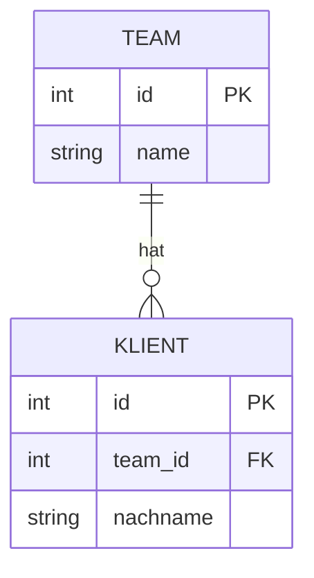
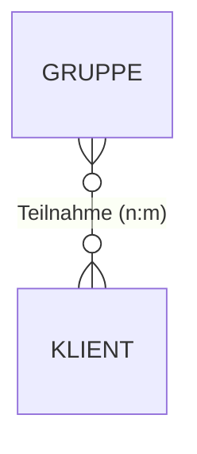

# Datenbank-Grundlagen

Diese Seite richtet sich an technisch interessierte Leser*innen **ohne Django-Vorwissen** – etwa künftige Entwickler*innen, die den Leistungsnachweis übernehmen oder erweitern. Sie erklärt die Begriffe, die man braucht, um die Seite [Datenmodell](datenmodell.md) zu verstehen. Wer sich mit relationalen Datenbanken auskennt, kann direkt dorthin springen.

!!! note "Kurzfassung"
    Die App speichert ihre Daten in einer **relationalen Datenbank**. Man kann sich diese wie eine Sammlung von Excel-Tabellen vorstellen, die über eindeutige Nummern (Schlüssel) miteinander verknüpft sind. Django übersetzt Python-Klassen automatisch in solche Tabellen.

## Was ist eine relationale Datenbank?

Eine **relationale Datenbank** ist ein Programm, das Daten in **Tabellen** ablegt und dafür sorgt, dass diese Daten dauerhaft, widerspruchsfrei und schnell durchsuchbar bleiben. „Relational“ heißt: Die Tabellen stehen in **Beziehung** (englisch *relation*) zueinander.

Die App wurde ursprünglich als **Excel-Mappe** (`TBEW_Leistungsnachweis_2026`) geführt – mit Blättern wie *Belegungsliste*, *Leistungsnachweis*, *Gruppennachweise* und *Teamsitzung*. Genau diese Blätter finden sich jetzt als Tabellen in der Datenbank wieder. Der große Unterschied zu Excel:

| Excel | Relationale Datenbank |
|---|---|
| Beliebige freie Zellen, jede kann alles enthalten | Feste **Spalten** mit festgelegtem Datentyp (Datum, Text, Zahl …) |
| Verweise über Zellbezüge (`=Blatt1!A5`), leicht kaputt | Verweise über **stabile Schlüssel**, von der DB geprüft |
| Mehrbenutzer schwierig | Viele Nutzer*innen gleichzeitig, mit Zugriffsschutz |
| Keine Garantie gegen Widersprüche | DB verhindert z. B. Löschen eines noch benutzten Datensatzes |

## Tabellen, Zeilen und Spalten

Jede Tabelle beschreibt **eine Art von Ding**. In dieser App gibt es z. B. eine Tabelle für Teams, eine für Mitarbeiter*innen, eine für Klient*innen und eine für erfasste Leistungen.

- **Spalte** (englisch *column* / *field*): eine Eigenschaft, die jedes Ding dieser Art hat. Bei einem Team z. B. `name`, `typ`, `aktiv`. Jede Spalte hat einen **Datentyp** – Text, ganze Zahl, Dezimalzahl, Datum, Ja/Nein.
- **Zeile** (englisch *row* / *record*): ein einzelnes konkretes Ding – ein bestimmtes Team, eine bestimmte Person. Eine Zeile füllt jede Spalte mit einem Wert.

Schematisch – die Tabelle „Team“ mit drei Zeilen (fiktive Demodaten):

| id | name | typ | aktiv |
|----|------|-----|-------|
| 1 | BEW Nord | BEW | true |
| 2 | WG Sonnenallee | WG | true |
| 3 | Verwaltung | Verwaltung | true |

Die Spalte `id` ist besonders – dazu gleich mehr.

## Der Primärschlüssel (Primary Key)

Jede Zeile braucht einen Namen, unter dem man sie eindeutig wiederfindet. Diesen eindeutigen „Ausweis“ nennt man **Primärschlüssel** (englisch *primary key*, kurz **PK**). In dieser App ist das immer eine fortlaufende Nummer in der Spalte `id`, die die Datenbank **automatisch** vergibt: Team 1, Team 2, Team 3 …

- Der Primärschlüssel ist innerhalb einer Tabelle **einmalig** – es gibt nie zwei Teams mit `id = 2`.
- Er ändert sich nie, auch wenn sich der Name ändert. „BEW Nord“ kann in „BEW Mitte“ umbenannt werden – die `id` bleibt `1`.

!!! tip "Django vergibt den Primärschlüssel automatisch"
    In den Modellen (siehe [Datenmodell](datenmodell.md)) ist die `id`-Spalte nirgends ausgeschrieben. Django legt sie für jedes Modell selbst an. In dieser App als großer Ganzzahltyp (`BigAutoField`, siehe `DEFAULT_AUTO_FIELD` in den Einstellungen) – reicht für sehr viele Datensätze.

## Der Fremdschlüssel (Foreign Key) – Tabellen verknüpfen

Ein **Fremdschlüssel** (englisch *foreign key*, kurz **FK**) ist eine Spalte, die auf den Primärschlüssel einer **anderen** Tabelle zeigt. So entstehen die Beziehungen.

Beispiel: Jede*r Klient*in gehört zu einem Team. Statt den Teamnamen in die Klienten-Tabelle zu kopieren (fehleranfällig, redundant), speichert man dort nur die **Nummer** des Teams:

Tabelle „Klient“ (Ausschnitt, fiktive Demodaten):

| id | nachname | team_id |
|----|----------|---------|
| 1 | Muster | 1 |
| 2 | Beispiel | 1 |
| 3 | Probst | 2 |

Die Spalte `team_id` ist der Fremdschlüssel. `team_id = 1` bedeutet: „gehört zu dem Team, das in der Team-Tabelle die `id = 1` hat“ – also „BEW Nord“. Muster und Beispiel sind im selben Team, Probst in der WG.

Vorteile:

- **Keine Doppelspeicherung.** Der Teamname steht nur an einer Stelle.
- **Konsistenz.** Die Datenbank kann verhindern, dass ein `team_id` auf ein nicht existierendes Team zeigt.
- **Schutz beim Löschen.** Man kann festlegen, was passiert, wenn das Ziel gelöscht wird (siehe unten).

## Beziehungstypen: 1:n und n:m

### 1:n (eins-zu-viele)

Die häufigste Beziehung. **Ein** Datensatz auf der einen Seite hängt mit **vielen** auf der anderen Seite zusammen, aber jeder von diesen vielen gehört zu genau einem.

> Ein Team hat **viele** Klient\*innen – aber jede\*r Klient\*in gehört zu **einem** Team.

Technisch wird 1:n durch **einen Fremdschlüssel auf der „viele“-Seite** umgesetzt – im Beispiel die Spalte `team_id` in der Klienten-Tabelle. In Django schreibt man dafür ein `ForeignKey`-Feld.



Weitere 1:n-Beispiele in der App: ein\*e Klient\*in hat viele **Leistungen**; ein\*e Mitarbeiter\*in hat viele **Arbeitszeiten**, **Abwesenheiten** und **Stempelungen**.

### 1:1 (eins-zu-eins)

Ein Sonderfall von 1:n, bei dem beide Seiten höchstens **einen** Partner haben. In der App verbindet so ein Feld die Tabelle `Mitarbeiter` mit dem **Login-Konto** (Django-User): Ein Login gehört zu genau einem Mitarbeiter-Profil und umgekehrt (`OneToOneField`).

### n:m (viele-zu-viele, ManyToMany)

Hier hängen **viele mit vielen** zusammen, in beide Richtungen.

> Ein Gruppenangebot hat **mehrere** teilnehmende Klient\*innen – und ein\*e Klient\*in nimmt an **mehreren** Gruppen teil.

Das lässt sich nicht mit einer einzelnen Fremdschlüssel-Spalte abbilden (eine Zelle kann nur eine Nummer enthalten). Die Lösung: eine **Zwischentabelle** (auch Verknüpfungs- oder Zuordnungstabelle). Sie enthält Paare aus zwei Fremdschlüsseln – je eine Zeile pro Teilnahme.

Zwischentabelle „gruppe_teilnehmer“ (fiktive Demodaten):

| id | gruppe_id | klient_id |
|----|-----------|-----------|
| 1 | 5 | 1 |
| 2 | 5 | 2 |
| 3 | 6 | 1 |

Gruppe 5 hat die Klient\*innen 1 und 2; Klient\*in 1 ist in den Gruppen 5 und 6.



!!! tip "Django legt die Zwischentabelle selbst an"
    Bei einem `ManyToManyField` erzeugt Django die Zwischentabelle automatisch im Hintergrund. Im Modellcode sieht man nur das eine Feld `teilnehmer = models.ManyToManyField(Klient, …)`. Auch die Zuordnung „welche\*r Leiter\*in leitet welche Teams“ ist so ein n:m (`Mitarbeiter.leitet`).

## Was passiert beim Löschen? (on_delete)

Wenn ein Datensatz gelöscht wird, auf den anderswo ein Fremdschlüssel zeigt, muss die Datenbank wissen, was mit den Verweisen geschehen soll. Django legt das pro Fremdschlüssel mit `on_delete` fest. In dieser App kommen drei Varianten vor:

| Regel | Bedeutung | Beispiel in der App |
|---|---|---|
| `PROTECT` | **Löschen verbieten**, solange noch Verweise bestehen. Schützt vor Datenverlust. | Ein\*e Klient\*in mit erfassten Leistungen kann nicht einfach gelöscht werden; Leistungen verweisen `PROTECT` auf Klient und Betreuer. |
| `SET_NULL` | Verweis auf **leer** (NULL) setzen, Datensatz bleibt erhalten. | Wird ein Team gelöscht, verlieren Mitarbeiter\*in/Klient\*in nur die Team-Zuordnung. |
| `CASCADE` | **Mitlöschen**: Verweisende Zeilen werden mit entfernt. | Löscht man eine\*n Mitarbeiter\*in, verschwinden auch deren Arbeitszeiten, Abwesenheiten und Stempelungen. |

`NULL` bedeutet dabei „kein Wert / leer“ – nicht dasselbe wie die Zahl 0 oder ein leerer Text.

## Datentypen in dieser App

Jede Spalte hat einen festen Typ. Die wichtigsten hier:

| Typ (Django) | Speichert | Beispiel-Feld |
|---|---|---|
| `CharField` | kurzer Text mit Maximallänge | `Team.name`, `Klient.nachname` |
| `TextField` | langer Freitext ohne feste Länge | `Klient.kommentar` |
| `DateField` | Datum (Tag) | `Leistung.datum` |
| `TimeField` | Uhrzeit | `Leistung.beginn`, `Leistung.ende` |
| `DateTimeField` | Datum + Uhrzeit | `Stempelung.beginn`, `Leistung.erstellt` |
| `DecimalField` | **exakte** Dezimalzahl | `Klient.al` (FLS/Monat), `Parameter.fls_preis` |
| `PositiveSmallIntegerField` | kleine positive Ganzzahl | `Mitarbeiter.urlaubstage`, `Arbeitszeit.pause_min` |
| `BooleanField` | Ja/Nein | `Team.aktiv`, `Leistung.auto` |
| `ForeignKey` | Verweis (1:n) | `Klient.team` |
| `OneToOneField` | Verweis (1:1) | `Mitarbeiter.user` |
| `ManyToManyField` | Verweis (n:m) | `Gruppe.teilnehmer` |

!!! warning "Geld und Zeiten niemals als Fließkommazahl"
    Für alle abrechnungsrelevanten Größen (Stunden, FLS-Mengen, Preise) verwendet die App bewusst `DecimalField` (exakte Dezimalzahlen), **nicht** Fließkommazahlen (`float`). Fließkommazahlen können Werte wie `0,1` nicht exakt darstellen und führen zu Rundungsfehlern – bei einer Rechnungsgrundlage inakzeptabel. Der Kommentar im Modellkopf sagt es klar: „Alle Zeit-/Betragsgrößen als Decimal (keine Floats) – abrechnungsrelevant.“

## SQL – die Sprache dahinter

Mit relationalen Datenbanken spricht man über **SQL** (Structured Query Language). Eine Abfrage „alle aktiven Teams, alphabetisch“ sieht so aus:

```sql
SELECT id, name FROM nachweis_team
WHERE aktiv = 1
ORDER BY name;
```

Das Schöne an Django: Man muss dieses SQL **selten selbst schreiben**. Man arbeitet mit Python-Objekten, und Djangos **ORM** (Object-Relational Mapper) erzeugt das passende SQL. Dieselbe Abfrage in Django-Python:

```python
Team.objects.filter(aktiv=True).order_by("name")
```

Wie aus den Python-Klassen echte Tabellen werden, steht auf der Seite [Migrationen](migrationen.md). Welche Tabellen und Beziehungen es konkret gibt, zeigt die Seite [Datenmodell](datenmodell.md).

## Wo liegen die Daten?

Im Prototyp speichert die App alles in einer einzigen Datei: **SQLite** (`db.sqlite3` im Projektverzeichnis). Das ist eine vollwertige relationale Datenbank ohne eigenen Server – ideal zum Entwickeln. Für den Produktivbetrieb ist ein Wechsel zu **PostgreSQL** vorgesehen (mehrbenutzerfest, robuster). Beides ist bereits vorbereitet; Details dazu ebenfalls unter [Migrationen](migrationen.md).
