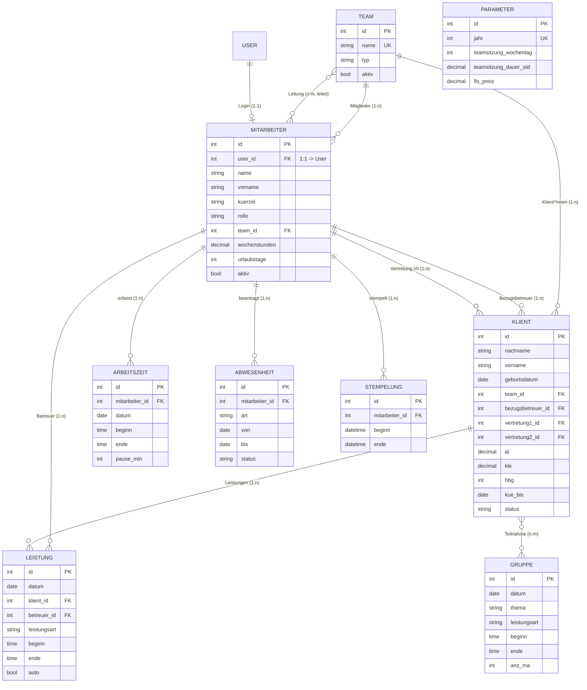

# Datenmodell

Diese Seite dokumentiert **jedes Datenmodell** der App: Zweck, wichtige Felder und Beziehungen. Grundlage ist die Datei `nachweis/models.py`. Die Begriffe (Tabelle, Primär-/Fremdschlüssel, 1:n, n:m) sind auf der Seite [Datenbank-Grundlagen](datenbank-grundlagen.md) erklärt.

!!! note "Modell = Tabelle"
    Jede Python-Klasse, die von `models.Model` erbt, wird zu **einer Datenbanktabelle**. Jedes Feld der Klasse wird zu **einer Spalte**. Jede gespeicherte Instanz (ein konkretes Team, eine konkrete Leistung) wird zu **einer Zeile**. Django ergänzt automatisch eine Spalte `id` als Primärschlüssel.

## Überblick: das ER-Diagramm

Das folgende **Entity-Relationship-Diagramm** zeigt alle Modelle und ihre Beziehungen auf einen Blick. `||--o{` bedeutet 1:n (eins-zu-viele), `}o--o{` bedeutet n:m (viele-zu-viele), `||--o|` bedeutet 1:1.

!!! info "Auswahllisten (Choices)"
    Mehrere Textfelder dürfen nur bestimmte Werte annehmen. Diese Wertelisten (`TextChoices`) sind **im Code** definiert, nicht als eigene Tabelle:

    - **Leistungsart:** FS, WFS, BAO, FUS, FZ, AL, kLE, FH. Davon zählen `FS`, `WFS`, `BAO` als **Fachleistungsstunden (FLS)** (`FLS_ARTEN`).
    - **Rolle:** `user` (Betreuer\*in), `leitung`, `admin`.
    - **Teamtyp:** `BEW`, `WG`, `Verwaltung`.
    - **Status** (Klient): `Betreuung`, `Beendigung`.
    - **AbwesenheitArt:** Urlaub, Freizeitausgleich, Krank, Fortbildung, Sonstige.
    - **AbwesenheitStatus:** beantragt, genehmigt, abgelehnt.

## Team

**Zweck:** Organisatorische Einheit. Mitarbeiter\*innen und Klient\*innen gehören zu einem Team. Der Typ steuert später u. a. die Stempeluhr (Verwaltung = fester Arbeitsplatz).

| Feld | Typ | Bedeutung |
|---|---|---|
| `name` | CharField (max. 80), **unique** | Teamname, muss eindeutig sein |
| `typ` | Choice (Teamtyp) | BEW / WG / Verwaltung, Standard BEW |
| `aktiv` | Boolean | inaktive Teams ausblendbar |

**Beziehungen:**

- 1:n zu **Mitarbeiter** (`Team.mitglieder`) und zu **Klient** (`Team.klienten`).
- n:m zu **Mitarbeiter** über `Mitarbeiter.leitet` (welche Person welche Teams leitet), Rückweg `Team.leitungen`.

**Hilfslogik:** `ist_verwaltung` (Property) ist wahr, wenn `typ == Verwaltung`.

## Mitarbeiter

**Zweck:** Teammitglied, verknüpft mit einem Login (Django-User). Trägt Rolle, Team-Zugehörigkeit und Selfservice-Vorgaben.

| Feld | Typ | Bedeutung |
|---|---|---|
| `user` | **OneToOne** → Django-`User`, `SET_NULL` | Verknüpftes Login-Konto; leer erlaubt (Profil ohne Login möglich) |
| `name` / `vorname` | CharField | Nachname (Pflicht) / Vorname |
| `kuerzel` | CharField (max. 10) | Kürzel für Listen |
| `rolle` | Choice (Rolle) | `user` / `leitung` / `admin`, Standard `user` |
| `team` | **FK** → Team, `SET_NULL` | Team-Zugehörigkeit |
| `leitet` | **ManyToMany** → Team | Nur für Leitung: geleitete Teams |
| `aktiv` | Boolean | aktiv/ausgeschieden |
| `wochenstunden` | Decimal (Standard 39,0) | Wochen-Soll für den Selfservice |
| `urlaubstage` | PositiveSmallInteger (Standard 30) | Urlaubsanspruch/Jahr |

**Beziehungen:** 1:1 zum Login; 1:n zu Team (Zugehörigkeit); n:m zu Team (Leitung). Als **Betreuer\*in** Ziel mehrerer Fremdschlüssel aus **Klient** (`bezugsbetreuer`, `vertretung1`, `vertretung2`) und aus **Leistung** (`betreuer`). Außerdem 1:n zu **Arbeitszeit**, **Abwesenheit**, **Stempelung**.

**Hilfslogik (Properties):** `ist_leitung`, `ist_admin`, `ist_verwaltung` (Team ist Verwaltung), `tagessoll` = Wochen-Soll ÷ 5.

!!! warning "DSGVO-Trennung im Rollenmodell"
    Laut Kommentar im Code hat die Rolle **Admin bewusst keinen Klientenzugriff** – Admins verwalten Teams und Mitarbeiter\*innen, nicht Betreuungsdaten. Diese Trennung ist Teil des Datenschutzkonzepts.

## Klient

**Zweck:** Stammdaten aus der Belegungsliste. Zentrale Abrechnungsgröße: **AL + kLE = bewilligte FLS pro Monat**.

| Feld | Typ | Bedeutung |
|---|---|---|
| `nachname` / `vorname` | CharField | Name (fiktive Demodaten) |
| `geburtsdatum` | Date (optional) | „geb. am“ |
| `team` | **FK** → Team, `SET_NULL` | zuständiges Team |
| `bezugsbetreuer` | **FK** → Mitarbeiter, **`PROTECT`** | Bezugsbetreuer\*in (Pflicht) |
| `al` | Decimal (3 Nachkommast.) | bewilligte FLS/Monat (AL), ≥ 0 |
| `kle` | Decimal (3 Nachkommast.) | davon kalkulatorische Leistungseinheit (kLE)/Monat, ≥ 0 |
| `hbg` | PositiveSmallInteger (optional) | Hilfebedarfsgruppe |
| `vertretung1` / `vertretung2` | **FK** → Mitarbeiter, `SET_NULL` | Vertretung I / II |
| `kue_bis` | Date (optional) | Kostenübernahme (KÜ) bis |
| `status` | Choice (Status) | Betreuung / Beendigung |
| `brp_bis`, `versendet_am` | Date (optional) | Bericht-Fristen |
| `person_id` | CharField | externe Person-ID |
| `thfd` | CharField | Zuständigkeit THFD |
| `kommentar` | TextField | Freitext |

**Beziehungen:** je 1:n von Team und (dreifach) von Mitarbeiter; 1:n zu **Leistung** (`Klient.leistungen`); n:m zu **Gruppe** (`Klient.gruppen`).

**Hilfslogik (Properties/Methoden):**

- `name` – „Nachname, Vorname“.
- `fls_gesamt` = `al + kle`; `fls_gesamt_jahr` = × 12; `kle_anteil` = kLE-Anteil an der Gesamt-FLS.
- `bericht_faellig_am` / `bericht_offen(...)` – Berichtsfrist **10 Wochen (70 Tage) vor KÜ-Ende** (`BERICHT_VORLAUF_TAGE = 70`); `bericht_offen` ist wahr, wenn heute im 10-Wochen-Fenster liegt und Status = Betreuung.

!!! warning "Löschschutz"
    `bezugsbetreuer` verweist mit **`PROTECT`**: Eine\*n Mitarbeiter\*in, der/die noch Bezugsbetreuer\*in ist, kann man nicht löschen. Ebenso schützen die Leistungen ihre Klient\*innen (siehe unten).

## Leistung

**Zweck:** Eine einzelne erfasste Leistung im Leistungsnachweis – die manuelle 1:1-Zeile der Erfassung.

| Feld | Typ | Bedeutung |
|---|---|---|
| `datum` | Date | Leistungstag |
| `klient` | **FK** → Klient, **`PROTECT`** | für wen |
| `leistungsart` | Choice (Leistungsart) | FS, WFS, BAO, FUS, FZ, AL, kLE, FH |
| `taetigkeit` | CharField | Tätigkeit (Freitext) |
| `betreuer` | **FK** → Mitarbeiter, **`PROTECT`** | wer |
| `beginn` / `ende` | Time (optional) | Uhrzeiten; Dauer wird berechnet |
| `notiz` | CharField | Bemerkung |
| `auto` | Boolean | automatisch aus Gruppe/Teamsitzung erzeugt? |
| `erstellt` / `geaendert` | DateTime (`auto_now_add` / `auto_now`) | Anlage- und Änderungszeitpunkt |

**Beziehungen:** 1:n von Klient und von Mitarbeiter.

**Hilfslogik:** `dauer_stunden` (aus `beginn`/`ende`, auf 3 Nachkommastellen; negativ = 0), `monat` (`MM.JJJJ`), `zaehlt_als_fls` (Leistungsart in `FS/WFS/BAO`).

## Gruppe

**Zweck:** Gruppenangebot mit mehreren Teilnehmenden. Die Zeit pro Klient\*in ergibt sich aus **Gesamtzeit ÷ Teilnehmerzahl ÷ Zahl der leitenden Mitarbeiter\*innen**.

| Feld | Typ | Bedeutung |
|---|---|---|
| `datum` | Date | Termin |
| `thema` | CharField | Thema des Angebots |
| `leistungsart` | Choice | Standard FS |
| `beginn` / `ende` | Time (optional) | Zeitrahmen |
| `anz_ma` | PositiveSmallInteger (≥ 1) | Zahl der leitenden Mitarbeiter\*innen |
| `teilnehmer` | **ManyToMany** → Klient | teilnehmende Klient\*innen |

**Beziehungen:** n:m zu Klient (Zwischentabelle, Rückweg `Klient.gruppen`).

**Hilfslogik:** `dauer_stunden`, `anzahl_teilnehmer`, `zeit_pro_klient` = Dauer ÷ (Teilnehmerzahl × `anz_ma`), 0 bei fehlenden Teilnehmern.

!!! note "Aus Gruppen werden einzelne Leistungen"
    Fachlich erzeugt ein Gruppennachweis pro Teilnehmer\*in eine Leistungszeile mit der anteiligen Zeit; solche Zeilen tragen in **Leistung** dann `auto = True`.

## Arbeitszeit

**Zweck:** Arbeitszeiterfassung je Mitarbeiter\*in (Selfservice), unabhängig von der klientbezogenen Leistungserfassung.

| Feld | Typ | Bedeutung |
|---|---|---|
| `mitarbeiter` | **FK** → Mitarbeiter, **`CASCADE`** | wessen Arbeitszeit |
| `datum` | Date | Arbeitstag |
| `beginn` / `ende` | Time (optional) | Kommen/Gehen |
| `pause_min` | PositiveSmallInteger | Pause in Minuten |
| `notiz` | CharField | Bemerkung |

**Hilfslogik:** `dauer_stunden` = Brutto (`ende − beginn`) minus Pause, auf 3 Nachkommastellen, nie negativ.

## Stempelung

**Zweck:** Kommen/Gehen-Stempelung am festen Arbeitsplatz (Verwaltung). Eine Zeile = eine Sitzung (ein Kommen mit zugehörigem Gehen).

| Feld | Typ | Bedeutung |
|---|---|---|
| `mitarbeiter` | **FK** → Mitarbeiter, **`CASCADE`** | wer |
| `beginn` | DateTime | Kommen (Datum + Uhrzeit) |
| `ende` | DateTime (optional) | Gehen; leer = Sitzung läuft noch |

**Hilfslogik:** `offen` (kein `ende`), `dauer_sekunden(jetzt)` – bei offener Stempelung bis „jetzt“ gerechnet.

!!! tip "Warum DateTime statt Time?"
    Anders als Arbeitszeit und Leistung speichert die Stempelung **volle Zeitstempel** (`DateTimeField`), damit eine Sitzung auch über Mitternacht korrekt erfasst werden kann.

## Abwesenheit

**Zweck:** Urlaub / Freizeitausgleich / Krank / Fortbildung / Sonstige – als Antrag mit Genehmigungs-Status.

| Feld | Typ | Bedeutung |
|---|---|---|
| `mitarbeiter` | **FK** → Mitarbeiter, **`CASCADE`** | wer |
| `art` | Choice (AbwesenheitArt) | Standard Urlaub |
| `von` / `bis` | Date | Zeitraum |
| `status` | Choice (AbwesenheitStatus) | beantragt / genehmigt / abgelehnt |
| `kommentar` | CharField | Begründung |
| `erstellt` | DateTime (`auto_now_add`) | Antragszeitpunkt |

**Hilfslogik:** `werktage` – Arbeitstage (Mo–Fr ohne Berliner Feiertage) im Zeitraum, berechnet über `services.werktage(...)`.

## Parameter

**Zweck:** Team-Parameter, **ein Datensatz je Jahr**. Vergütungssätze werden hier gepflegt, **nicht** im Code hartkodiert.

| Feld | Typ | Bedeutung |
|---|---|---|
| `jahr` | PositiveInteger, **unique** | Jahr (Standard 2026) |
| `teamsitzung_wochentag` | PositiveSmallInteger | 0 = Mo … 3 = Do … 6 = So (Standard Do) |
| `teamsitzung_dauer_std` | Decimal | Dauer der Teamsitzung (Std, Standard 3,0) |
| `fls_preis` | Decimal | FLS-Preis in € |

**Beziehungen:** keine Fremdschlüssel – eine reine Konfigurationstabelle. Durch `unique` auf `jahr` kann es pro Jahr nur einen Parametersatz geben.

!!! warning "Preise gehören in die Datenbank, nicht in den Code"
    Der Modellkommentar mahnt ausdrücklich: „Vergütungssätze NICHT hartkodieren.“ Der FLS-Preis (Berlin ab 01.01.2026, Beschluss 3/2026) wird über diesen Datensatz gepflegt, damit sich künftige Sätze ohne Code-Änderung anpassen lassen.

## Zusammenfassung der Beziehungen

| Von | Nach | Art | Feld / Rückweg |
|---|---|---|---|
| Mitarbeiter | User (Login) | 1:1 | `user` / `mitarbeiter_profil` |
| Team | Mitarbeiter | 1:n | `Team.mitglieder` |
| Team | Mitarbeiter | n:m | `Mitarbeiter.leitet` / `Team.leitungen` |
| Team | Klient | 1:n | `Team.klienten` |
| Mitarbeiter | Klient (Bezug + 2× Vertretung) | 1:n | `bezugsbetreuer`, `vertretung1`, `vertretung2` |
| Klient | Leistung | 1:n | `Klient.leistungen` |
| Mitarbeiter | Leistung | 1:n | `betreuer` |
| Klient | Gruppe | n:m | `Gruppe.teilnehmer` / `Klient.gruppen` |
| Mitarbeiter | Arbeitszeit / Abwesenheit / Stempelung | 1:n | jeweils `mitarbeiter` |

Wie diese Modelle zu echten Tabellen werden und wie man Änderungen einspielt, steht auf der Seite [Migrationen](migrationen.md).
