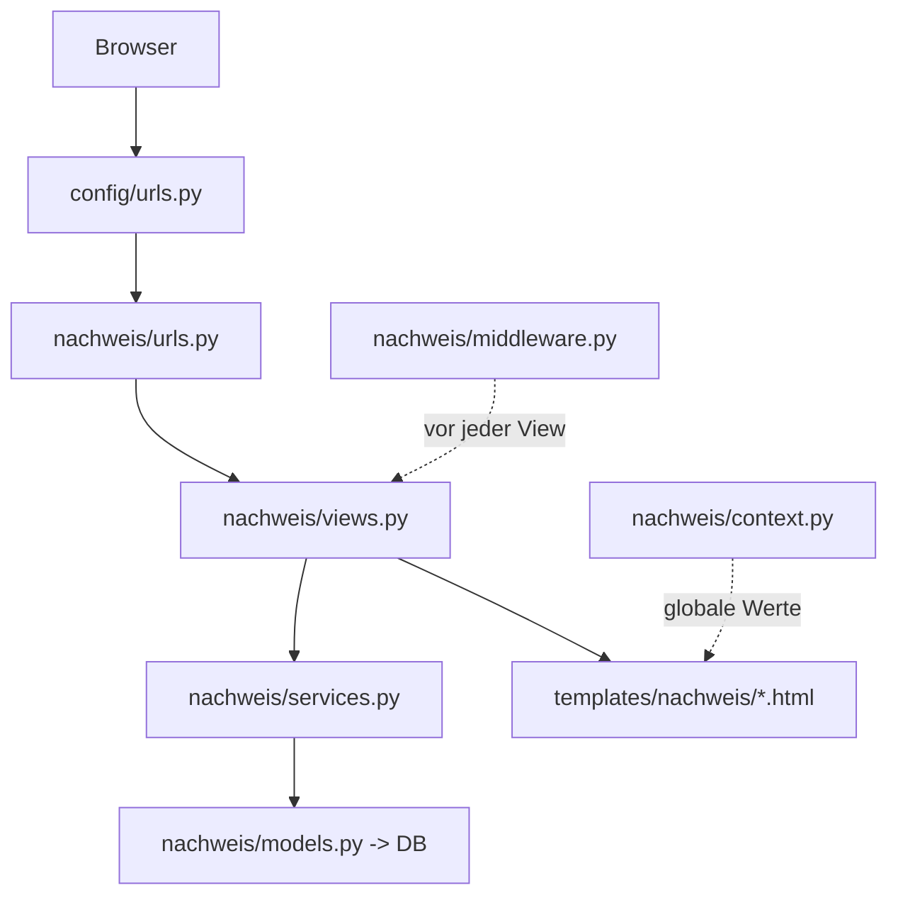

# Projektstruktur des Repos

Diese Seite erklärt Ordner für Ordner, wie das Repository `FEGH-Leistungsnachweis` aufgebaut ist und welche Datei wofür zuständig ist. Sie ergänzt die Seite „Python, Django & MTV“ um die konkrete Landkarte des Codes.

!!! info "Zwei Ebenen"
    Ein Django-Projekt besteht aus dem **Projekt** (zentrale Konfiguration, hier `config/`) und einer oder mehreren **Apps** (Fachlichkeit, hier `nachweis/`). Dazu kommen Doku (`docs/`), Deployment (`deploy/`) und Hilfsdateien im Wurzelverzeichnis.

## Überblick als Baum

```text
FEGH-Leistungsnachweis/
├─ manage.py                 # Kommandozeilen-Werkzeug (runserver, migrate, seed …)
├─ requirements.txt          # Python-Abhängigkeiten (pip)
├─ mkdocs.yml                # Konfiguration dieses Wikis (MkDocs Material)
├─ README.md                 # Kurzbeschreibung des Projekts
├─ .env.example              # Vorlage für Umgebungsvariablen (Prod)
├─ db.sqlite3                # lokale Prototyp-Datenbank (nicht in Produktion)
│
├─ config/                   # das DJANGO-PROJEKT (zentrale Konfiguration)
│  ├─ settings.py            #   alle Einstellungen
│  ├─ urls.py                #   oberste URL-Verteilung
│  ├─ wsgi.py / asgi.py      #   Einstiegspunkte für den Webserver
│  └─ __init__.py
│
├─ nachweis/                 # die DJANGO-APP (die eigentliche Fachlichkeit)
│  ├─ models.py              #   Datenmodell (Datenbank-Tabellen)
│  ├─ views.py               #   Views (Seiten & JSON-APIs)
│  ├─ views_2fa.py           #   Views für die Zwei-Faktor-Anmeldung
│  ├─ services.py            #   Geschäftslogik (Berechnungen, Regeln, Rechte)
│  ├─ context.py             #   Context-Processor (globale Template-Werte)
│  ├─ middleware.py          #   eigene Middleware (2FA-Zwang)
│  ├─ urls.py                #   URLs der App
│  ├─ admin.py               #   Konfiguration des Django-Admin
│  ├─ apps.py                #   App-Registrierung
│  ├─ tests.py               #   Platz für automatische Tests
│  ├─ migrations/            #   Datenbank-Migrationen (Versionsstände des Schemas)
│  ├─ management/commands/   #   eigene manage.py-Befehle (seed.py)
│  ├─ templates/nachweis/    #   HTML-Templates
│  └─ static/nachweis/       #   CSS/JS/Assets (Tabulator, Chart.js)
│
├─ docs/                     # Quelltext dieses Wikis (Markdown)
├─ deploy/                   # Deployment (gunicorn.conf.py u. a.)
├─ logs/                     # Logdateien (in Produktion)
└─ .github/                  # CI/Workflows (z. B. Wiki-Veröffentlichung)
```

## Das Wurzelverzeichnis

| Datei | Zweck |
|---|---|
| `manage.py` | Das zentrale Kommandozeilen-Werkzeug. Es setzt `DJANGO_SETTINGS_MODULE = 'config.settings'` und reicht Befehle an Django weiter (`runserver`, `migrate`, `seed`, `test` …). |
| `requirements.txt` | Liste der Python-Pakete. Aufgeteilt in **Basis** (Prototyp) und **Produktion** (gunicorn, psycopg, whitenoise, argon2 …). |
| `mkdocs.yml` | Konfiguration dieses Wikis (Navigation, Theme „Material“). |
| `.env.example` | Vorlage für Umgebungsvariablen (Secret-Key, Datenbank, Hosts) – die echte `.env` gehört nicht ins Repo. |
| `db.sqlite3` | Die lokale SQLite-Datenbank des Prototyps. In Produktion wird stattdessen PostgreSQL genutzt. |
| `README.md` | Einstiegs- und Kurzbeschreibung. |

## `config/` – das Projekt

Hier liegt die Konfiguration, die für das **gesamte** Projekt gilt.

### `config/settings.py`

Das Herzstück der Konfiguration. Wichtige Bereiche:

- **`INSTALLED_APPS`** – aktive Django-Apps, u. a. `django_otp`, die OTP-Plugins und die eigene App `nachweis`.
- **`MIDDLEWARE`** – die Zwischenschichten-Kette inklusive `django_otp.middleware.OTPMiddleware` und der eigenen `nachweis.middleware.OTPErzwingenMiddleware`.
- **`TEMPLATES`** – Template-Engine; hier ist der eigene Context-Processor `nachweis.context.globale` registriert.
- **`DATABASES`** – lokal SQLite; wird bei gesetzter `DATABASE_URL` automatisch auf PostgreSQL umgestellt (`dj_database_url`).
- **Login-Routen** – `LOGIN_URL`, `LOGIN_REDIRECT_URL`, `LOGOUT_REDIRECT_URL`.
- **Zwei-Faktor** – `OTP_TOTP_ISSUER` und der Schalter `OTP_REQUIRED`.
- **Produktions-Block** (`if not DEBUG:`) – aktiviert WhiteNoise, HTTPS-Redirect, HSTS, sichere Cookies, Argon2-Passworthashing und Datei-Logging.

```python
# config/settings.py – Konfiguration über Umgebungsvariablen mit Dev-Defaults
DEBUG = os.environ.get("DJANGO_DEBUG", "1") == "1"
SECRET_KEY = os.environ.get("DJANGO_SECRET_KEY", "django-insecure-…")
```

!!! tip "Ein Codestand, zwei Welten"
    Dieselbe `settings.py` funktioniert lokal (SQLite, DEBUG, kein HTTPS-Zwang) und in Produktion. Der Unterschied liegt allein in **Umgebungsvariablen** (`DJANGO_DEBUG`, `DATABASE_URL`, `DJANGO_OTP_REQUIRED`, …). So gerät kein Geheimnis in den Code.

### `config/urls.py`

Die oberste URL-Verteilung. Sie kennt nur zwei Einträge: den Django-Admin unter `/admin/` und – für alles andere – die eingebundenen App-URLs `nachweis.urls`.

### `config/wsgi.py` und `config/asgi.py`

Einstiegspunkte für den Webserver. In Produktion startet **gunicorn** die Anwendung über `config.wsgi.application` (in `settings.py` als `WSGI_APPLICATION` gesetzt).

## `nachweis/` – die App

Hier steckt die gesamte Fachlichkeit des Leistungsnachweises.

### Kern-Dateien

| Datei | Aufgabe |
|---|---|
| `models.py` | Definiert die **Datenbank-Tabellen** als Python-Klassen: u. a. `Team`, `Mitarbeiter`, `Klient`, `Leistung`, `Gruppe`, `Arbeitszeit`, `Abwesenheit`, `Stempelung`, `Parameter`. Enthält auch Auswahllisten (`Rolle`, `Status`, `Leistungsart`, `AbwesenheitStatus`). |
| `views.py` | Die **Views**: HTML-Seiten (`mein_ueberblick`, `dashboard`, `erfassung`, `druck`, `gruppen`, `arbeitszeit`, `abwesenheit`) und die **JSON-APIs** (`api_leistungen`, `api_leistung_save/delete`, `api_arbeitszeit…`). |
| `views_2fa.py` | Views rund um die Zwei-Faktor-Anmeldung (`2fa_setup`, `2fa_verify`, `2fa_status`, `2fa_deaktivieren`). |
| `services.py` | Die **Geschäftslogik**: Fachleistungsstunden-Berechnung, Teamsitzungs-Verteilung (Berliner Feiertage), Gruppen-Anteile, Arbeitszeit/Urlaub, Stempeluhr – und die **Sichtbarkeits-/Rollenregeln** (`klienten_fuer`, `ist_leitung`, `ist_admin`). |
| `context.py` | Ein **Context-Processor**: stellt jedem Template globale Werte bereit (Wiki-URL, Rollen-Flags für die Navigation). |
| `middleware.py` | Die eigene **`OTPErzwingenMiddleware`**, die den 2FA-Zwang umsetzt. |
| `urls.py` | Die **Routen** der App mit `app_name = "nachweis"` und benannten Pfaden (`nachweis:start`, `nachweis:dashboard`, …). |
| `admin.py` | Registriert Modelle für den Django-Admin (Verwaltung von Teams, Mitarbeitenden usw.). |
| `apps.py` | App-Konfiguration (`NachweisConfig`). |
| `tests.py` | Vorgesehener Ort für automatische Tests (`python manage.py test`). |

### `nachweis/migrations/`

**Migrationen** sind versionierte Beschreibungen des Datenbank-Schemas. Ändert man ein Model, erzeugt `makemigrations` eine neue Datei; `migrate` spielt sie in die Datenbank ein. Vorhandene Stände hier u. a.:

```text
0001_initial.py                         # Grundschema
0002_mitarbeiter_user.py                # Verknüpfung Mitarbeiter <-> Login
0003_..._urlaubstage_wochenstunden…     # Selfservice-Felder
0004_team_..._klient_team…              # Teams eingeführt
0005_stempelung.py                      # Stempeluhr
```

!!! warning "Migrationen gehören ins Repo"
    Migrationsdateien werden **mit eingecheckt**. Nur so bekommt jede*r – und der Produktionsserver – exakt dasselbe Datenbank-Schema. Niemals von Hand an der DB-Struktur schrauben.

### `nachweis/management/commands/`

Hier liegen **eigene `manage.py`-Befehle**. Aktuell:

- **`seed.py`** – befüllt die Datenbank mit **fiktiven Demodaten** (Teams, Mitarbeitende, Klient*innen, Leistungen, Gruppen, Arbeitszeiten, Abwesenheiten, Stempelungen). Aufruf: `python manage.py seed` (leert & befüllt neu) oder `python manage.py seed --keep` (nur ergänzen). Die Demo-Logins nutzen das Passwort `demo12345`. Details siehe Seite „Lokale Entwicklung“.

### `nachweis/templates/nachweis/`

Die **HTML-Templates**. `base.html` ist das gemeinsame Grundgerüst (Navigation, Kopf, Fuß), von dem alle Seiten erben. Vorhandene Templates:

```text
base.html               mein_ueberblick.html    dashboard.html
erfassung.html          druck.html              druck_pdf.html
gruppen.html            arbeitszeit.html        abwesenheit.html
login.html              _2fa_base.html          2fa_setup.html
2fa_verify.html         2fa_status.html         2fa_codes.html
```

!!! note "Doppelter Ordnername"
    Der Pfad `templates/nachweis/…` enthält den App-Namen bewusst doppelt. Da mehrere Apps gleiche Dateinamen haben könnten, sorgt der Zwischenordner `nachweis/` für eindeutige Template-Namen wie `nachweis/dashboard.html`.

### `nachweis/static/nachweis/`

Statische Dateien (CSS, JavaScript, Assets). Fremdbibliotheken liegen **lokal** unter `vendor/` – bewusst ohne CDN, damit die App auch offline/abgeschottet läuft:

```text
static/nachweis/vendor/tabulator/   -> Tabellen-Grid (Erfassung, Listen)
static/nachweis/vendor/chartjs/     -> Diagramme (Auslastungs-Zeitreihe)
```

In Produktion sammelt `collectstatic` diese Dateien nach `staticfiles/` (siehe `STATIC_ROOT`), von wo WhiteNoise sie ausliefert.

## `docs/` – dieses Wiki

Der Markdown-Quelltext des Wikis, das mit **MkDocs Material** gebaut wird (konfiguriert über `mkdocs.yml`). Aus dieser Kategorie „Technik“ stammt auch die Seite, die Sie gerade lesen.

## `deploy/` und `.github/`

- **`deploy/`** enthält Deployment-Bausteine, u. a. `gunicorn.conf.py` (WSGI-Serverkonfiguration). Die Zielumgebung ist ein V-Server mit **Docker + Caddy (TLS) + PostgreSQL**.
- **`.github/`** enthält CI-Workflows, z. B. zum automatischen Veröffentlichen des Wikis.

## Wie die Teile zusammenspielen (Kurzfassung)



Damit ist die Landkarte vollständig: **`config/`** stellt die Weichen, **`nachweis/`** liefert die Fachlichkeit, und die Ordner `docs/`, `deploy/`, `.github/` kümmern sich um Doku und Betrieb. Wie man das Ganze lokal zum Laufen bringt, zeigt die nächste Seite.