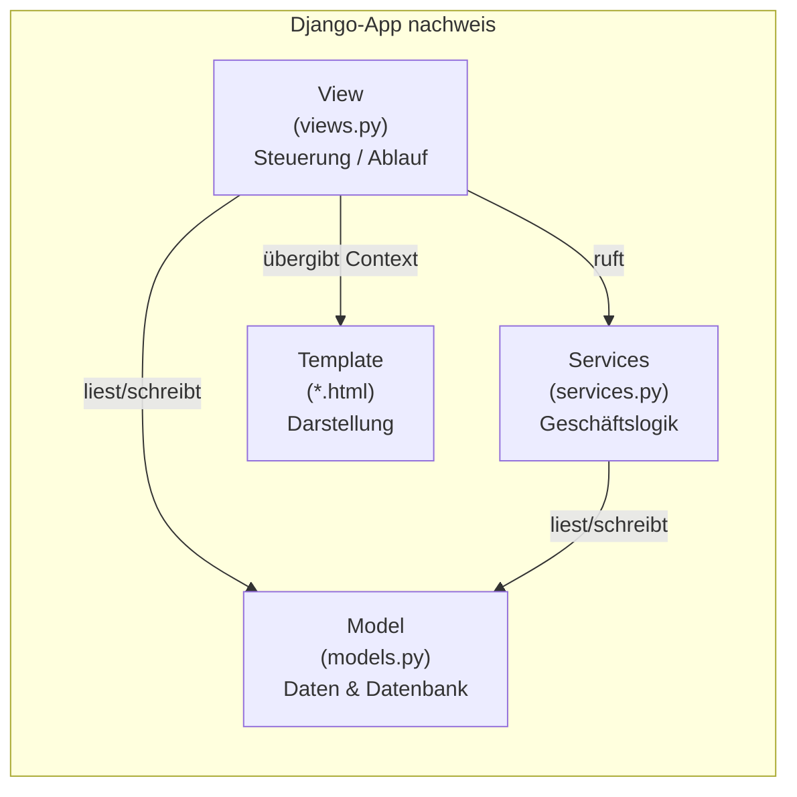
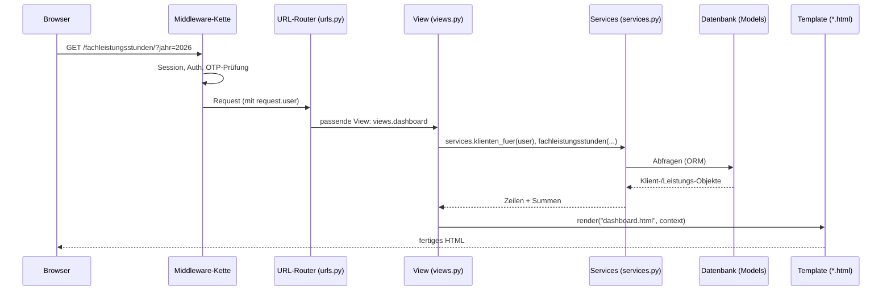

# Python, Django & das MTV-Muster

Diese Seite richtet sich an Einsteiger*innen und künftige Entwickler*innen. Sie erklärt kurz, was Python und Django sind, wie das Django-typische **MTV-Muster** (Model – Template – View) funktioniert und wie ein Aufruf (Request) in **dieser** App vom Browser bis zur fertigen HTML-Seite läuft. Alle Beispiele stammen aus dem echten Code des Repos `FEGH-Leistungsnachweis`.

!!! info "In einem Satz"
    Der Browser schickt eine Anfrage an eine **URL**, Django sucht die passende **View** (eine Python-Funktion), diese holt Daten über die **Models** aus der Datenbank, bereitet sie ggf. mit der **Geschäftslogik** auf und rendert ein **Template** (HTML) als Antwort zurück.

## Was ist Python?

**Python** ist eine weit verbreitete, gut lesbare Programmiersprache. Sie kommt ohne geschweifte Klammern aus und strukturiert Code über **Einrückung**. Für dieses Projekt muss man kein Python-Profi sein, aber ein paar Begriffe helfen:

| Begriff | Bedeutung | Beispiel aus dem Code |
|---|---|---|
| **Funktion** | benannter Block, der etwas tut und meist etwas zurückgibt (`return`) | `def stempeln(mitarbeiter): ...` in `services.py` |
| **Modul** | eine `.py`-Datei mit Funktionen/Klassen | `views.py`, `services.py`, `context.py` |
| **Import** | Code aus anderen Modulen einbinden | `from . import services` |
| **Dekorator** | ein `@name` über einer Funktion, das ihr Verhalten erweitert | `@login_required` über jeder View |
| **Dictionary** | Schlüssel-Wert-Sammlung `{"a": 1}` | der Context, den eine View ans Template gibt |

!!! tip "Warum `Decimal` statt `float`?"
    In `services.py` werden Stunden als `Decimal` gerechnet (z. B. `Decimal("3.0")`), nicht als Fließkommazahl. Bei Abrechnungen ist das wichtig: `Decimal` rundet kaufmännisch exakt (`ROUND_HALF_UP`) und vermeidet die typischen Rundungsfehler von `float`.

## Was ist Django?

**Django** ist ein „Web-Framework“ für Python: ein Baukasten, der die immer wiederkehrenden Aufgaben einer Web-Anwendung schon mitbringt – Routing (welche URL führt wohin), eine **Datenbank-Anbindung** (ORM), ein **Template-System** für HTML, Benutzerverwaltung (Login, Passwörter, Rechte), einen fertigen **Admin-Bereich** und Schutzmechanismen (z. B. gegen CSRF).

Diese App nutzt **Django 5.1**. Ergänzt wird es u. a. durch:

- **django-otp** – Zwei-Faktor-Anmeldung (TOTP, siehe Middleware-Abschnitt),
- **holidays** – gesetzliche Feiertage in Berlin (für die Teamsitzungs-Berechnung),
- **Tabulator** und **Chart.js** – Tabellen und Diagramme im Browser (lokal eingebunden).

### Projekt vs. App

Django unterscheidet zwei Ebenen:

- Das **Projekt** `config/` enthält die zentrale Konfiguration: `settings.py` (Einstellungen), `urls.py` (oberste URL-Verteilung), `wsgi.py`/`asgi.py` (Server-Einstieg).
- Die **App** `nachweis/` enthält die eigentliche Fachlichkeit: Models, Views, Templates, Geschäftslogik. In `settings.py` ist sie unter `INSTALLED_APPS` registriert.

```python
# config/settings.py
INSTALLED_APPS = [
    'django.contrib.admin',
    'django.contrib.auth',
    ...
    'django_otp',
    'django_otp.plugins.otp_totp',
    'nachweis',        # <- unsere App
]
```

## Das MTV-Muster (Model – Template – View)

Django trennt eine Anwendung in drei Verantwortlichkeiten. In anderen Frameworks heißt das oft **MVC**; Django nennt es **MTV**:



| Buchstabe | Django-Begriff | Aufgabe | In dieser App |
|---|---|---|---|
| **M** | Model | beschreibt die Daten und die Datenbank-Tabellen | `nachweis/models.py` (z. B. `Klient`, `Leistung`, `Mitarbeiter`, `Gruppe`) |
| **T** | Template | erzeugt die HTML-Ausgabe für den Browser | `nachweis/templates/nachweis/*.html` |
| **V** | View | nimmt den Request an, steuert den Ablauf, gibt eine Antwort zurück | `nachweis/views.py` |

Eine Besonderheit dieses Projekts: Die **eigentliche Rechen- und Regel-Logik** steckt nicht in den Views, sondern in einer eigenen Datei `services.py`. Die Views bleiben dadurch schlank und lesbar (siehe Seite „Services & Context-Processor“ weiter unten).

## Der Request-Ablauf: Request → URL → View → Template

Wenn im Browser eine Seite aufgerufen wird, durchläuft die Anfrage immer dieselben Stationen:



1. **Request** – Der Browser schickt eine HTTP-Anfrage (z. B. `GET /fachleistungsstunden/`).
2. **Middleware** – Bevor die View läuft, durchläuft der Request eine Kette von „Zwischenschichten“ (Session laden, Nutzer erkennen, 2FA prüfen). Mehr dazu unten.
3. **URL-Router** – Django vergleicht den Pfad mit den Mustern in `urls.py` und wählt die passende View.
4. **View** – Die View-Funktion holt Daten, ruft die Geschäftslogik und stellt einen **Context** (Dictionary) zusammen.
5. **Template** – `render(...)` füllt das HTML-Template mit dem Context und schickt das Ergebnis als **Response** zurück.

## Wie URLs, Views und Templates hier konkret zusammenspielen

### Schritt 1 – Die oberste URL-Verteilung

`config/urls.py` ist die erste Anlaufstelle. Sie leitet nur weiter: `/admin/` zum Django-Admin, **alles andere** an die App `nachweis`.

```python
# config/urls.py
urlpatterns = [
    path("admin/", admin.site.urls),
    path("", include("nachweis.urls")),   # alles Übrige -> nachweis/urls.py
]
```

Welche Datei hier gilt, legt `ROOT_URLCONF = 'config.urls'` in `settings.py` fest.

### Schritt 2 – Die URLs der App

`nachweis/urls.py` ordnet jedem Pfad genau eine View zu und gibt ihr einen **Namen** (`name=...`). Über diesen Namen werden Links im Code und in Templates gebaut – nie über fest verdrahtete Pfade.

```python
# nachweis/urls.py
app_name = "nachweis"

urlpatterns = [
    path("", views.mein_ueberblick, name="start"),
    path("fachleistungsstunden/", views.dashboard, name="dashboard"),
    path("erfassung/", views.erfassung, name="erfassung"),
    path("druck/", views.druck, name="druck"),
    ...
    path("api/leistungen/", views.api_leistungen, name="api_leistungen"),
    path("login/", auth_views.LoginView.as_view(
        template_name="nachweis/login.html"), name="login"),
]
```

!!! note "Namensräume: `nachweis:start`"
    Durch `app_name = "nachweis"` heißen die Routen mit Präfix, z. B. `nachweis:dashboard`. Im Python-Code wird daraus ein Pfad über `reverse("nachweis:dashboard")` oder `redirect("nachweis:start")`, im Template über ``. Ändert sich später ein Pfad, bleiben alle Links gültig.

### Schritt 3 – Die View

Eine View ist eine gewöhnliche Python-Funktion mit einem Parameter `request`. Sie gibt ein **Response**-Objekt zurück. Beispiel: die Startseite „Mein Überblick“.

```python
# nachweis/views.py (gekürzt)
@login_required
def mein_ueberblick(request):
    jahr = _jahr(request)                       # ?jahr=... aus der URL, sonst aktuelles Jahr
    me = services.mitarbeiter_fuer(request.user)   # Mitarbeiter-Profil zum Login
    eigene = services.eigene_klienten(request.user)
    zeilen, summe = services.fachleistungsstunden(jahr, klienten=eigene)
    return render(request, "nachweis/mein_ueberblick.html", {
        "aktiv": "start",
        "jahr": jahr,
        "me": me,
        "eigene_zeilen": zeilen,
        "summe": summe,
        ...
    })
```

Wichtige Beobachtungen:

- Der Dekorator **`@login_required`** stellt sicher, dass nur angemeldete Nutzer*innen die View erreichen. Fehlt der Login, leitet Django auf `LOGIN_URL = 'nachweis:login'` (aus `settings.py`) um.
- Die View **rechnet nicht selbst**, sondern ruft `services....`. Das hält Views kurz und die Fachlogik testbar.
- Am Ende steht `render(request, template, context)`. Der dritte Parameter ist der **Context** – ein Dictionary, dessen Schlüssel im Template als Variablen verfügbar sind (`{{ jahr }}`, `{{ summe.ist }}` …).

### Schritt 4 – Das Template

Das Template ist HTML mit eingestreuten Django-Tags (`{{ ... }}` für Werte, `` für Logik). Alle Templates dieser App liegen unter `nachweis/templates/nachweis/` und erben von einem gemeinsamen Grundgerüst `base.html`. Vereinfacht:

```django


  <h1>Mein Überblick {{ jahr }}</h1>
  
    <tr><td>{{ z.klient.name }}</td><td>{{ z.ist }} h</td></tr>
  

```

!!! info "Wo Django Templates sucht"
    In `settings.py` steht `'APP_DIRS': True`. Dadurch findet Django Templates automatisch im Unterordner `templates/` jeder App – hier `nachweis/templates/nachweis/…`. Der doppelte `nachweis`-Ordner ist Absicht: Er verhindert Namenskollisionen zwischen Apps.

## Zwei Antwort-Typen: HTML-Seiten und JSON-APIs

Nicht jede View rendert HTML. Die Erfassungs-Tabelle (Tabulator) lädt ihre Daten per JavaScript nach – dafür gibt es **API-Views**, die statt eines Templates ein `JsonResponse` zurückgeben:

```python
# nachweis/views.py (gekürzt)
@login_required
def api_leistungen(request):
    jahr = _jahr(request)
    qs = Leistung.objects.filter(
        datum__year=jahr, klient__in=services.klienten_fuer(request.user)
    ).select_related("klient", "betreuer")
    data = [_row(l) for l in qs.order_by("-datum", "beginn")]
    return JsonResponse({"data": data})
```

So entsteht ein sauberes Muster: `erfassung/` liefert die **Seite** (HTML), `api/leistungen/` liefert die **Daten** (JSON), und `api/leistungen/save/` bzw. `.../delete/` nehmen Änderungen entgegen (nur per `POST`, erzwungen durch `@require_POST`).

!!! warning "Berechtigungen stecken in der Abfrage"
    Jede dieser Views filtert über `services.klienten_fuer(request.user)`. Dadurch sieht und ändert jede*r nur Daten im erlaubten Team. Diese Sichtbarkeits-Regeln sind zentral in `services.py` definiert – siehe die Seite „Services & Context-Processor“.

## Middleware – die Zwischenschichten (inkl. 2FA-Zwang)

**Middleware** sind Bausteine, die **jeden** Request vor der View und jede Response danach durchlaufen. Sie sind in `settings.py` als Liste konfiguriert; die **Reihenfolge** ist entscheidend, weil sie von oben nach unten abgearbeitet wird.

```python
# config/settings.py
MIDDLEWARE = [
    'django.middleware.security.SecurityMiddleware',
    'django.contrib.sessions.middleware.SessionMiddleware',      # lädt die Session
    'django.middleware.common.CommonMiddleware',
    'django.middleware.csrf.CsrfViewMiddleware',                 # CSRF-Schutz
    'django.contrib.auth.middleware.AuthenticationMiddleware',   # setzt request.user
    'django_otp.middleware.OTPMiddleware',                       # NACH Auth: request.user.is_verified()
    'nachweis.middleware.OTPErzwingenMiddleware',                # NACH OTP: erzwingt 2FA
    'django.contrib.messages.middleware.MessageMiddleware',
    'django.middleware.clickjacking.XFrameOptionsMiddleware',
]
```

Was die wichtigsten Schichten tun:

- **SessionMiddleware** – lädt die Sitzung (Cookie) und stellt `request.session` bereit.
- **CsrfViewMiddleware** – schützt Formulare/POSTs vor gefälschten Fremd-Anfragen.
- **AuthenticationMiddleware** – hängt den angemeldeten Nutzer als `request.user` an.
- **OTPMiddleware** (django-otp) – ergänzt `request.user.is_verified()` (Zwei-Faktor bestätigt?).
- **OTPErzwingenMiddleware** (eigene) – der 2FA-Zwang dieser App.

### Die eigene 2FA-Middleware im Detail

Die Datei `nachweis/middleware.py` sorgt dafür, dass angemeldete, aber **noch nicht per Zweitfaktor bestätigte** Nutzer*innen auf die 2FA-Seiten umgeleitet werden:

```python
# nachweis/middleware.py (gekürzt)
class OTPErzwingenMiddleware:
    def __call__(self, request):
        u = request.user
        if (u.is_authenticated and not u.is_verified()
                and not self._exempt(request)):
            hat_device = u.totpdevice_set.filter(confirmed=True).exists()
            if settings.OTP_REQUIRED or hat_device:
                ziel = "nachweis:2fa_verify" if hat_device else "nachweis:2fa_setup"
                return redirect(f"{reverse(ziel)}?next={request.get_full_path()}")
        return self.get_response(request)
```

Die Logik in Worten:

- **Ausgenommen** (`_exempt`) sind Login/Logout, die 2FA-Seiten selbst, statische Dateien und `/admin/` – sonst könnte man sich nie einrichten.
- Hat jemand bereits ein bestätigtes Gerät (`hat_device`), wird zur **Code-Eingabe** (`2fa_verify`) geleitet; sonst zur **Einrichtung** (`2fa_setup`).
- Über `settings.OTP_REQUIRED` schaltet man zwischen **Opt-in** (Prototyp) und **Pflicht für alle** (Produktion) um.
- Bei `OTP_REQUIRED=1` gilt die 2FA-Pflicht **auch für den Break-Glass-Superuser** (TOTP + Recovery-Codes); die letzte Rückfallebene im Notfall ist der Server-Shell-Zugang (`manage.py`), nicht der Web-Login.

!!! note "Opt-in vs. Pflicht per Umgebungsvariable"
    In `settings.py`: `OTP_REQUIRED = os.environ.get("DJANGO_OTP_REQUIRED", "0") == "1"`. Lokal (Default `0`) ist 2FA freiwillig – wer ein Gerät einrichtet, wird künftig danach gefragt. In Produktion setzt man `DJANGO_OTP_REQUIRED=1` und 2FA wird für alle verpflichtend.

## Zusammenfassung

- **Python** ist die Sprache, **Django** das Web-Framework darüber.
- **MTV** trennt Daten (**Model**), Darstellung (**Template**) und Ablauf (**View**); die Fachlogik lagert diese App zusätzlich in **`services.py`** aus.
- Ein Request läuft **Middleware → URL-Router → View → (Services/Models) → Template → Response**.
- URLs tragen **Namen** (`nachweis:…`) und werden nie fest verdrahtet.
- **Middleware** erledigt Querschnittsaufgaben; die eigene `OTPErzwingenMiddleware` setzt die **Zwei-Faktor-Anmeldung** durch.

Wie die einzelnen Ordner und Dateien konkret aufgebaut sind, zeigt die Seite **„Projektstruktur“**. Wie man das Projekt lokal startet, erklärt **„Lokale Entwicklung“**.